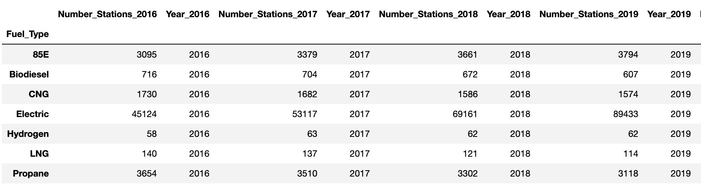
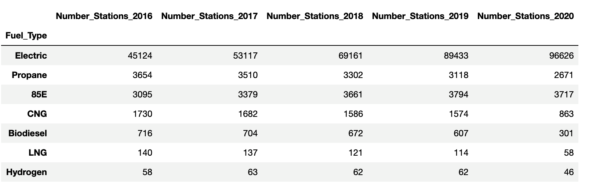

# Joining Alternative Energy

In this activity, you will practice combining DataFrames using the `join` function to append their data to a combined DataFrame.

## Instructions

1. Import the pandas and pathlib libraries.

2. Create variables to import the [CSV files](Unsolved/Resources/) using the pathlib library.

3. Read in each year of the alternative fuel station data into pandas DataFrames and set the `index_col` parameter set to the "Fuel_Type" column.

4. Display the first five rows of each year of the alternative fuel station data.

5. Combine the 2016 and 2017 alternative fuel station DataFrames, setting the `lsuffix` and `rsuffix` parameters to "2016" and "2017" respectively and display the new DataFrame.

6. Next, add the 2018, 2019, and 2020 alternative fuel station DataFrames to the 2016–2017 DataFrame.

    * Create a list to hold the 2018, 2019, and 2020 DataFrames and add "_2018", "_2019" and, "_2020" suffixes to the 2018, 2019, and 2020 DataFrames using the `add_suffix()` method.

    * Using the `join` function, combine the 2016–2017 DataFrame with the list of 2018–2020 DataFrames. The combined data should look like the following image:

        

7. Drop all the columns with the "Year_<year>" with the year of the data, i.e., "Year_2016".

8. Sort the combined DataFrame on all the columns in descending order using the `sort_values()` function.

    * Your final DataFrame should look like the following image:

        

## References

The original data is from the U.S Department of Energy, available: [https://afdc.energy.gov/stations/states](https://afdc.energy.gov/stations/states), and the Alternative Fuels Data Center and Bureau of Transportation Statistics, available: [https://www.bts.gov/](https://www.bts.gov/), and has been modified by edX Boot Camps LLC for this activity.

---

© 2023 edX Boot Camps LLC. Confidential and Proprietary. All Rights Reserved.
