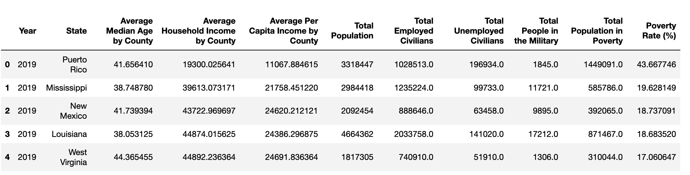

# Census Merging

In this activity, you will merge the two Census datasets that we created in the last class and then do a calculation and sort the values.

## Instructions

1. Read in both [CSV files](Unsolved/Resources/) and print out their DataFrames.

2. Perform an inner merge that combines both DataFrames on the "Year" and "State" columns.

3. Create a DataFrame that filters the data on 2019 only , using the `loc` method.

4. Add a new column "Poverty Rate (%)" that calculates the percent poverty rate.

5. Sort the data by "Poverty Rate (%)" and "Average Per Capita Income by County" columns, in descending order, to find the state or territory with the highest poverty rate.

6. Reset the index of the sorted DataFrame and display the sorted DataFrame. The combined data should look like the following image:

    

7. Print out the data for the state or territory with the highest poverty rate.

8. Print out the data for the state or territory with the lowest poverty rate with one line of code.

## Hint

* Get the last row in the DataFrame using `loc[(len(df)-1):]` to print out the data for the state or territory with the lowest poverty rate with one line of code.

## Reference

United States Census Bureau. 2023. *Census Microdata API*. Available: [https://www.census.gov/data/developers/data-sets/census-microdata-api.ACS_5-Year_PUMS.html](https://www.census.gov/data/developers/data-sets/census-microdata-api.ACS_5-Year_PUMS.html) [2023, September 11].

---

© 2023 edX Boot Camps LLC. Confidential and Proprietary. All Rights Reserved.
