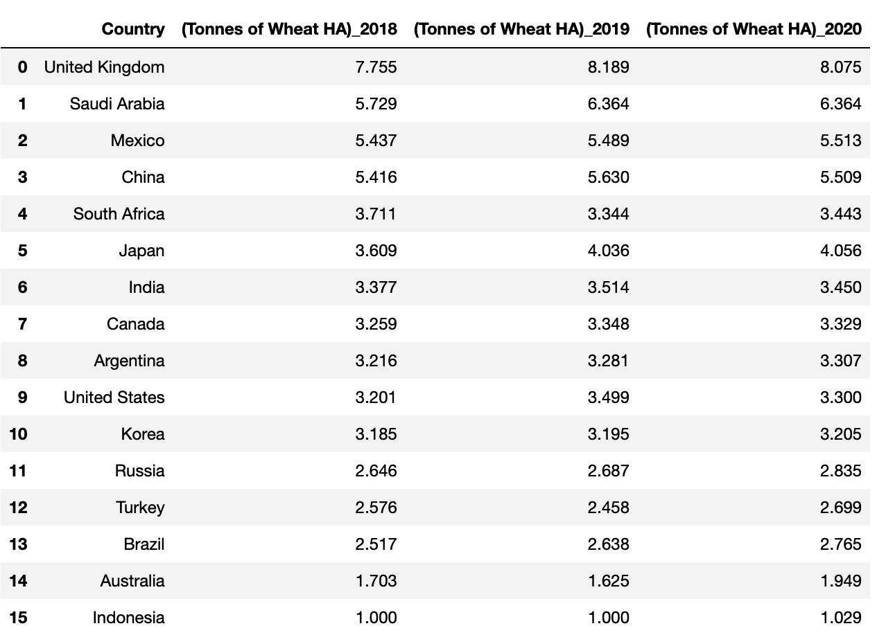

# Merging Crop G20 Production

In this activity, you will merge the two 2018–2020 G20 crop datasets and clean up the merged DataFrames by removing or renaming duplicate columns.

## Instructions

1. Read in the 2018–2020 [CSV files](Unsolved/Resources/), and print out their DataFrames.

2. Perform an inner merge that combines the 2018 and 2019 DataFrames on the "Country" column.

3. Perform another inner merge that combines the 2018–2019 merged DataFrame with the 2020 DataFrame on the "Country" column.

4. Drop the following columns:
    * "Crop_x"
    * "Year_x"
    * "Crop_y"
    * "Year_y"
    * "Crop"
    * "Year"

5. Rename the columns as follows:
    * "Value(tonnes of HA)_x" to: "(Tonnes of Wheat HA)_2018"
    * "Value(tonnes of HA)_y" to "(Tonnes of Wheat HA)_2019"
    * "Value(tonnes of HA)"  to "(Tonnes of Wheat HA)_2020"

6.  Sort the DataFrame on the "(Tonnes of Wheat HA)_2018", "(Tonnes of Wheat HA)_2019", and "(Tonnes of Wheat HA)_2020" columns in descending order and reset the index.

    * Your final DataFrame should look like the following image:

        

## References

OECD and Food and Agriculture Organization of the United Nations. 2023. *OECD-FAO Agricultural Outlook*. DOI:  [10.1787/08801ab7-en](https://doi.org/10.1787/08801ab7-en)

---

© 2023 edX Boot Camps LLC. Confidential and Proprietary. All Rights Reserved.
