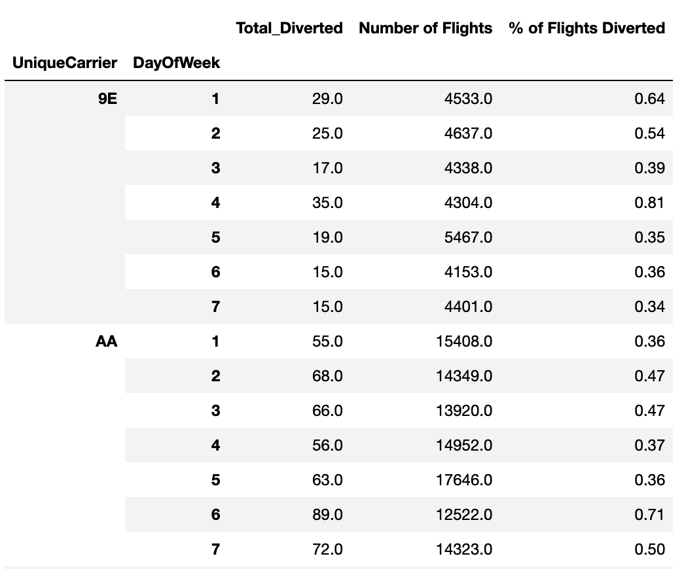

# Airline Delays Custom Aggregations

In this activity, you will practice creating custom functions to use for aggregations to gain insights into airline delays.

## Instructions

1. Read in the delayed flight dataset.

2. Create a custom function that will calculate an average of values from a DataFrame column.

3. Using the custom function, show the average time for delayed arrivals ("ArrDelay") for each airline carrier ("UniqueCarrier").

4. Using the custom function, show the average time for delayed arrivals ("ArrDelay") and delayed departures ("DepDelay") for each airline carrier ("UniqueCarrier").

5. Create another custom function that will calculate the total of values from a DataFrame column.

6. Using the two custom functions you created, show the total number of flights and the average number of flights that were diverted for each flight origin ("Origin") and destination ("Dest"). Then, sort the results in descending order on two new columns and display the top 25 results.

7. Create two more custom functions: one that returns the number of items from a DataFrame column, and one that returns the percentage.

8. Using the two custom functions created in Step 7, show the total number of diverted flights, the total flights, and the percentage of diverted flights for each airline carrier ("UniqueCarrier") by day of the week.

    * The DataFrame should look like the following image:

        

## Hints

* For the `custom_percentage()` function, use a conditional statement that checks if `x.count()` is greater than zero. If `True` then return `(x.sum()/x.count()*100).round(2)`, if `False` then return zero to avoid division by zero.

## Reference

Kaggle. 2021. *Airlines Delay*. Available. [https://www.kaggle.com/datasets/giovamata/airlinedelaycauses/](https://www.kaggle.com/datasets/giovamata/airlinedelaycauses/) [2023, September 11].

---

© 2023 edX Boot Camps LLC. Confidential and Proprietary. All Rights Reserved.
