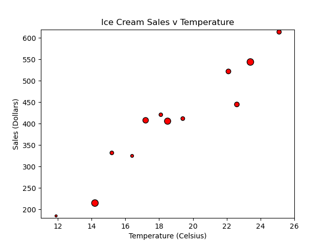

# Scatter Py

In this activity, you will create a scatter plot that visualizes ice cream sales in comparison to temperature increases.

## Instructions

Using the starter code notebook, create a scatter plot that matches the following image:

---

© 2023 edX Boot Camps LLC. Confidential and Proprietary. All Rights Reserved.
