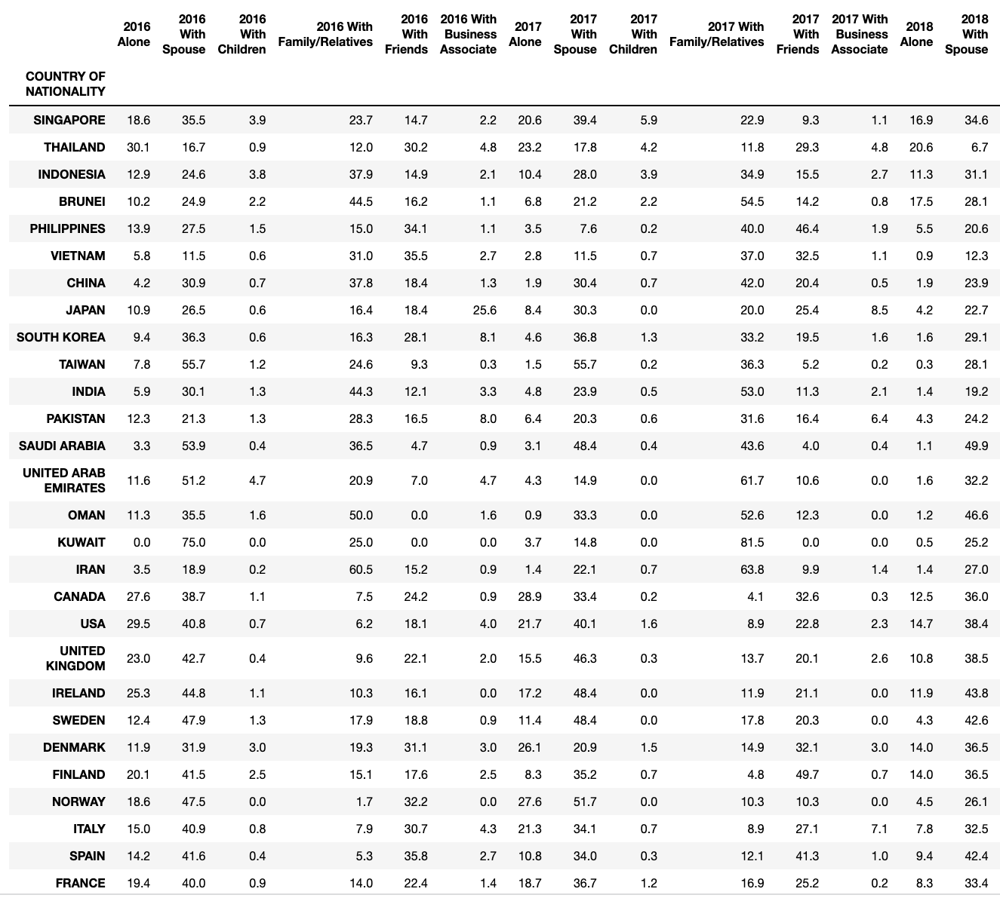

# Traveling Companions, Part 2

This is Part 2 of a three-part mini-project.

In this second part, you will examine the averages of each column and reduce the DataFrame to include only types of companion travelers that are above 1% across all three years.

## Instructions

* Check the comments in each cell of the starter file for activity instructions.

* Your final table should align with the following table:

   

## Reference

*Tourism Malaysia*. [2023]. *Travelling Companion* [Dataset]. Available: [https://archive.data.gov.my/data/en_US/dataset/travelling-companion](https://archive.data.gov.my/data/en_US/dataset/travelling-companion) [2023].
([CC-BY 4.0](https://creativecommons.org/licenses/by/4.0/legalcode)).

- - -

© 2023 edX Boot Camps LLC. Confidential and Proprietary. All Rights Reserved.
