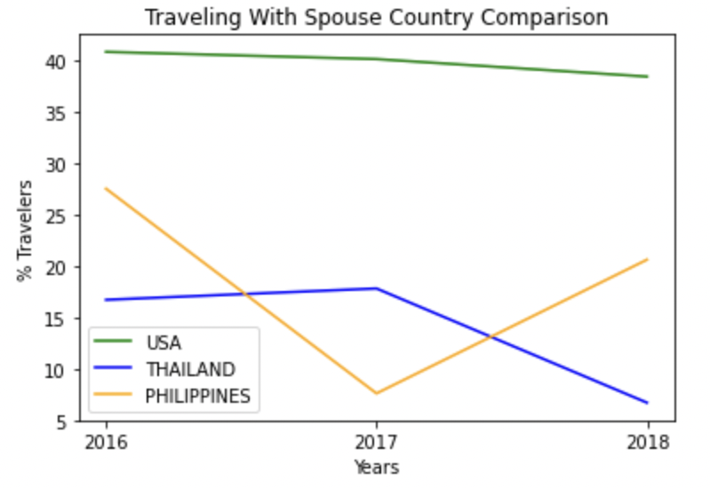

# Traveling Companions, Part 3

This is the third and final part of a three-part mini-project.

In this final part, you will take the DataFrame you created and, using Matplotlib, chart a comparison of three different countries for one type of traveling companion between 2016 and 2018.

## Instructions

* Check the comments in each cell of the unsolved notebook for activity instructions.

* Your output should align with the following figure, depending on the user’s input variable:

   

## References

*Tourism Malaysia*. [2023]. *Travelling Companion* [Dataset]. Available: [https://archive.data.gov.my/data/en_US/dataset/travelling-companion](https://archive.data.gov.my/data/en_US/dataset/travelling-companion) [2023].
([CC-BY 4.0](https://creativecommons.org/licenses/by/4.0/legalcode)).

- - -

© 2023 edX Boot Camps LLC. Confidential and Proprietary. All Rights Reserved.
