## Module 18.1: Introduction to Neural Networks

### Overview

This lesson will introduce the students to neural networks, a transformative approach to machine learning that leverages interconnected units (or "neurons") to model complex patterns. They're an essential tool for machine learning engineers. Neural networks are collections of perceptron models, which are related to logistic regressions. They are also the basis of deep learning networks, which we will cover in the next lesson plan.

### Class Objectives

By the end of today's class, the students will be able to:

* Compare the advantages and disadvantages of using neural network models with other types of machine learning models.

* Describe the perceptron model and its components.

* Create, train, and evaluate neural network models using TensorFlow.

---

### Instructor Notes

If you've had some experience with machine learning but haven't used neural network models, please review the following online resources before this week's class. These resources are not part of the student-facing content for this module. Rather, they'll provide the instructor with some context for how neural networks function:

* [But what is a Neural Network?](https://www.youtube.com/watch?v=aircAruvnKk): This video by 3Blue1Brown is a fantastic introduction to neural networks and what they do.

* [Hands-On in the Playground](https://www.youtube.com/watch?v=ru9dXF04iSE): This video by Sundog Education is a step-by-step guide to [Google's TensorFlow Playground](https://playground.tensorflow.org/). If this is your first interaction with the Playground, it is recommended that you scroll past the interactive visualization to read the brief summary of what the visualization represents.

Because the landscape of machine learning is still changing rapidly, especially with regard to neural networks, TensorFlow will have more drastic changes than other libraries. This means you may encounter deprecation warnings when you run your code. For the purpose of these lessons, these warnings can generally be ignored.

The TensorFlow library requires specific instructions to be installed locally, and those instructions can vary dramatically depending on the hardware and operating system. To avoid losing time to installation issues, the activities in this lesson have been designed and tested using Google Colab, and students are not encouraged to install TensorFlow on their own machines. Google Colab is a free service, and outages or restrictions can occasionally occur. It is recommended that the instructional team install TensorFlow and KerasTuner locally so that class can continue in the event of such an outage. Installation guides are available on the TensorFlow [install page](https://www.tensorflow.org/install/) and the KerasTuner [website](https://keras.io/keras_tuner/).

---

### Class Slides

The slides for this lesson can be viewed on Google Drive here: [Module 18.1 Slides](https://docs.google.com/presentation/d/1LPPVTT_DPv5WyASezfHifGQWaq0z_o34zH0ZGyuAXb8/edit?usp=sharing).

To add the slides to the student-facing repository, download the slides as a PDF by navigating to File, selecting "Download as," and then choosing "PDF document." Then, add the PDF file to your class repository along with other necessary files. You can view instructions for this [here](https://docs.google.com/document/d/1XM90c4s9XjwZHjdUlwEMcv2iXcO_yRGx5p2iLZ3BGNI/edit).

**Note:** Editing access is not available for this document. If you wish to modify the slides, create a copy by navigating to File and selecting "Make a copy...".

---

### Time Tracker

| Start Time | Number | Activity                                           | Duration |
| ---------- | ------ | -------------------------------------------------- | -------- |
| 6:30 PM    | 1      | Instructor Do: Introduction to the Class           | 0:05     |
| 6:35 PM    | 2      | Instructor Do: What is a Neural Network?           | 0:15     |
| 6:50 PM    | 3      | Students Do: Working Through the Logistics         | 0:15     |
| 7:05 PM    | 4      | Review: Working Through the Logistics              | 0:10     |
| 7:15 PM    | 5      | Instructor Do: Perceptron                          | 0:10     |
| 7:25 PM    | 6      | Instructor Do: Make the Connections                | 0:10     |
| 7:35 PM    | 7      | Everyone Do: Playing in the TensorFlow Playground  | 0:15     |
| 7:50 PM    | 8      | Instructor Do: Understanding the TensorFlow Neural Network Structure | 0:10     |
| 8:00 PM    | 9      | BREAK                                              | 0:15     |
| 8:15 PM    | 10     | Everyone Do: Work Through a Neural Network Workflow | 0:20     |
| 8:35 PM    | 11     | Students Do: BYONNM—Build Your Own Neural Network Model | 0:20     |
| 8:55 PM    | 12     | Review: BYONNM—Build Your Own Neural Network Model | 0:10     |
| 9:05 PM    | 13     | Instructor Do: Training Real World Data Comparison | 0:20     |
| 9:25 PM    | 14     | Instructor Do: End Class                           | 0:05     |
| 9:30 PM    |        | END                                                |          |

---

### 1. Instructor Do: Introduction to the Class (5 min)

Open the slideshow and use it to introduce the learning objectives for the day.

Use the following talking points to pique students’ interest in the topic:

* Today we will dive into a type of ML model that is a bit different from the models we’ve learned about thus far. We will begin to explore neural networks.

* Neural networks are an advanced ML technique that powers many of the prominent ML-driven applications that we are familiar with.

* Here are some examples of neural networks you might have encountered:

    * Voice-activated assistants and voice-to-text functionalities such as Siri, Cortana, and Google Assistant are powered by neural networks designed to recognize human speech.

    * OpenAI’s ChatGPT, capable of generating conversational responses to text prompts, is an innovative application of **natural language processing** (NLP), which you will learn about in a later module.

    * Self-driving cars and facial recognition both make use of **computer vision** systems, which are powered by neural networks and machine learning models, to identify features and extract information from images.

    * Recommendation engines, such as the ones on Netflix and YouTube, use deep neural networks to understand user behavior and develop personalized content recommendations. Later in this module, we will explore more deep learning networks and recommendation systems.

Point out to the students that the skills they acquire this week are not just academic; they are in high demand in the job market.

The following diagram plots the different types of machine learning models.


In the previous section of this course, we learned and implemented a number of supervised and unsupervised models.

* These models range in accuracy and interpretability, and each has its specific use cases.

Over the next couple of weeks, we'll focus on neural networks and their more complex variant: deep learning models.

* As we have discussed, neural networks have many use cases and can be applied to a wide variety of datasets.

* By the end of this week, you'll be able to implement and optimize neural network models and compare the performance of neural networks to other supervised and unsupervised machine learning models.

Let’s dive right into neural networks.

---

### 2. Instructor Do: What is a Neural Network? (15 min)

Use the slideshow to accompany the introduction.

* **Question:** Can anybody briefly explain what a neuron is?

* **Answer:** A neuron is a part of the human brain.

* **Question:** What are neurons responsible for in the brain?

* **Answer:** The brain is filled with thousands of neurons, each responsible for conducting information in the form of electrical signals to and from the brain to other parts of the body.

Explain that a neural network is an advanced form of machine learning that tries to mimic the way that neurons are connected and communicate in the brain. Neural networks contain multiple layers of nodes. For now, we will think about each node as being equivalent to one neuron. Each node performs an individual computation that is communicated to other nodes to inform their own computations, and so on.

Developers model neural networks based on the interconnections of the human brain, so the nodes in a layer are often called neurons.

Explain that artificial neural networks (ANNs), or neural networks (NNs) as they are more commonly known, are algorithms that draw inspiration for their name and structure from neurons in the human brain. But there are a range of model architectures that fall under the umbrella of ANNs.

* In this module, we will focus on the basic perceptron model and deep learning models. In future modules we will expand our toolkit of ANNs to include recurrent neural networks (RNNs), long short-term memory models, large language models (LLMs), transformers, and more.

* Having a large, diverse toolkit of ANNs is important because many of the foremost AI applications that we interact with on a daily basis employ more than one ANN model to deliver useful services to end-users. For example, Google Translate depends on both natural language processing and powerful transformer models to help you order pasta on your trip to Italy.

* As a developer, a diverse toolkit of ANNs will level-up your skills when it comes to real-world applications. At the same time, a diverse toolkit demands that you hone your skills of discerning which models perform better or are more suited to your problem than others. In the modules to come, we will work on honing all these skills so you will notice that we will spend more time comparing the results of different models to each other to understand how they each perform.

Mention that popular ANNs used for image processing are convolutional neural networks (CNNs), which we will explore in depth in the next module.

A classic example is a handwriting image classification model such as MNIST (Modified National Institute of Standards and Technology).

* The MNIST dataset contains black-and-white images of handwritten numbers.

* A neural network can train on each pixel of each image as a scaled value from 0 (completely white) to 1 (completely black). With enough data points, a trained neural network model can classify handwritten numbers with a high degree of accuracy.

Show the students the following example diagram of a neural network:

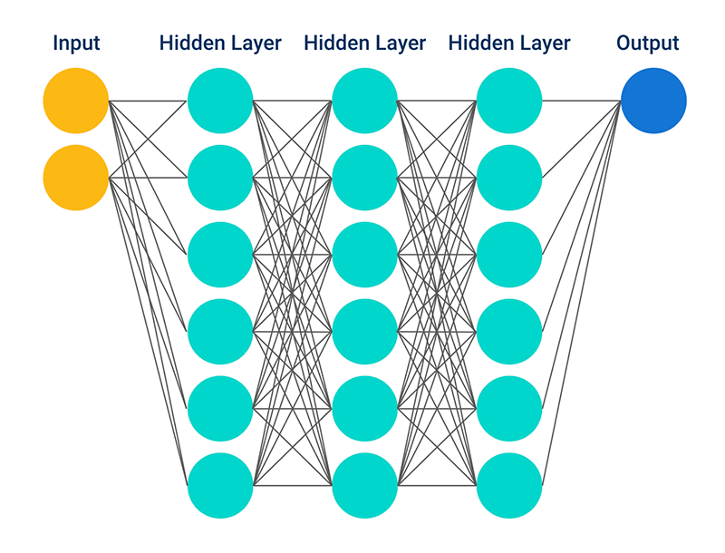

Show students the following visual representation of a neural network classification model.

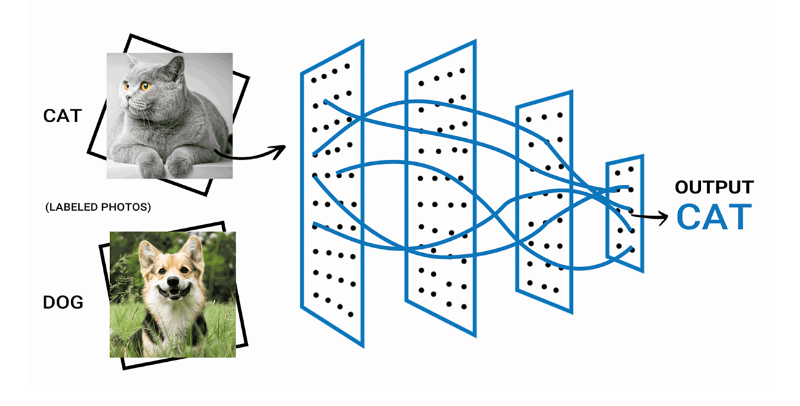

Explain that the layers of neurons are connected and weighed against one another until the neurons reach the final outer layer. The outer final layer returns a numerical or encoded categorical result.

Neural networks are very useful in AI because they serve multiple purposes. Two popular uses include the following:

* Classification algorithms that determine how to categorize an input.

* Regression models that predict a dependent output from independent input variables.

Point out that neural networks are a great alternative to many of the machine learning models we have covered in this course, such as logistic regression, Random Forest, or multiple linear regression.

* As the amount of data in the world grows, it becomes increasingly important to be able to handle large and complex datasets. Versatile neural networks can detect complex relationships in datasets that traditional statistical or machine learning models can't. Neural networks are also better equipped to handle large, noisy datasets because they can learn to ignore the noise in the data.

* However, neural networks have their share of disadvantages too. While the complexity of their algorithms makes neural networks powerful tools for data analysis, the same complexity can be beyond human understanding, resulting in what's known as a black box problem.

  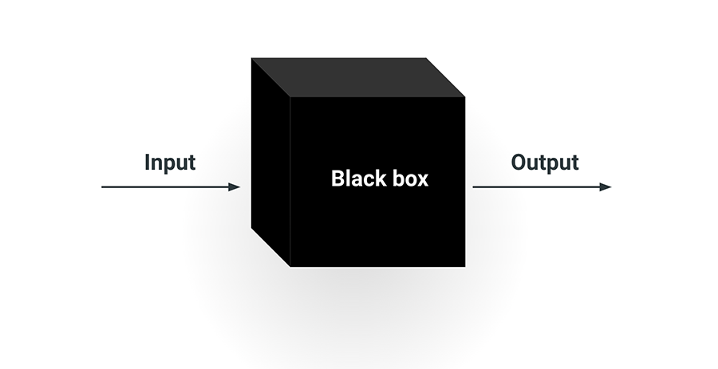

* In a black box system, the input is known and the output can be observed; however, the process to get from the input to the output is unknown. This is typically the case with systems that use neural networks and deep learning models to make predictions or decisions. When predictions are accurate and decisions make sense, this isn’t a problem. However, if a system is inaccurate or biased, it can be challenging to figure out why.

* Another disadvantage is that neural networks are prone to overfitting the training data. As you’ve learned, this means that the model might struggle to generalize data trends for datasets beyond its training data, impeding performance in predictions.

---

### 3. Students Do: Working Through the Logistics (15 min)

**Corresponding Activity:** [01-Stu_Work_Through_Logistics](Activities/01-Stu_Work_Through_Logistics/)

Continue through the slideshow, using the next slides as an accompaniment to this activity.

In this activity, students will use logistic regression to build a binary classification model, which is the precursor to neural networks. The activity guides the students through using logistic regression to categorize data from a dataset and serves as a warmup for the lesson.

---

### 4. Review: Working Through the Logistics (10 min)

**Corresponding Activity:** [01-Stu_Work_Through_Logistics](Activities/01-Stu_Work_Through_Logistics/)

Open the solution, share the file with the students, and go through the code line by line while answering any student questions. Use the following talking points to do a brief recap of the steps:

* Let's revisit the logistic regression model we worked on, examining the steps we took and understanding how each contributes to the model's success. We won’t go into too much detail because these steps are quite familiar at this stage.

* We imported the data and dependencies, and after visualizing the data, we see that the data is quite clearly linearly separable, so linear regression would be a good choice of model for this problem.

* We separated the data into features and target variables stored on `X` and `y` before splitting the data into training and testing sets.

* We initiated a logistic regression model, trained it, and used it to make predictions.

* Finally, we print the model accuracy score.

Cover the following key points during the discussion:

* Prior to this class, we have been using scikit-learn for our entire machine learning workflow. We will continue to use this library for our preprocessing needs, however, after today, we will start to incorporate other Python libraries that can help us build neural network models. Neural networks are more complex than the models we’ve learned so far, but the libraries we’ll introduce are as easy to use as scikit-learn.

Remember, logistic regression is just the beginning. As we move forward, we'll start integrating additional libraries into our machine learning toolkit, enhancing our ability to build sophisticated models like neural networks.

Now that we've seen logistic regression in action, let's pivot to a new concept: the perceptron. This is a step towards understanding the more complex structures that make up neural networks.

---

### 5. Instructor Do: Perceptron (10 min)

This section introduces students to the foundational concepts of the perceptron model. There is no coding demonstration for this section. Use the slideshow to accompany the introduction.

Reassure the students by noting that neural networks are simply multiple layers of smaller models, such as our logistic regression model.

* The original design for computational neurons (and subsequently the neural network) dates back to the 1950s, when Frank Rosenblatt created the **perceptron model**.

* The perceptron model is a single neural network unit that mimics the biological neuron by receiving input data, weighing the information, and producing a clear output.

The following image depicts the perceptron model.


Explain to the students that the perceptron model has four major components:

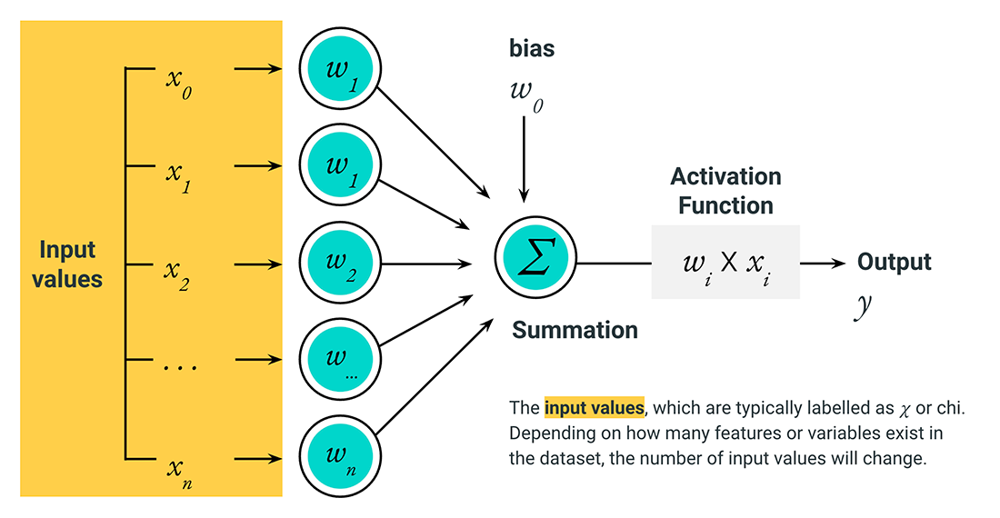

* The **input values** are typically labeled as *𝜒*, or chi (the “ch” sound is pronounced as a hard “k” and the “i” is pronounced as “eye”). The number of input values will change depending on how many features or variables exist in the dataset.


* Each input value has **weight coefficients** that help the machine learning model identify features of interest. The weight coefficients are typically labeled as $w$, or omega.

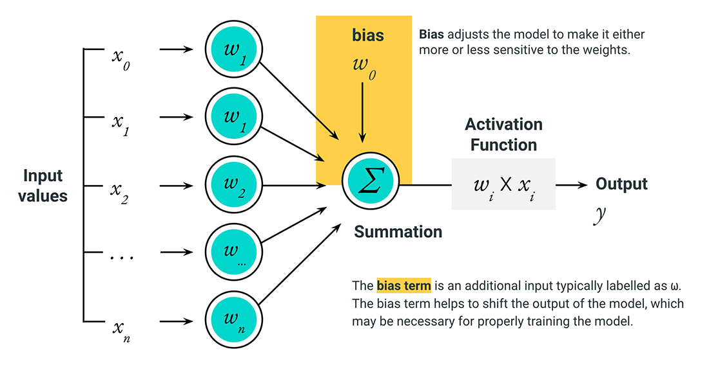

* The **bias term** is an additional input typically labeled as $w_0$. The bias term helps shift the output of the model, which may be necessary for properly training the model.

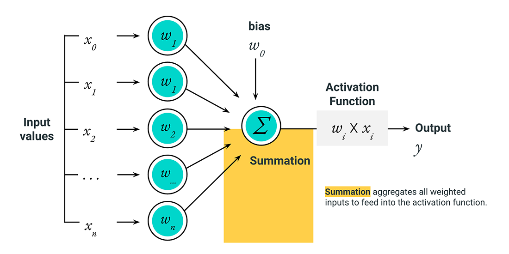

* The **activation function**: The activation function ensures that the output is useful. Useful output addresses the task at hand; outputs can take on any numerical value. We will explore some activation functions and how they transform numerical values into useful outputs in more detail when we consider larger neural networks.

    * Since we are only considering a single perceptron, we can think of the activation function as a threshold value. If the weighted sum is higher than the **threshold value**, then the output of the perceptron is 1. If the weighted sum is lower than the threshold value, then the output is 0.

Explain that a perceptron is a binary classifier, which means that it can classify the input data it receives into two parts by assigning it a numerical value of either 1 or 0. A perceptron model—also known as a **linear binary classifier**—contains a linear equation that separates data into two groups. If the data is linearly separable, the algorithm is able to classify each data point into one of the two classes.

Point out to the students that the perceptron model is a form of **supervised machine learning** because we provide the model with our input features and parameters.

The easiest way to understand the perceptron model is to go through the algorithm step by step.

Show the students the following image for our perceptron example and introduce it as a visualization of the dataset.

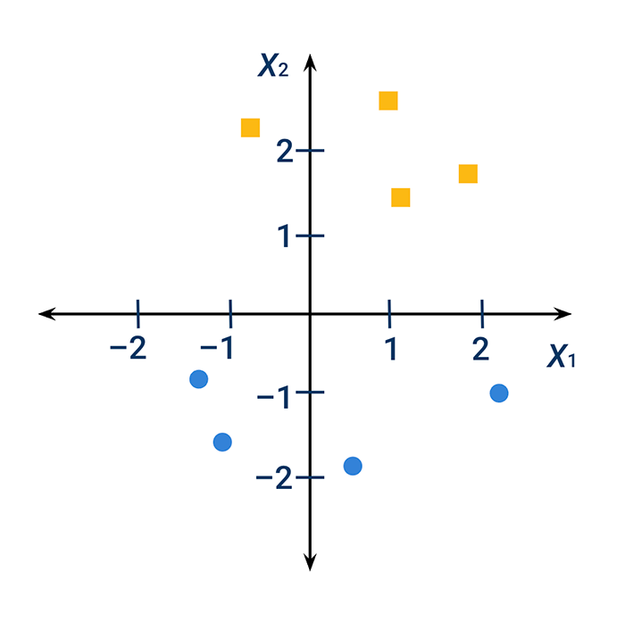

In our example, we want to generate a perceptron classification model that can distinguish between purple squares and blue circles.

Because our model will try to classify values in a two-dimensional space, our perceptron model will use three inputs:

* $x_1$: The *x* value

* $x_2$: The *y* value

* $w_0$: The bias constant

The end result of our two-dimensional perceptron model is the net sum function: $w_0 + x_1w_1 + x_2w_2$

Currently, our perceptron model is untrained, so the weights and coefficients are somewhat random (this is the case with any untrained machine learning model).

Using the slides, show students the image of an untrained perceptron model on our dataset.

Point out that the untrained model did an acceptable job of classifying the two groups, but the results are not perfect: one of the blue circles was misclassified.

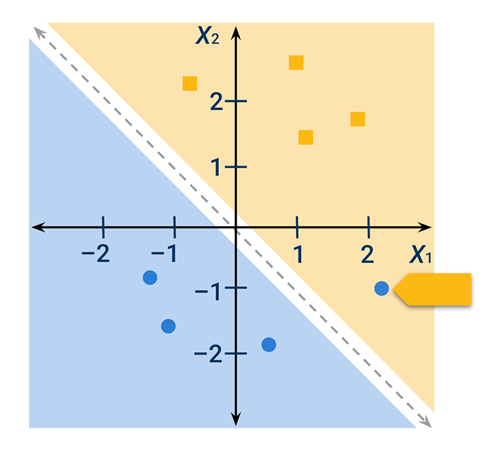

Explain that the perceptron model will evaluate each data point and determine if the input weights should change. If a data point is classified correctly, the weights will not change. If a data point is misclassified, the weights will move the model closer to the missed data point.


As with other machine learning algorithms and models, perceptron model training continues until one of three conditions is met:

* The perceptron model exceeds a predetermined performance threshold. The designer determines the threshold before model training begins. In this module, we will use accuracy and the loss function to quantify model performance. Our goal will be to minimize the loss function and maximize the accuracy.

  * For example, if we are working with noisy data that cannot be preprocessed or excluded, our model may not be able to reach a certain level of performance without overfitting. We should set a training cutoff at the point of model convergence.

* The perceptron model training comprises a set number of iterations through the entire dataset, determined by the designer before training. A full iteration of the dataset is known as an **epoch** (pronunciation varies depending on country of origin. Use [this video](https://www.youtube.com/watch?v=6qUASw244FY) as a guide). When training with vast amounts of data, each epoch consists of a number of smaller iterations (**batches**), each with only a small portion of the training data (**batch size**).

  * If we know approximately how many iterations a model needs to achieve desired performance, we can simply "set it and forget it" by having the model train over a specific interval.

* If the perceptron model stops or encounters an error during training, the cause is usually a hardware or power issue during the cleaning and preprocessing of our input data.

  * To minimize problems, we can set up our model to save itself after a specific number of training iterations and then resume training immediately.

Point out that a simple perceptron model is very similar to our basic statistical models. The power of the perceptron model comes from its ability to handle multidimensional data and to interact with other perceptron models.

* As we mesh and layer more multidimensional perceptrons, a new, more powerful classification and regression algorithm emerges: the neural network.

---

### 6. Instructor Do: Make the Connections (10 min)

Continue using the slideshow to accompany this demonstration.

This section summarizes the basic structure of a neural network, outlining how each layer connects to the next. There is no coding demonstration for this section. Use the slideshow to accompany the introduction.

Recall that at the start of the lesson, we spoke of nodes as analogous to neurons in the brain. Mention that students have now learned about the perceptron model, which mimics a single neuron. However, the power of the neural network lies in the way that individual neurons are networked together.

Show the students the following diagram of a neural network.

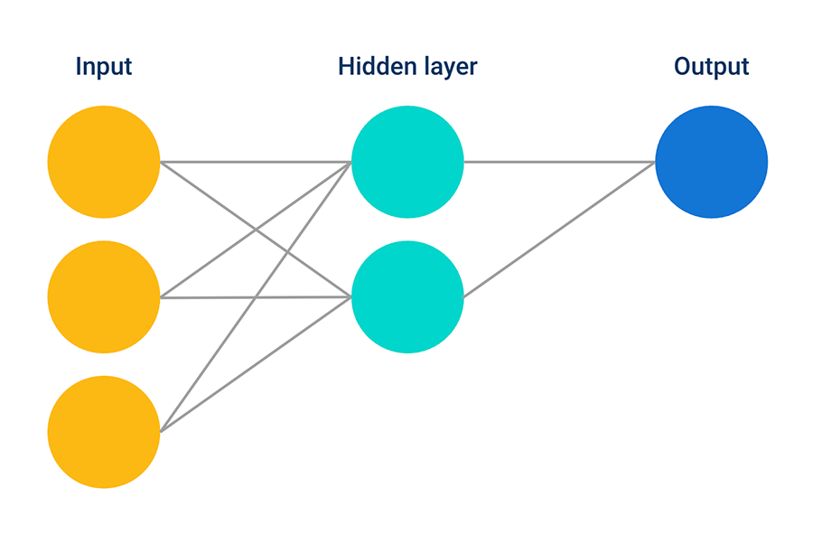

Explain that a basic neural network consists of three main layers:

1. The **input layer** receives initial data points, each modified by individual weight coefficients.

2. A **hidden layer**, which could be one or many, comprises neurons that process the weighted inputs.

3. The **output layer** presents the final classification or regression value, based on the inputs it receives.

Ask the students the following rhetorical question:

* If each neuron has its own output, how does the neural network combine each neuron's output into the model's classification or regression output?

Neural networks use an **activation function** to transform the output of each neuron to a quantitative value. The other layers in the neural network use the transformed output as an input value.

There are a variety of activation functions designed for many specific purposes. However, most neural networks will use one of the following activation functions:

* The **linear function** transforms the output into the coefficients of a linear model (the equation of a line).

* The **sigmoid function** transforms the output to a range between 0 and 1. The function creates an output with a characteristic S-curve. Recall that you were first introduced to the sigmoid function as part of the logistic regression classification model in a previous module.

  

* The **tanh function** transforms the output to a range between –1 and 1. Like the sigmoid function, it also generates a characteristic S-curve.

  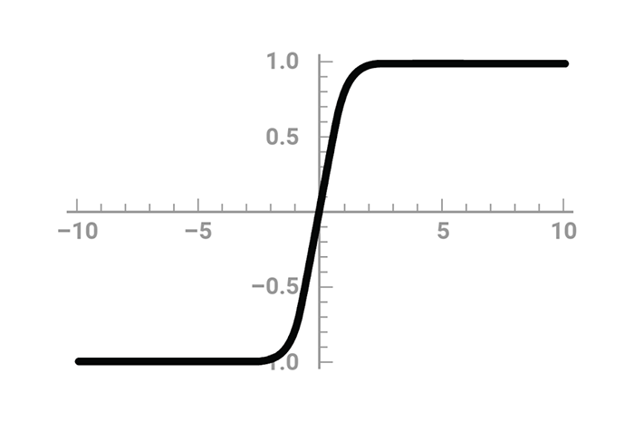

* The **rectified linear unit (ReLU) function** returns a value from 0 to infinity, so any negative input through the activation function is 0. This is the most commonly used activation function in neural networks due to its computational simplicity and effectiveness, but it might not be appropriate for simpler models.

  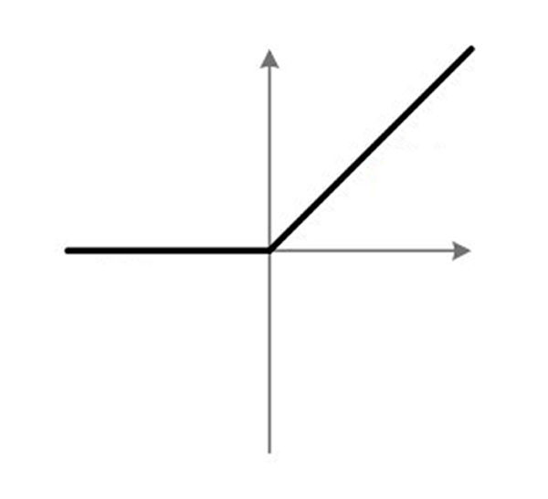

* The **leaky ReLU** function is an alternative to the ReLU function. Here, the negative input values will return very small, non-zero, negative values.

  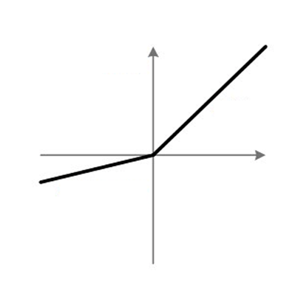

Point out that we have covered all the components of a neural network model. Now we can explore the interactions between these components.

Answer any questions before moving on.

---

### 7. Everyone Do: Playing in the TensorFlow Playground (15 min)

Use the slides to present this activity.

Explain that we will use **TensorFlow Playground** to explore all the different components of a neural network and their interactions.

Use the following talking points to introduce the demonstration:

* TensorFlow is a neural network and machine learning library for Python that has become an industry standard for developing robust neural network models. However, TensorFlow is more than just a library; it's an ecosystem for implementing machine learning and neural network models.

* The developers of TensorFlow created the Playground application as a teaching tool to "demystify the black box" of neural networks. With the TensorFlow Playground, we'll get hands-on experience with the training process.

* The Playground provides a working simulation of a neural network as it trains on a variety of different datasets and conditions. We can also use TensorFlow Playground to test different configurations of our neural network models as an abstract form of our model-fit-predict workflow.

Remind the students that, regardless of what machine learning model or technology we use, we follow the same general modeling workflow across all of machine learning:

* Decide on a model and create a model instance.

* Split the dataset into training and testing sets and preprocess the data.

* Train/fit the training data to the model.

* Evaluate the model for predictions and transformations.

Send out the link to the [TensorFlow Playground](https://playground.tensorflow.org/#activation=sigmoid&batchSize=10&dataset=gauss&regDataset=reg-plane&learningRate=0.03&regularizationRate=0&noise=0&networkShape=1&seed=0.10587&showTestData=false&discretize=true&percTrainData=50&x=true&y=true&xTimesY=false&xSquared=false&ySquared=false&cosX=false&sinX=false&cosY=false&sinY=false&collectStats=false&problem=classification&initZero=false&hideText=false&discretize_hide=true&regularization_hide=true&learningRate_hide=true&regularizationRate_hide=true&percTrainData_hide=true&showTestData_hide=true&noise_hide=true&batchSize_hide=true).

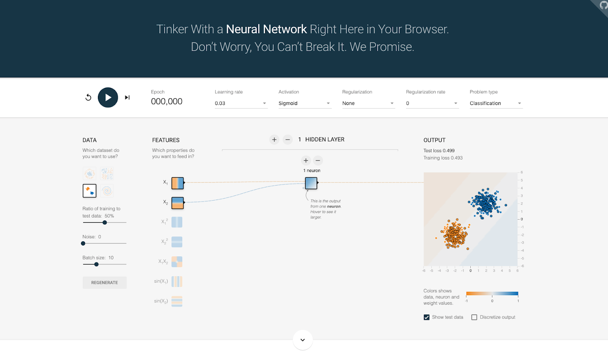

Remind students of the components of a neural network we’ve covered so far:

* Three types of layers: input, hidden, and output

* Each layer is comprised of neurons.

* The output layer uses an activation function to produce a numerical output.

Point out the following components of the playground:

* The **input data** is on the left side of the page.

  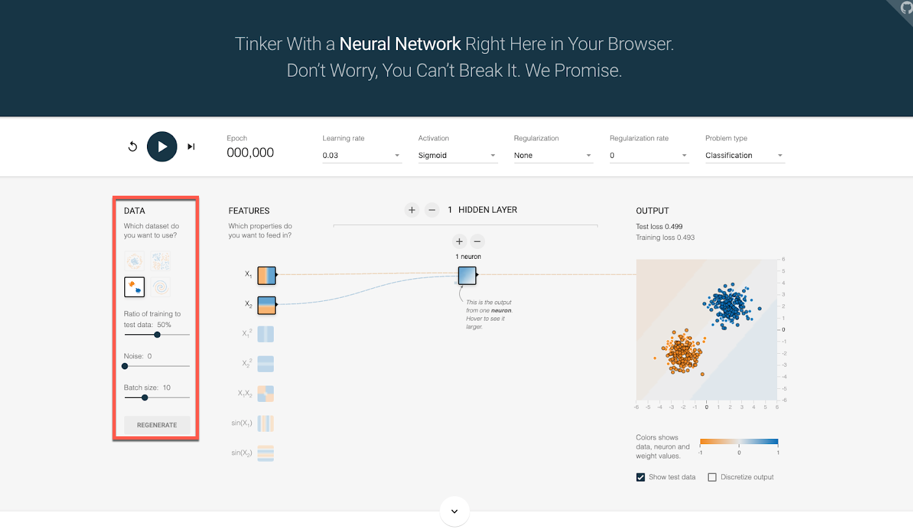

* Both the input features and input layer structure are in the "Features" section of the page. For this example, we will use *X<sub>1</sub>* and *X<sub>2</sub>* for our *x* and *y* values. We can add and subtract neurons using the plus and minus buttons above the neurons. As we add more neurons, each one is responsible for keeping track of different weights.

  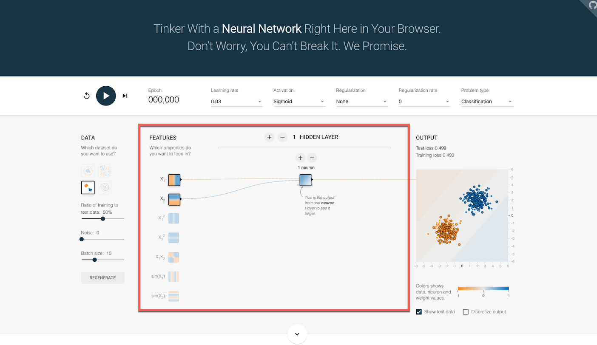

* The "Output" section of the page visualizes the output of the neural network. In TensorFlow Playground, we are most concerned about the "test loss" function: the better the model performs, the lower the test loss value.

  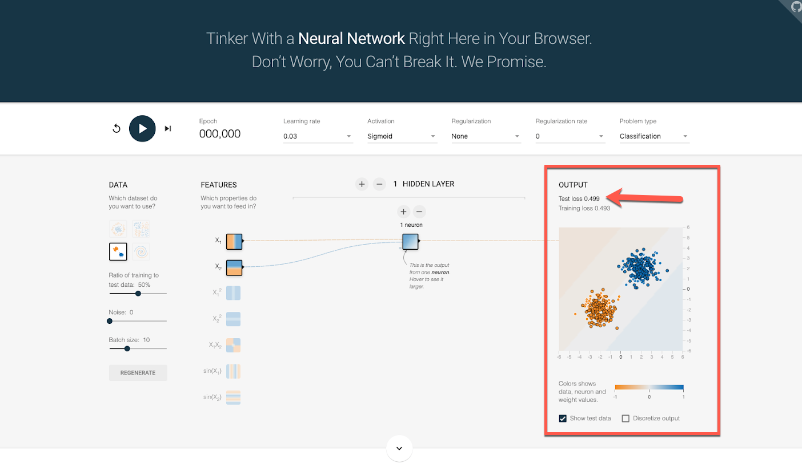

* The **simulation parameters** are near the top of the page. There are many parameters to tweak and test, such as "Learning rate," "Activation," and "Regularization." We will concentrate on the "Activation" and "Problem type" parameters.

  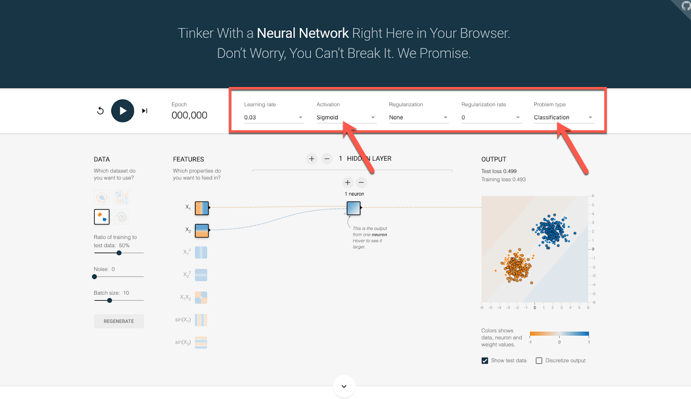

* The **simulation controls** and **epoch counter** are to the left of the simulation parameters. Each epoch is a single training iteration in TensorFlow machine-learning training. By pressing the play button, we allow the model to simulate epochs until we press stop. Encourage students to experiment with the epochs and the other hyperparameters that we haven’t covered yet in the Playground.

  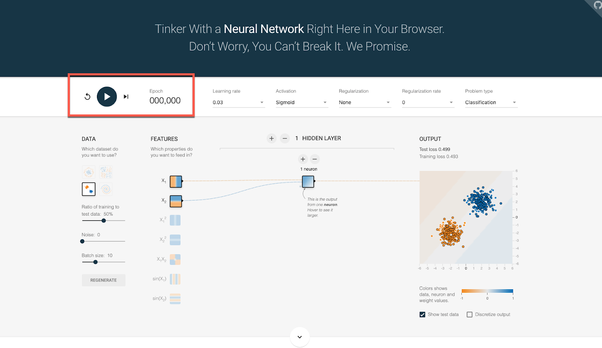

Now that you have covered the different features of the TensorFlow Playground, explain to the students that they are ready to start simulating their neural network models.

In the first simulation, we will try to classify two groups using the X<sub>1</sub> and X<sub>2</sub> features and one neuron.

* Does this example sound familiar? That's because it's our previous perceptron model!

Run the model and tell the class they should also run the model using the sigmoid function for approximately 100 epochs. Reassure students that they do not need to stop the training at exactly 100 epochs.

Point out that the model's test loss was less than 0.01, which means that the model is capable of correctly classifying both groups with high precision.

Tell the students to run their models again using a different activation function.

* Ask them if the model training worked differently this time. What were the differences?

For the next simulation, we will change our activation function from sigmoid to tanh and train the model through 100 epochs.

Run the tanh simulation through 100 epochs while the students also run the simulation.

Point out that the tanh function performs even better than the sigmoid in approximately the same number of iterations. Because tanh transforms the values between –1 and 1, the changes are more dramatic than with sigmoid.

For the final classification simulation, we'll add two more neurons for a total of three neurons in the hidden layer.

Ask the students to think about what will happen to our model training as we add more neurons to the model. Will training get faster? Will our model be more accurate?

Run the multi-neuron model until the test loss metric reaches 0.001. Instruct the class to also run the model and ask them to guess how many epochs it will take.

By adding two more neurons while using the tanh function, we can more easily identify the characteristics of the dataset. In this case, we were able to achieve the same model performance as our single neuron model in roughly 33 epochs.

**Time permitting:** Give students an additional 5–10 minutes of free time to explore the functionality of the TensorFlow Playground and see what happens when they tweak different parameters.

Answer any questions before moving on.

---

### 8. Instructor Do: Understanding the TensorFlow Neural Network Structure (10 min)

**Corresponding Activity:** [02-Ins_Work_Through_NN](Activities/02-Ins_Work_Through_NN/)

Before we head into our break, let's take a high-level look at the TensorFlow structure we'll be using. Open the Colab solution file as we briefly outline the code you'll write together post-break.  Explain that there are several smaller modules in the TensorFlow 2.0 library that make it even easier to build machine learning models.

Point out that we'll use the Keras module to help build our neural networks. Mention that:

* The Keras module is part of the TensorFlow library, and it contains classes and objects that we can combine to design a variety of neural network types.

* These classes are order-dependent, which means that the behavior of the neural network model will change depending on what Keras objects are used (and in what order).

Explain that creating a neural network will require us to think about components we didn’t consider with earlier ML models. We will have to consider that each of the layers must connect to the next. Each layer must also contain neurons. We will use two Keras classes for the basic neural network:

* The **Sequential class** is a linear stack of neural network layers where data flows from one layer to the next. We simulated the Sequential class in the TensorFlow Playground. In the code notebook, we call the `Sequential()` class in the “model” phase of the model-fit-predict process. Using the Sequential model allows us to add multiple Dense layers that will act as our input, hidden, and output layers.

* Although we have created an instance of the model, we still have not yet built the model by adding layers. The generalized **Dense class** allows us to add layers within the neural network.

* For each Dense layer, we'll define the number of neurons and activation functions. Explain that the Keras module simplifies the process of building our layers by combining the input layer with the first hidden layer.

    * **Question:** During which part of the model-fit-predict process would you use the `Sequential()` and `Dense()` modules?

    * **Answer:** During the model part of the process. We use these modules to configure our desired structure for the neural network model.

* After we have completed the Sequential model design, we will apply the same scikit-learn model -> fit -> predict/transform workflow that we used previously.

Let's take a quick break. Afterward, we'll dive right into coding with TensorFlow to build our neural network.

---

### 9. BREAK (15 min)

---

### 10. Everyone Do: Work Through a Neural Network Workflow (20 min)

**Corresponding Activity:** [02-Ins_Work_Through_NN](Activities/02-Ins_Work_Through_NN/)

Welcome the students back. Now, we'll take our understanding of TensorFlow and apply it hands-on. Using the same activity folder as the previous section, open the Unsolved notebook in Colab and send it out to students. As you progress, be sure to distribute the code blocks to students so that they can code alongside your example.

Use the following talking points to guide students through the code:

* We will work together to build our first neural network model in TensorFlow. Note that within our basic neural network model, we will use some new parameters and steps.

* We will review each step in detail throughout the week. By the end of the unit, you will feel comfortable implementing and tweaking the neural network models on your own.

* As always, the first step in implementing a basic neural network is to import our dependencies. The only new addition here is that we have imported `tensorflow`.

    ```python
    # Import our dependencies
    import pandas as pd
    from sklearn.model_selection import train_test_split
    from sklearn.preprocessing import StandardScaler
    import tensorflow as tf
    ```

* The next step is to import our data. In this case, we're importing 1,000 samples with two features that are linearly separable. This means we can plot the data to visualize the linear separability.

    ```python
    # Import the sample data
    df = pd.read_csv("https://static.bc-edx.com/ai/ail-v-1-0/m18/lesson_1/datasets/sample-data-1000.csv")

    # Plot the sample data
    df.plot.scatter(x="Feature 1", y="Feature 2", c="Target", colormap="winter")
    ```

    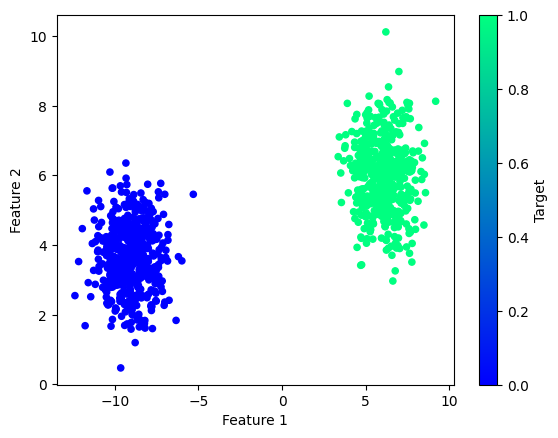

* The next step is to set the `X` and `y` variables and then to separate our dataset into training and test datasets using scikit-learn's `train_test_split` method.

    ```python
    # Separate the X and y
    X = df.drop(columns="Target")
    y = df["Target"]

    # Use sklearn to split dataset
    X_train, X_test, y_train, y_test = train_test_split(X, y, random_state=78)
    ```

Once we have the training data, we need to prepare the dataset for our neural network model. Point out that just like we did in our earlier machine learning algorithms, we must normalize or standardize our numerical variables. This will ensure that our neural network does not focus on outliers and can apply proper weights to each input.

A stable neural network model does a better job of generalizing. In most cases, the more we can normalize input variables to the same scale, the more stable the neural network model will be.

Run the following code block that normalizes our data:

```python
# Create scaler instance
X_scaler = StandardScaler()

# Fit the scaler
X_scaler.fit(X_train)

# Scale the data
X_train_scaled = X_scaler.transform(X_train)
X_test_scaled = X_scaler.transform(X_test)
```

Now that our dataset is preprocessed, we are ready to build the neural network in Python. To create the neural network in our notebook, run the following code block to create the Sequential model:

```python
# Create the Keras Sequential model
nn_model = tf.keras.models.Sequential()
```

Point out that the `nn_model` object will store the entire architecture of our neural network model. Next, we must add our layers to the Sequential model.


Explain that the Keras module simplifies the process of building our layers by combining the input layer with the first hidden layer. All we need to concentrate on are three parameters:

* The `units` parameter indicates how many neurons we want in the hidden layer. For our first neural network, we will use five.

* The `activation` parameter indicates which activation function to use. We’ll use the ReLU activation function to allow our hidden layer to identify and train on nonlinear relationships in the dataset.

* The `input_dim` parameter indicates how many inputs will be in the model. Since we want the inputs to be the number of features in our model, we create a variable `input_nodes` that stores the number of columns in `X`. We then use that variable to set the `input_dim` parameter.

    ```python
    # Set input nodes to the number of features
    input_nodes = len(X.columns)

    # Add our first Dense layer, including the input layer
    nn_model.add(tf.keras.layers.Dense(units=5, activation="relu", input_dim=input_nodes))
    ```

* Our next step is to add the output layer. Because we are trying to build a neural network classification model, we want the sigmoid activation function to produce a probability output.

    ```python
    # Add the output layer that uses a probability activation function
    nn_model.add(tf.keras.layers.Dense(units=1, activation="sigmoid"))
    ```

    * **Question:** How many neurons are in our output layer?

    * **Answer:** One, as indicated by `units=1`.

Explain that if we attempted to include more than one neuron in our output layer, our model would fail to function. This is because we are only attempting to predict one column; i.e., our `y` is a single column.

Point out that there are different types of situations where we would have multiple output columns to predict in a more complex neural network, and therefore need more than one neuron in the output layer. For example:

* Multi-class classification problems: Unlike in the supervised learning models we explored previously, a neural network model sees the target column not as “Class A” or “Class B”, but instead “Class A” or “Not Class A”. The binary is an on/off switch! This means we would need to use OneHotEncoding on our target column, and use each of the resulting columns as our output or target variable `Y`.

* In a recommendation system, we may want to make predictions to suggest multiple products or movies a user might be interested in. Note that so far we have assumed mutual exclusivity; that is that one and only one class is correct for every row. This is the case for determining, for instance, whether the stoplight in a picture is green, yellow, or red. For recommendation systems, that won’t be the case. We may want to recommend multiple movies all at once!

* Now that we have added our layers to the Sequential model, we can double-check our model structure using the summary method. Try running the following code in your notebook:

    ```python
    # Check the structure of the Sequential model
    nn_model.summary()
    ```

    ```text
    Model: "sequential"
    _________________________________________________________________
     Layer (type)                Output Shape              Param #   
    =================================================================
     dense (Dense)               (None, 5)                 15        
                                                                 
     dense_1 (Dense)             (None, 1)                 6         
                                                                 
    =================================================================
    Total params: 21 (84.00 Byte)
    Trainable params: 21 (84.00 Byte)
    Non-trainable params: 0 (0.00 Byte)
    _________________________________________________________________
    ```

We’ve now set up the architecture for the model. However, it has not yet been “built”. We’ve merely laid out the blueprint for how it should look when it is built or **compiled**. The next step is to compile and train the model. Depending on the function of the neural network, we will need to compile and train the neural network model with a specific loss metric, optimization function, and evaluation metric. We will use these to gauge the model’s performance.

Reassure the students that TensorFlow and Keras have many parameters to tweak the performance, but most basic classification and regression models use the same parameters.

* In general, when we make a classification neural network, we will always use a `binary_crossentropy` loss. For all of our models, we will always use the `adam` optimizer.

  We use the `metrics` parameter to print a performance metric at the end of each epoch. This lets us judge how well the model is doing during training.

  **Note:** Tell the students that understanding `binary_crossentropy` loss and the `adam` optimizer are outside the scope of this class.

Run the following code block that compiles and trains the basic neural network model.

```python
# Compile the Sequential model together and customize metrics
nn_model.compile(loss="binary_crossentropy", optimizer="adam", metrics=["accuracy"])

# Fit the model to the training data
fit_model = nn_model.fit(X_train_scaled, y_train, epochs=100)
```

Point out that we now have a trained neural network model, but we need to test the performance of our neural network to ensure that it doesn't need retraining.

Run the following code block that visualizes the model's training loss over 100 epochs. This means we have run the model 100 times and then visualized its performance using the following code:

```python
# Create a DataFrame containing training history
history_df = pd.DataFrame(fit_model.history)

# Increase the index by 1 to match the number of epochs
history_df.index += 1

# Plot the loss
history_df.plot(y="loss")
```

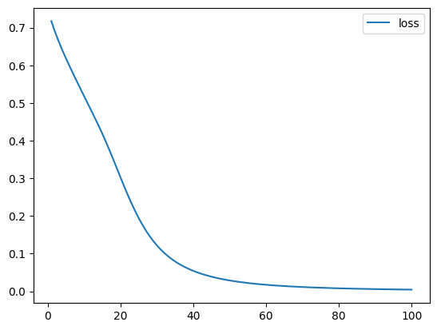

Run the following code block that visualizes the model's predictive accuracy over the same timeframe:

```python
# Plot the accuracy
history_df.plot(y="accuracy")
```

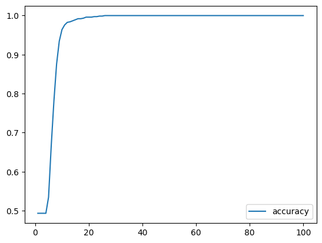

* **Question:** What happens to loss as the epochs progress? What about accuracy?

* **Answer:** As the 100 epochs run, the loss decreases. At the same time, the accuracy increases as the epochs progress.

We have now modeled and trained our neural network. The final step of our neural network workflow is to evaluate the performance of the trained model against the test dataset. For our neural network to be useful as a classification model, it should have a predictive accuracy close to 100%, or 1.0.

Run the following code that evaluates the test loss and predictive accuracy of the model on our testing dataset:

```python
# Evaluate the model using the test data
model_loss, model_accuracy = nn_model.evaluate(X_test_scaled, y_test, verbose=2)
print(f"Loss: {model_loss}, Accuracy: {model_accuracy}")
```

```text
8/8 - 0s - loss: 0.0035 - accuracy: 1.0000 - 165ms/epoch - 21ms/step
Loss: 0.0035116749349981546, Accuracy: 1.0
```

* We can observe that our trained basic neural network classified every test datapoint correctly. Although perfect performance is ideal, our models may not be able to achieve 100% accuracy with more complex datasets.

Explain that we must establish model performance thresholds before designing a machine learning model. Depending on the type of data and the use case, we may need to recreate and retrain a model using different parameters, use different training/test data, or use a completely different model.

Answer any questions before moving on.

---

### 11. Students Do: BYONNM—Build Your Own Neural Network Model (20 min)

**Corresponding Activity:** [03-Stu_BYONNM](Activities/03-Stu_BYONNM/)

In this activity, students will implement and evaluate their own basic classification neural network model using the TensorFlow Keras module. In addition, they will split the data into training and test sets, and normalize the data using scikit-learn.

---

### 12. Review: BYONNM—Build Your Own Neural Network Model (10 min)

**Corresponding Activity:** [03-Stu_BYONNM](Activities/03-Stu_BYONNM/)

Open the Solved notebook in Colab and use the following talking points to review the activity:

* Review the visualization.

  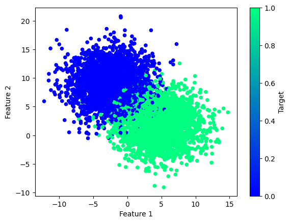

  * **Question:** What do you notice about the visualization of the data in this problem? Hint: Remember that at this stage, we are dealing with a binary classification problem. We want the model to classify each point as either blue or green.

  * **Answer:** There is considerable overlap between the data points. It does not appear to be as clearly linearly separable as the previous examples in the lesson.

* After our data is prepared, we need to set up a basic neural network that meets the following criteria:

    * Two inputs (i.e. the number of features in the dataset)

    * Five neurons in the hidden layer

    * One classification output comes from the output layer.

    ```python
    # Create the Keras Sequential model
    nn_model = tf.keras.models.Sequential()

    # Set input nodes to the number of features
    input_nodes = len(X.columns)

    # Add our first Dense layer, including the input layer
    nn_model.add(tf.keras.layers.Dense(units=5, activation="relu", input_dim=input_nodes))

    # Add the output layer that uses a probability activation function
    nn_model.add(tf.keras.layers.Dense(units=1, activation="sigmoid"))
    ```

* Next, we must compile the model and customize the metrics.

    ```python
    # Compile the Sequential model together and customize metrics
    nn_model.compile(loss="binary_crossentropy", optimizer="adam", metrics=["accuracy"])
    ```

* We are now ready to fit the model to the training data. We have to run it over 50 epochs.

    ```python
    # Fit the model to the training data
    fit_model = nn_model.fit(X_train_scaled, y_train, epochs=50)
    ```

* Finally, we will evaluate the model’s performance first numerically and then graphically.

    ```python
    # Evaluate the model using the test data
    model_loss, model_accuracy = nn_model.evaluate(X_test_scaled, y_test, verbose=2)
    print(f"Loss: {model_loss}, Accuracy: {model_accuracy}")
    ```

    ```text
    40/40 - 0s - loss: 0.1228 - accuracy: 0.9520 - 201ms/epoch - 5ms/step
    Loss: 0.1228090301156044, Accuracy: 0.9520000219345093
    ```

    ```python
    # Create a DataFrame containing training history
    history_df = pd.DataFrame(fit_model.history, index=range(1,len(fit_model.history["loss"])+1))

    # Plot the accuracy
    history_df.plot(y="accuracy")
    ```

    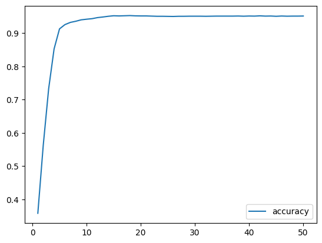

  * **Question:** The previous demonstrations we worked through had an accuracy of 1 or 100%. Did this model achieve the same accuracy?

  * **Answer:** No. The accuracy was 0.9520000219345093.

  * **Question:** Would it have been reasonable to expect 100% accuracy from this model?

  * **Answer:** No. When we visualized the data, we noted that there was quite an overlap between some of the data points. This means that no matter how many neurons we provide in the model, the neural network will never be able to achieve 100% classification since some data points are indistinguishable by only *x* and *y* coordinates.

  * **Question:** Is there anything we could consider changing to try and improve the accuracy?

  * **Answer:** Since some points in the overlap are indistinguishable by only x and y coordinates, we might consider adding more features to inform the learning process of the model.

Answer any questions before moving on.

---

### 13. Instructor Do: Training Real World Data Comparison (20 min)

**Corresponding Activity:** [04-Ins_Training_Real_Data](Activities/04-Ins_Training_Real_Data/)

In this demo, we will use real-world data that classifies sounds as either nasal or oral. Note that the dataset source indicates the binary classes as nasal (class 0) or oral (class 1), however, the dataset actually classifies them as class 1 and 2. This will cause issues for our neural network, which will be part of the demonstration, and is why there are two solution notebooks in the Solved folder. Ensure that you use them in the correct order.

Open the `compare_training_real_data_solution.ipynb` notebook and go through each code block using the following talking points to guide the discussion:

* Let's see how neural networks perform with real-world data, especially when the results may not be as expected.

* In this activity, we will work with a dataset of speech sounds. We will aim to classify the sounds as either nasal (class 0) or oral (class 1).

* We will begin by using `Sequential()` to build out a neural network, and we will then redo the classification problem using a Random Forest model, which we explored earlier with supervised learning.

* Pose the following question to the students. Do not give the answer yet. The question is meant to get them thinking about the activity.

    * **Question:** When we compare the performance of the neural network to the Random Forest, which do you expect will perform better?

    * **Answer:** We will see as we complete the activity.

* We notice that the DataFrame contains five features and one target column. So, we drop the label to create the `X` data. Then we split the data into training and testing sets.

* Next, we must create the architecture for the Sequential model underpinning our neural network. We will specify 5 neurons in the hidden layer and set the `input_dim` equal to the number of features in our dataset. The hidden layer will use the ReLU activation function, while the output layer will consist of one neuron and use a sigmoid activation function to classify the data as class 0 or 1.

    ```python
    # Create the Keras Sequential model
    nn_model = tf.keras.models.Sequential()

    # Set input nodes to the number of features
    input_nodes = len(X.columns)

    # Add our first Dense layer, including the input layer
    nn_model.add(tf.keras.layers.Dense(units=5, activation="relu", input_dim=input_nodes))

    # Add the output layer that uses a probability activation function
    nn_model.add(tf.keras.layers.Dense(units=1, activation="sigmoid"))

    # Check the structure of the Sequential model
    nn_model.summary()
    ```

* Next, we compile the model and customize our metrics to include `binary_crossentropy` as a loss function, `adam` as the optimizer, and `accuracy` as the metric. Then we can fit the model and set it to run for 100 epochs.

    ```python
    # Compile the Sequential model together and customize metrics
    nn_model.compile(loss="binary_crossentropy", optimizer="adam", metrics=["accuracy"])

    # Fit the model to the training data
    fit_model = nn_model.fit(X_train, y_train, epochs=100)
    ```

* Let’s visualize the training history:

    ```python
    # Create a DataFrame containing training history
    history_df = pd.DataFrame(fit_model.history)

    # Increase the index by 1 to match the number of epochs
    history_df.index += 1

    # Plot the loss
    history_df.plot(y="loss")
    ```

    

    ```python
    # Plot the accuracy
    history_df.plot(y="accuracy")
    ```

    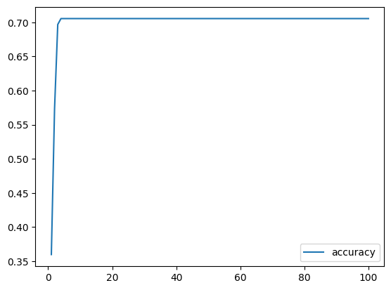

* Point out that we will now evaluate the model using the test data:

    ```python
    # Evaluate the model using the test data
    model_loss, model_accuracy = nn_model.evaluate(X_test, y_test, verbose=2)
    print(f"Loss: {model_loss}, Accuracy: {model_accuracy}")
    ```

    ```text
    43/43 - 0s - loss: -3.3864e+02 - accuracy: 0.7098 - 212ms/epoch - 5ms/step
    Loss: -338.6400451660156, Accuracy: 0.7098445892333984
    ```

* Note that the accuracy score is 0.7.

* Finally, we are ready to make predictions based on the test data set.

    ```python
    # Make predictions
    predictions = nn_model.predict(X_test,verbose=2)
    predictions
    ```

* Point out that the output's values are floating point values that are close to but not exactly 1. Since this is a binary classification problem, we want the outputs to be 0 or 1, so we do the following to round each prediction:

    ```python
    # Round predictions
    predictions_rounded = [round(prediction[0],0) for prediction in predictions]
    predictions_rounded
    ```

* When we explored ML optimization, we learned that another tool we can use to evaluate predictions made by a classification model is the classification report. To generate this report, you must import `classification_report` from `sklearn.metrics`. The report outputs a table of values which can be very useful.

    ```python
    # Check the classification report
    from sklearn.metrics import classification_report
    print(classification_report(y_test, predictions_rounded))
    ```

    ```text
                      precision    recall  f1-score   support

               1       0.71      1.00      0.83       959
               2       0.00      0.00      0.00       392
    
        accuracy                           0.71      1351
       macro avg       0.35      0.50      0.42      1351
    weighted avg       0.50      0.71      0.59      1351
    ```

    * Ask the students what observations they can make from the classification report.

    * Attention should be given to class 2: note that our neural network was unable to identify anything for this class, because our classes were not the binary classes 0 and 1, but rather 1 and 2. We will need to go back to our preprocessing to fix this problem, which we will do shortly to see if it improves our model.

    * Point out that this issue with class 2 reinforces the point that we established earlier: that our binary classifications need to be class 0 or class 1, and for multiclass classification problems, each possible classification needs a separate target column.

* Here we can also see that the accuracy score 0.71 resulted solely from correctly predicting all of the majority class 1 and none of the minority class 2. This wouldn't be a very useful model, but we will see shortly if fixing our input data improves this model evaluation.

* Before we fix the dataset, let's return to the question of whether a neural network or a Random Forest model would perform better on this problem. To answer this question, let's model-fit-predict a Random Forest model and then compare its classification report to the neural network’s classification report.

    ```python
    # Compare with random forest model
    from sklearn.ensemble import RandomForestClassifier

    # Create the random forest classifier model
    # with n_estimators=128 and random_state=1
    rf_model = RandomForestClassifier(n_estimators=128, random_state=1)

    # Fit the model to the training data
    rf_model.fit(X_train, y_train)

    # Validate the model by checking its accuracy with the model.score
    print(f"Training Data Score: {rf_model.score(X_train, y_train)}")
    print(f"Testing Data Score: {rf_model.score(X_test, y_test)}")
    ```

    ```text
    Training Data Score: 1.0
    Testing Data Score: 0.9052553663952627
    ```

* The testing data score is already 0.91 (rounded to two decimal places) compared to the neural network’s score of 0.7. Now let’s make some predictions using the Random Forest model and then display the classification report.

    ```python
    # Make predictions and produce the classification report for the random forest model
    predictions = rf_model.predict(X_test)
    print(classification_report(y_test, predictions))
    ```

    ```text
                  precision    recall  f1-score   support

               1       0.94      0.92      0.93       959
               2       0.82      0.86      0.84       392

        accuracy                           0.91      1351
       macro avg       0.88      0.89      0.89      1351
    weighted avg       0.91      0.91      0.91      1351
    ```

* Point out that, unlike the neural network, the Random Forest model is able to classify both of our classes regardless of the numbers used to identify them. Here we can observe from the recall column that our Random Forest model is able to accurately identify 86% of the minority class 2.

* Before we answer the question of which model performs better with this dataset, open the second solution file `comparison_with_binary_classes_solution.ipynb` and quickly re-run the code, pointing out that we fix the binary class issue during preprocessing.

* Draw students' attention to the updated classification report:

    ```text
                  precision    recall  f1-score   support

               0       0.68      0.66      0.67       392
               1       0.86      0.88      0.87       959

        accuracy                           0.81      1351
       macro avg       0.77      0.77      0.77      1351
    weighted avg       0.81      0.81      0.81      1351
    ```

    * Remind students that class 0 was previously class 2. Here we can observe that the neural network makes better predictions when the classes are correctly labeled as binary. However, this model is still only able to accurately identify 66% of the minority class.

    * Also point out that although the overall accuracy is improved at 0.81, it is still 0.1 lower than our Random Forest model, which achieved a 0.9 accuracy score.

* So, the answer to our earlier question is that the Random Forest model performs better as a classification model for this sound classification problem. This may seem counterintuitive since we typically think of the neural network as the more sophisticated model. However, it demonstrates two things:

    * The more complex model is not always the best choice. It is up to the developer to evaluate the performance of each model type and make a design choice about which model to use.

    * Some models require more fine-tuning than others. The neural network is one such model, and the next lesson will introduce some ways to improve model performance for neural networks.

---

### 14. Instructor Do: End Class (5 min)

Open the recap slide in the slide deck and let students know that they have reached the end of the lesson.

Congratulate the students for building the first of many neural network applications.

So far, we have only covered the basic capabilities of neural network models.

Read through the learning objectives on the recap slide to sum up what students have achieved in this lesson.

Use the following questions to prompt learners to reflect on their learning:

* How has your understanding of neural networks changed or evolved today?

* What is one thing that you are eager to learn more about or are wondering about?

Use these points as a guide to summarize the next lesson:

* In our next class, we will examine more complex nonlinear datasets and learn how to make more robust models to handle these datasets.

* You will advance your knowledge of neural networks to include deep learning models. If you’ve ever wondered how your YouTube, Spotify, Netflix, or TikTok recommendation algorithm can so accurately predict what you want to see, you will have already admired a deep learning model at work.

* You will be introduced to some optimization and tuning techniques, both of which will help you get better performance out of the models you build.

* You will also learn to preprocess real-world data for use in a neural network model.

Let the students know that for this week's Challenge, they will be building a neural network model to predict whether or not student loans will be repaid.

Invite students to further explore the TensorFlow Playground for a visual understanding of neural networks and to see how model performance changes with different data complexities.

Answer any remaining questions before ending class.

---

© 2023 edX Boot Camps LLC. Confidential and Proprietary. All Rights Reserved.
