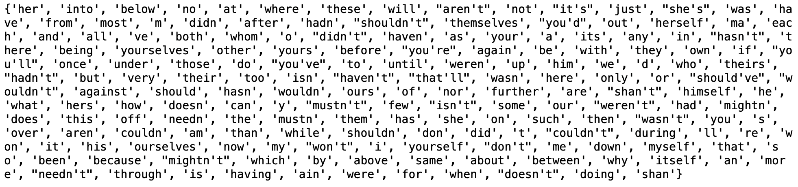

## Module 20.1: Introduction to Natural Language Processing

### Overview

In this lesson, students will be introduced to natural language processing (NLP), an exciting area of machine learning (ML), large language models, and transformers. Today's class will delve into the fundamental concepts of NLP, providing students with a comprehensive understanding of how to prepare text data for NLP tasks. They will be introduced to key aspects of preprocessing such as tokenization, dealing with stopwords, stemming, lemmatization, and the importance of word frequency. Acquiring these skills is essential to effectively harness the power of NLP in analyzing and extracting meaningful insights from text data. By the end of this lesson, students will possess the foundational knowledge and skills to perform basic NLP tasks and prepare them for advanced concepts in NLP.

### Class Objectives

By the end of today's class, the students will be able to:

* Define NLP and implement its workflow.
* Demonstrate how to tokenize text
* Proficiently preprocess text, including tokenization and punctuation handling, for analysis.
* Manage and process punctuation marks and other non-alphabetic characters.
* Differentiate between stemming and lemmatization.
* Understand the importance of removing stopwords.
* Understand and demonstrate how to count tokens and n-grams.


---

### Instructor Notes

Throughout this week, students will dive into NLP. Have the students check to make sure they have `nltk` installed for the NLP material.

There is plenty of jargon in NLP. While we try to explain things in plain English as often as possible, some terms, such as **token** or **corpus** are inescapable. To help students remember and differentiate these terms, consider writing unfamiliar terms on a whiteboard for easy reference.

Each step in this lesson ties into the next, and every section is critical for students to learn before they can implement the full NLP workflow. Pause and ask for questions often.

Students may expect to start by doing cool things like text classification or text generation, and that's OK&mdash;these are coming in the next couple of lessons! However, it's good to remind them that preprocessing text, like any other kind of data, is critical to preventing the "garbage in, garbage out" phenomenon of which they have learned in previous modules.


---

### Class Slides

The slides for this lesson can be viewed on Google Drive here: [Model 20.1 Slides](https://docs.google.com/presentation/d/137xCDGG8nGDdSW1r6UY6ADduyDaIbK8ZB7w6On7C-eI/edit?usp=sharing).

To add the slides to the student-facing repository, download the slides as a PDF by navigating to File, selecting "Download as," and then choosing "PDF document." Then, add the PDF file to your class repository along with other necessary files. You can view instructions for this [here](https://docs.google.com/document/d/1XM90c4s9XjwZHjdUlwEMcv2iXcO_yRGx5p2iLZ3BGNI/edit).

**Note:** Editing access is not available for this document. If you wish to modify the slides, create a copy by navigating to File and selecting "Make a copy...".

---

### Time Tracker

| Start Time | Number | Activity                                           | Duration |
| ---------- | ------ | -------------------------------------------------- | -------- |
| 6:30 PM    | 1      | Instructor Do: Introduction to the Class           | 0:05     |
| 6:35 PM    | 2      | Instructor Do: Introduction to NLP                 | 0:15     |
| 6:50 PM    | 3      | Instructor Do: Tokenization                        | 0:10     |
| 7:00 PM    | 4      | Student Do: Tokenizing Reuters                     | 0:15     |
| 7:15 PM    | 5      | Review: Tokenizing Reuters                         | 0:10     |
| 7:25 PM    | 6      | Instructor Do: Stopwords                           | 0:15     |
| 7:40 PM    | 7      | Student Do: Crude Oil Stopwords                    | 0:15     |
| 7:55 PM    | 8      | Review: Crude Oil Stopwords                        | 0:10     |
| 8:05 PM    | 9      | BREAK                                              | 0:15     |
| 8:20 PM    | 10     | Instructor Do: Stemming and Lemmatization          | 0:15     |
| 8:35 PM    | 11     | Student Do: Stemming and Lemmatization of Moby Dick | 0:15     |
| 8:50 PM    | 12     | Review: Stemming and Lemmatization of Moby Dick    | 0:05     |
| 8:55 PM    | 13     | Instructor Do: N-gram Counter                      | 0:10     |
| 9:05 PM    | 14     | Student Do: Word and Bigram Corpus Counter         | 0:15     |
| 9:20 PM    | 15     | Review: Word and Bigram Corpus Counter             | 0:05     |
| 9:25 PM    | 16     | End Class                                          | 0:05     |
| 9:30 PM    |        | END                                                |          |


---

### 1. Instructor Do: Introduction to the Class (5 min)


Open the slideshow and welcome the class.

Cover the following points:

Welcome the students and explain that in today’s lesson they will be learning how to preprocess text through tokenization, removing stopwords, stemming, lemmatization, and determining how frequent words and groups of words appear in text.

By the end of the lesson, students will be able to:
* Define NLP and implement its workflow.
* Demonstrate how to tokenize text.
* Proficiently preprocess text, including tokenization and punctuation handling, for analysis.
* Manage and process punctuation marks and other non-alphabetic characters.
* Differentiate between stemming and lemmatization.
* Understand the importance of removing stopwords.
* Understand and demonstrate how to count tokens and n-grams.

With that introduction, let's dive deeper into the fascinating world of NLP.

---

### 2. Instructor Do: Introduction to NLP (15 min)

This section introduces students to natural language processing (NLP). There is no coding demonstration in this section. Use the following talking points to guide the introduction:

* If you’ve ever typed a term into a search engine to find out more about it, had your computer summarize a body of text for you, or used a voice assistant, your task was made possible in some way by NLP.

* NLP is able to make sense of vague phrases, perform opinion mining, and perform speech tagging and recognition.

* When we start working with NLP, we have to take a step back and think about what is happening in the background of computer processes that we take for granted, such as simple internet searches or asking your voice assistant what the weather's like today.

* The languages that people use to interact and communicate with each other are referred to as natural languages. So, the way I am speaking to you right now is natural language.

* But since computers are machines that make use of numerical representations to perform tasks, they don’t have an inherent ability to "understand" natural language.

* You may say that computers can define words and this is true. But computers would use dictionaries to store what words mean and feed them back to you in a look-up fashion. The internal representation of the words does not exactly constitute an understanding of the language.

* So, what does "understanding" language mean, then? Well, if a computer can encounter a word or string of words in an article or social media post, would the computer be able to interpret its meaning *in context*?

* This question is at the heart of NLP tasks. Your search engine instance must be able to discern what to show you when you search "coffee shop" versus "coffee shop near me."

* The goal of NLP is to get computers not only to understand definitions of words (as a look-up type task) but to interpret their meaning in context, across seemingly endless possibilities of context that can exist, as humans do.

* It sounds like a simple enough task. But in reality, there are many complications that exist in getting a computer to "understand" language. To illustrate this complexity, let's consider a common linguistic feature we often take for granted.

    * For example, you are able to distinguish between homonyms in English natural language. So you would know that the bark of a tree and the bark of a dog mean different things but the words sound the same. You also understand that the idiom "barking up the wrong tree" technically has nothing to do with either trees or dogs.

    * This complexity and variation is just one example of the challenge presented by NLP. Social media feeds, emails, online forums, and blogs are all unstructured, text-based data. The task of NLP is to use this data and interpret meaning from it.

Ask the following question:

* **Question:** When was the last time that a student made a decision&mdash;it could be a financial, career, or consumer purchase decision&mdash;based on what they read in a news story? What about the story that made them want to make that decision?

* **Sample answer**: I recently read a news article about the growing importance of AI in the workplace. Based on that, I started looking into learning opportunities like this bootcamp. The tone of the story&mdash;optimistic&mdash;as well as the forecasts they cited from reputable sources made me feel strongly that I should look into upskilling myself.

Take a few answers from volunteers (or call on a couple of students).

* Common answers might include statistics cited in a story, something novel that was described, or the tone in which an author wrote about something.

* Reading and understanding the text of documents is a key task in NLP and is a central use case in data science applications.

* Many of you will have implicitly picked up on the tone of an article you read. You could interpret whether their tone was urgent, hopeful, optimistic, wistful, or a mix of all four.

* Computers don't understand the stories in the way that we do, but they can identify key features&mdash;like overall sentiment and tone&mdash;and make decisions based on those features.

Hopefully, your students are excited and ready to dive into the content at this point! Open the slides for this lesson and begin the next section.

Pause after each slide for questions, and be sure to include the following talking points:

* The NLP workflow comprises four steps: preprocessing, extraction, analysis, and representation.This might remind you of a typical ML workflow. However, unstructured text data can take much more work to get into a usable form than structured numerical data.

* Our objectives today are focused on preprocessing, the stage of the NLP workflow when written documents are transformed into units of data that can be more easily processed by a computer.

* It may seem a bit over the top to spend an entire lesson on preprocessing, but from your experience in previous modules you will know that the preprocessing stage is fundamental to the performance of the model. This was especially true when we worked with artificial neural networks (ANN).

* Although we will speak about NLP systems and their unique considerations for interpreting natural language, it is important to keep in mind that the majority of these NLP systems are constructed using ANN models.

* Recall that of all the models we’ve encountered thus far, the preprocessing for ANNs is the most extensive since the model needs high-quality data. If it learns from muddy, noisy data sets, the outputs generated will be of poor quality as well.

* In this module, we will focus on the following preprocessing steps that are specific to NLPs:

    * Tokenization
    * Stopword removal
    * Converting all text to lowercase
    * Removing punctuation and special characters
    * Stemming/lemmatization

* Having understood the premise of NLP, let’s narrow it down to one fundamental question: What is text?
#### What is Text?

Use the following question to involve students in the introduction of this subsection:

* **Question:** Think back to previous demonstrations and activities. When we had numerical data in our data sets, we could clean and scale the data and then use it to train our models. What did we do when we had text-based (categorical) columns?

* **Answer:** Categorical data had to be **encoded** using OneHotEncoding for features and `labelEncoder` for target variables.

* During preprocessing, we used these modules to turn text-based data into numerical data, often 1s and 0s. So we already have some first-hand experience navigating the issue that computers, and ML models in particular, cannot understand text words in the way a human can.

* For humans, language is a collection of letters, symbols, words, and gestures that are used to convey meaning and communicate. A human can instruct computers to perform various operations on text, such as searching, sorting, parsing, and transforming it to extract useful information.

* On the other hand, computers "communicate" and "understand" using numerical representations. Text is typically stored in a computer's memory or on a storage device as a sequence of binary digits, 1s and 0s, which represent the text characters according to the ASCII or unicode encoding standard. Together, the sequences are the computer’s "language" (Joshi & Finin, 2017).

* Processing text data presents unique challenges compared to processing the structured data you have previously used to train ML models. In addition to the "translation" obstacle, text data used for NLP such as online articles, digitized books, email, and social media posts is **unstructured**.

* Structured data, such as tabular data sets or image pixels, can easily be represented and manipulated numerically. However, text data is inherently unstructured and requires specialized techniques to extract meaningful features and convert those features into a numerical format.

* One such technique that we will learn about in the next section is called **tokenization**.

Ask the students if they have any questions about NLP in general.

---

### 3. Instructor Do: Tokenization (10 min)

**Corresponding Activity:** [01-Ins_Tokenization](Activities/01-Ins_Tokenization/)

Continue using the slideshow to accompany this demonstration.

This activity introduces the students to tokenization, the process by which we break documents down into smaller units for analysis. Tokenization is crucial because it's used in many NLP tasks we'll explore, such as analyzing word frequency, text classification, and text generation. These tasks operate on word-, phrase-, or sentence-level chunks instead of the entire document.

Explain that the first step in preprocessing text-based data is tokenization:

* Tokenization divides text into smaller units, which are called "tokens." If you think about a sentence, the most logically smallest unit is probably words. But tokenizer tools can break down text into other units such as subwords, punctuation, symbols, and even emojis.

Open the unsolved activity notebook and use the following talking points to guide the discussion:

* Before we move on with the demonstration, you should understand what a **corpus** is. A **corpus** (plural, _corpora_) is a large, structured, and organized collection of text documents that usually focuses on a specific subject.

* Today we will be drawing from the Reuters corpus of financial news articles. This corpus is organized according to topic, as we will see in the demonstration. Our goal will be to break down articles about cocoa into smaller units or tokens.

  * We will be using `nltk` (Natural Language Toolkit) functions to split documents into sentences and words so we need to import it. More specifically, we import the modules containing the Reuters corpus and the modules that contain the tokenization functionality we need.

  * NLTK is mainly a rule-based NLP tool, meaning that NLTK applies specific linguistic rules or patterns to extract information from text, such as tokenization. In later sections, we will learn more about the preprocessing steps that involve removing stopwords, stemming, lemmatization, and finding sequential word combinations of varying lengths, or n-grams. The `nltk` library contains modules that serve all these functions.

Open the `tokenization_solution.ipynb` file and go through the following:

* First, we import the dependencies from the `nltk` library and download two collections from the `nltk` library&mdash;the Reuters news corpus, which includes news stories and is grouped by topic or "category", and the `punkt` tokenizer&mdash;as the following code shows:

  ```python
  from nltk.corpus import reuters
  from nltk.tokenize import sent_tokenize, word_tokenize

  # Code to download corpora
  import nltk
  nltk.download("reuters")
  nltk.download('punkt')
  ```

Point out that running the code to download the "corpora" will download the `reuters` and `punkt` packages on the computer.

* When working with this corpus, we are able to find articles by "category" in the `reuters` package by using the following code:

    ```python
    # The Reuters corpus includes over 10,000 news articles, many of which are about financial markets
    # These articles are tagged by topic, or category
    print(reuters.categories())
    ```

    * The output from running the code is a list of categories:

    ```text
    ['acq', 'alum', 'barley', 'bop', 'carcass', 'castor-oil', 'cocoa', 'coconut', 'coconut-oil', 'coffee', 'copper', 'copra-cake', 'corn', 'cotton', 'cotton-oil', 'cpi', 'cpu', 'crude', 'dfl', 'dlr', 'dmk', 'earn', 'fuel', 'gas', 'gnp', 'gold', 'grain', 'groundnut', 'groundnut-oil', 'heat', 'hog', 'housing', 'income', 'instal-debt', 'interest', 'ipi', 'iron-steel', 'jet', 'jobs', 'l-cattle', 'lead', 'lei', 'lin-oil', 'livestock', 'lumber', 'meal-feed', 'money-fx', 'money-supply', 'naphtha', 'nat-gas', 'nickel', 'nkr', 'nzdlr', 'oat', 'oilseed', 'orange', 'palladium', 'palm-oil', 'palmkernel', 'pet-chem', 'platinum', 'potato', 'propane', 'rand', 'rape-oil', 'rapeseed', 'reserves', 'retail', 'rice', 'rubber', 'rye', 'ship', 'silver', 'sorghum', 'soy-meal', 'soy-oil', 'soybean', 'strategic-metal', 'sugar', 'sun-meal', 'sun-oil', 'sunseed', 'tea', 'tin', 'trade', 'veg-oil', 'wheat', 'wpi', 'yen', 'zinc']
    ```

  * Our goal for this demonstration is to tokenize an article about cocoa. We can select a single article to practice on using the corpus object as the following code shows:

    ```python
    # We'll find the first article about cocoa.
    reuters.fileids(categories = 'cocoa')[0]
    ```

    * The `fileid` for the first item in the "cocoa" category is:

      ```text
      test/15095
      ```

    * Using this `fileid`, we can retrieve the article information and pint it, as the following code shows:

    ```python
    article = reuters.raw('test/15095')
    print(article)
    ```

* We’ve now retrieved an unstructured text sample that we can preprocess, starting with tokenizing it. Let’s look at the Python string methods that we use to mimic tokenization.
#### Tokenization Simulation using Python String Methods

Explain that we will first briefly consider how we would approach tokenization in general before applying it to our cocoa article using Python methods.

* First, we decide the unit of text we want to work with. Should we break the text up into sentences or words? It’s possible to break down the text into small units such as subwords or characters but that is relatively complicated, so we’ll stick to tokenizing at the word and sentence level for now.

* Next, we look for strings that signal a boundary or a break between one unit and the next. For words, this might be spaces. For sentences, it might be periods.

* Finally, to mimic tokenization, we use the Python `split()` method, with our token boundary specified as the delimiter.

Ask students how they might attempt to do the actual split for our demonstration, where we want to tokenize the cocoa article at a sentence level.

* Use the following code to show how we can use Python's native string `split()` function to break text into smaller units or tokens:

    ```python
  # We can mimic tokenization first by using `split()` on the article.
    article.split('.')
    ```

* The result is that each sentence is split at the period.


    

It may have been awhile since students used this Python method or worked with text-based data. Use the following question to activate prior knowledge and test student understanding:

* **Question:** How do we know that the article is split at the end of each sentence?

* **Answer:** The output we see contains multiple `\n` which is referred to as a **newline character**. It is essentially an instruction to begin on a new line, similar to what would happen if you hit the enter key while typing in a word processing document. We see that each sentence is on a new line, so our sentence-based tokenization was successful.

* The next step would be to tokenize the text even further into individual words. We will once again achieve this using the `split()` function.

* **Question:** If we used a period as a delimiter for sentence tokenization, what should we use as the delimiter to carry out word tokenization?

* **Answer:** Spaces (whitespaces)

Show how we can split the first item in a text at an empty space instead of at the period, using the following code:

```python
# Then we split the first sentence on the whitespace.
sent = article.split('.')[0]
print(sent.split(' '))
```

* The result is that the first item in the article (i.e., the first sentence) is split at the empty space.


    

* We’ve managed to successfully tokenize a part of this article using Python. However, these simple methods aren't very good at covering many potential types of boundaries. For example, sentences don't just end with periods; sometimes they have periods within the sentence or end in exclamation marks, question marks, etc. It's possible, but annoying and impractical, to account for all these cases. Luckily, NLTK provides us with tokenization methods that do this for us.
#### Sentence and Word Tokenization with NLTK

* We can retrieve each sentence, like we did using `article.split('.')`, but this time, we use the `sent_tokenize` method, as the following code shows:

    ```python
    # NLTK tokenizes in similar way by using the `sent_tokenize` function
    sent_tokenize(article)
    ```

    

* Similarly, we can retrieve each word in a sentence, like we did using `sent.split(' ')`, but this time, we use the `word_tokenize` method, as the following code shows:

    ```python
    # We can tokenize the first sentence with the `word_tokenize` function.
    sent = sent_tokenize(article)[0]
    print(word_tokenize(sent))
    ```

    

* Ask students what differences there are between using Python string `split` and NLTK tokenizer functions.

   * Answers: Python keeps the escape character (\n), while the NLTK tokenizer doesn't, and it doesn’t keep the period. NLTK splits the opening and closing parentheses around "CPA."

Answer any questions before moving on.

---

### 4. Student Do: Tokenizing Reuters (15 min)


**Corresponding Activity:** [02-Stu_Tokenizing_Reuters](Activities/02-Stu_Tokenizing_Reuters/)

In this activity, the students will practice both sentence and word tokenization on some articles from the Reuters Corpus.

After answering any questions that students have about the activity, send out the instructions.

Open the slideshow, and use the next slides as an accompaniment to the activity.

---

### 5. Review: Tokenizing Reuters (10 min)


**Corresponding Activity:** [02-Stu_Tokenizing_Reuters](Activities/02-Stu_Tokenizing_Reuters/)

Open the solution, share the file with the students, and go over it with the class, answering whatever questions they may have.

Begin by explaining that when we perform NLP tasks, we're often doing it on many documents at once. This is one reason why keeping everything in a DataFrame is a good idea: it allows us to keep track of the various versions of any given document. It allows us to add metadata, such as the "file ID" of the article, in this case&mdash;to each document in a corpus.

Then, open the solved file and discuss the following points:

* Unlike in the demonstration, we want to tokenize multiple articles. Since we know how to get one article in a given category, we can get all of the raw stories and "ids" from the articles in the "cpi" categories. We do this using list comprehensions, as the following code shows:

    ```python
    # Get all raw stories and the ids in separate lists.
    raw_stories = [reuters.raw(id) for id in income_ids]
    # Remove the "test/" from the ids so only the id number is retained.
    ids = [id.replace('test/','') for id in income_ids]
    ```

* Just as with the raw articles, we can store sentences in a list using the `sent_tokenize()` method on the `raw_stories` list, as the following code shows:

  ```python
  # Sentence tokenize stories
  sentence_tokenized = [sent_tokenize(i) for i in raw_stories]
  ```

* After splitting our articles into sentences, we can break these sentences into words.

* Point out that the word tokenized list is a little trickier to create. If we apply `word_tokenize` to each of these lists and try to store the results in another list, we'll get three layers of lists: the first of which are articles, the second of which are sentences, and the third of which are words. The activity asks for a list of tokenized words for each article, which we create with nested `for` loops, as the following code shows:

    ```python
    # Word tokenize all the sentences using for loops.
    # Create an empty list for the tokenized words
    word_tokenized = []

    # Write a for loop to get each story from the tokenized sentences.
    for story in sentence_tokenized:
        # Write a for loop to get all the words for each story and add the words to a list.
        words = []
        for the sentence in the story:
            words = words + word_tokenize(sentence)
        # Append all words for each article to the word_tokenized list
        word_tokenized.append(words)
    ```

* Lastly, we create our DataFrame with the `raw_stories`, `sentence_tokenized`, and `word_tokenized` lists, and use the `ids` list as our index, as the following code shows:

    ```python
    # Put the raw stories, tokenized sentences, and words into a DataFrame.
    reuters_income  = pd.DataFrame({'raw_stories': raw_stories,
                                'sentence_tokenized': sentence_tokenized,
                                'word_tokenized': word_tokenized
                                })

    # Make the index the story ids.
    reuters_income.index = ids
    # Display the DataFrame
    reuters_income.head()
    ```


    

Answer any questions before moving on.

---

### 6. Instructor Do: Stopwords (15 min)


**Corresponding Activity:** [03-Ins_Stopwords](Activities/03-Ins_Stopwords/)

This section continues the discussion of preprocessing steps by introducing stopwords. Students will be presented with the pros and cons of removing stopwords. Continue using the slideshow to accompany this demonstration.

* Now that we’ve covered tokenization, we’ll consider the next preprocessing step: Removing stopwords.

* Let's delve deeper into how stopwords work on sentences from the classic novel _Persuasion_ by Jane Austen. In English, there are many words that are important to grammar and expression but have no topical significance. These include some of the most common words in the language, such as "is", "her", "for", etc.

* In NLP, these are called stopwords. For many use cases in which we hope to summarize the contents of a corpus, such as frequency analysis or topic modeling, which we will cover later in this module, we want to take these words out in preprocessing so they don't distract from the analysis of the topically important words and phrases. We will also take a look at a way of stripping out non-alphabetic characters, which we might want to do for a similar reason.

* Open `stopwords_solution.ipynb`, and walk through the solution, taking care to allow time for students to look at the output of each step.

* This time, rather than downloading the Reuters and financial news, we’ll download `stopwords` and `gutenberg` from Project Gutenberg, as the following code shows:

  ```python
  # Import the Gutenberg and stopwords databases from the nltk corpus
  from nltk.corpus import gutenberg, stopwords
  # Import the tokenizers
  from nltk.tokenize import word_tokenize, sent_tokenize

  # Import nltk and download the sentence tokenizer.
  import nltk
  nltk.download('punkt')
  ```

* Let’s take a look at all the file ids in the Gutenberg corpora.

    ```python
     # Get all the file ids
     print(gutenberg.fileids())
    ```

    

* Next, we'll get the text of _Persuasion_ by Jane Austen, which is available from Project Gutenberg, as the following code shows:

  ```python
  # Get Jane Austen's book, Persuasion.
  persuasion_book = gutenberg.raw(fileids=('austen-persuasion.txt'))
  print(persuasion_book)
  ```


    


* For simplicity's sake, we're only going to use one sentence from the book to demonstrate how to use stopwords:

    ```python
    # Use the sentence tokenizer in one sentence for Persuasion.
    one_sentence = sent_tokenize(persuasion_book)[8]
    print(one_sentence)
    ```

    ```text
    He had been remarkably handsome
    in his youth; and, at fifty-four, was still a very fine man.
    ```

* Next, we retrieve all the words in the sentence using the `word_tokenize` method, as the following code shows:

    ```python
    # Get all the words in the sentence.
    all_words = word_tokenize(one_sentence)
    print(all_words)
    ```

    ```text
    ['He', 'had', 'been', 'remarkably', 'handsome', 'in', 'his', 'youth', ';', 'and', ',', 'at', 'fifty-four', ',', 'was',  'still', 'a', 'very', 'fine', 'man', '.']
    ```

* Demonstrate how to retrieve all the stopwords from the `stopwords` package using the following code:

    ```python
    # Get all the nltk stopwords
    sw = set(stopwords.words('english'))
    print(sw)
    ```

    * **Important:** We choose to instantiate the list of stopwords as a set because a set is more efficient computationally than a list when we want to determine whether it contains a specific word. This is not a big difference when we only want to do this once, but if you have large numbers of documents and words, it may take significantly longer.

* The output is a dictionary of common English words, prepositions, and contractions.


   

    * **Note:** The stopwords will be in a different order every time you print them.

* Pause for a moment and ask students to familiarize themselves with the list of stopwords. What others can they think of that might be added? Could stopwords for one domain be ill-suited for another? For example, might you want to ignore certain words in a classic English novel that you wouldn't want to ignore in something more contemporary?

* We can filter out all the stopwords in this one sentence from the book _Persuasion_ using list comprehension, and then retrieve the words that are "not in" the stopwords dictionary, as the following code shows:

    ```python
    # Filter out all the stopwords from the words in the sentence
    first_result = [word.lower() for word in all_words if word.lower() not in sw]
    print(first_result)
    ```

    ```text
    ['remarkably', 'handsome', 'youth', ';', ',', 'fifty-four', ',', 'still', 'fine', 'man', '.']
    ```

    * Point out that we use the `.lower()` string function to make all words in the list lowercase when we evaluate them because stopwords are only in lowercase. We can output the words in either their regular case or lowercase&mdash;usually, the latter is preferred because this is one more way of normalizing words. This becomes important if we're doing something like frequency analysis because words like "orange" and "Orange" in most cases mean the same thing, regardless of capitalization.

* Next, have the students take a look at the result after all the stopwords have been removed from the sentence. Are there other words in there that aren’t informative? If so, we can define our list of custom stopwords and join these to the `nltk` list using the `union()` function to combine the unique elements.

* Now, we can filter out the additional stopwords using list comprehension, where the words are "not in" the union of the `nltk` stopwords and any new words, as the following code shows:

    ```python
    # We can define our own list of stopwords to add to the default nltk stopwords
    sw_addon = {'still', 'fifty-four'}
    second_result = [word.lower() for word in all_words if word.lower() not in sw.union(sw_addon)]
    print(second_result)
    ```

    ```text
    ['remarkably', 'handsome', 'youth', ';', ',', ',', 'fine', 'man', '.']
    ```

* Once again, have students take a look at the result. We've gotten rid of the words that are uninformative, but what about the numbers and punctuation at the end? For most use cases, these characters are also of little use. It's possible to get rid of them using the stopword methodology, but this would involve entering every combination of numbers and punctuation that exists in the corpus, and that's unrealistic.

* Instead, we're going to make use of regular expressions. Send out the link to [Regular Expression HOWTO](https://docs.python.org/3/howto/regex.html) in the Python documentation so that the students can refresh their memory on how to use regular expressions.

* First, import the regular expression library and use a regular expression to substitute everything that is **not** a letter with an empty string, as the following code shows:

    ```python
    # Import regular expressions library
    import re

    # Substitute everything that is not a letter with an empty string.
    regex = re.compile("[^a-zA-Z ]")
    re_clean = regex.sub('  ', one_sentence)
    ```

    ```text
    He had been remarkably handsome in his youth  and  at fifty four he  was still a very fine man
    ```

    * Explain that we compile a pattern to match all characters that are not a letter or a space, which is denoted by the caret, `^`, followed by lowercase "a-z" and uppercase "A-Z" letters and a space, `a-zA-Z `, inside the brackets.

    * Then, we use the `sub()` function to substitute a space, `( )` for whatever matches that pattern in the string.

    * **Important:** Cleaning the text should occur **before** the text is word tokenized.

* Finally, we remove the stopwords from our cleaned regular expression using the same list comprehensions with our additional stopwords, as the following code shows:

    ```python
    # Remove all the stopwords from our cleaned regular expression.
    re_words = word_tokenize(re_clean)
    re_result = [word.lower() for word in re_words if word.lower() not in sw.union(sw_addon)]
    print(re_result)
    ```

    ```text
    ['remarkably', 'handsome', 'youth', 'fifty', 'four', 'fine', 'man']
    ```

Answer any questions before moving on.

---

### 7. Student Do: Crude Oil Stopwords (15 min)

**Corresponding Activity:** [04-Stu_Crude_Oil_Stopwords](Activities/04-Stu_Crude_Oil_Stopwords/)

In this activity, the students will practice creating a function that performs the preprocessing steps on a news article about crude oil.

After answering any questions that students have about the activity, send out the instructions.

Open the slideshow, and use the next slides as an accompaniment to the activity.

---

### 8. Review: Crude Oil Stopwords (10 min)

**Corresponding Activity:** [04-Stu_Crude_Oil_Stopwords](Activities/04-Stu_Crude_Oil_Stopwords/)

Open and send out the solution and highlight the following information:

* First, we get the second article from the "crude" category of the Reuters library and print out the article, as the following code shows:

    ```python
    # Get the second article from the crude category of the Reuters library and print out the article.
    crude_article = reuters.raw(fileids=reuters.fileids(categories='crude')[2])
    print(crude_article)
    ```

* Next, reiterate that using stopwords is especially domain- and circumstance-specific. Using the same set of stopwords for every corpus is rarely a good idea. The `nltk` set is a good start, but chances are you'll want to augment it with your own set after inspecting the results.

* For the `clean_text` function, first, we use regular expressions to remove non-letter characters, then we use word tokenizing, and finally, we remove the stopwords to clean the article.

    ```python
    # Write a function to clean the article using stopwords and regular expressions.
    def clean_text(article):
    # Get the stopwords
    sw = set(stopwords.words('english'))
    # Use regex to substitute everything that is not a letter with an empty string.
    regex = re.compile("[^a-zA-Z ]")
    re_clean = regex.sub(' ', article)
    # Tokenize the words
    words = word_tokenize(re_clean)
    # Retrieve only the words that aren't in the stopwords.
    output = [word.lower() for word in words if word.lower() not in sw]
    return output
    ```


    


  * Based on the output, we've identified the following words to add to our list of stopwords:

    ```text
    sw_addons = {'said', 'sent', 'found', 'including', 'today', 'announced', 'week', 'basicly','also'}
    ```

  * Read the list of additional words that we decided to drop in the second solved implementation. Ask students if they agree with these and whether there are any words they might add or drop from this list.

* In the `clean_text_again` function, we repeat the steps from the `clean_text` function, then add the additional words and perform the cleaning, as the following code shows:

  ```python
  # Write a function to clean the article using stopwords and regular expressions.
  def clean_text_again(article):
    # Get the stopwords
    sw = set(stopwords.words('english'))
    # Add the custom stopwords as a dictionary.
    sw_addons = {'said', 'sent', 'found', 'including', 'today', 'announced', 'week', 'basicly','also'}
    # Use regex to substitute everything that is not a letter with an empty string.
    regex = re.compile("[^a-zA-Z ]")
    re_clean = regex.sub('', article)
    # Tokenize the words
    words = word_tokenize(re_clean)
    # Retrieve only the words not in the stopwords. Create a union of the sw and sw_addons.
    output = [word.lower() for word in words if word.lower() not in sw.union(sw_addons)]
    return output
  ```


  

Tell the students that the extent to which we want to add stopwords is a trade-off. The more stopwords, the fewer words we have to look through in a final analysis; however, this also raises the chances that we delete informative words.

Answer any questions before moving on.

Next, we’ll learn how to process text into their root or base word with stemming and lemmatization.

---


### 9. BREAK (15 min)

---

### 10. Instructor Do: Stemming and Lemmatization	 (15 min)


**Corresponding Activity:** [05-Ins_Stemming_and_Lemmatization](Activities/05-Ins_Stemming_and_Lemmatization/)

Continue using the slides to introduce stemming and lemmatization:

* Before the break, we worked on tokenization and removing stopwords. The next preprocessing step we’ll explore is stemming and lemmatization.

* Remember that the cornerstone goal of NLP is to allow a computer to understand what words mean in context, and use that understanding to perform some other tasks.

* Stemming and lemmatization mark the beginning of the preprocessing steps we take to help the computer begin to understand what words mean in context. We refer to them as **normalization** methods.

* Think back to how we’ve used the term "normalization" for numerical data. We used it to describe a scaling method where the aim was to reduce the range or variation in a data set. If our data was a rating scale from 0 to 5, we divided every data point by 5 so that the data ranged between 0 and 1. This focuses the model during training and reduces the computational expense of running the model. In the same way, normalization techniques like stemming and lemmatization aim to simplify the variations of words in text so that the model can "focus its attention" on the core meanings of words in context.
#### Stemming

* **Stemming** is a crude method for cataloging related words; it essentially chops off letters from the end until the stem is reached. This works fairly well in most cases, but unfortunately, English has many exceptions where a more sophisticated process is required.

Explain that there are several different algorithms for stemming, including the Porter, Snowball, and Lancaster stemmers.

* The Porter stemmer is the most widely used algorithm, and it is based on a set of rules that are used to remove common suffixes from words.
* The Snowball stemmer is a more advanced algorithm that is based on the Porter stemmer, but it also supports several other languages in addition to English.
* The Lancaster stemmer is more aggressive, but it is less accurate than the Porter and Snowball stemmers.

Explain that we will only be covering the Porter and Snowball stemmers in this module since they are the most commonly used.

Open `stemming_solution.ipynb`, and then go through the code with the students while explaining the following:

* So, what would stemming look like? If you were to search for the word "boat", the results would also include the words "boats," "boater," and "boating." The word "boat" was the stem for all these words.


    

* We will begin by looking at one of the most common and effective stemmers, the Porter stemmer.

* The Porter algorithm was developed in 1980 by Martin Porter. The algorithm employs five phases of word reduction, each with its own set of mapping rules.

* We won’t go into too much detail on the specifics of the phases because the Porter stemmer class we import will take care of most of the functionality. However, it is worth noting that from a set of stemming rules, only one rule is applied based on the longest suffix.

* Understanding the reasoning here is fairly straightforward. We want to simplify the words to their stems but don’t want to chop already short words to the extent that they lose all meaning, since that will not benefit the model during training.

* As an example, consider the following set of rules:


    

* For this rule set, it would be easy to see why "boats" would map to "boat", but what would happen to a more complicated word such as "caresses"? If we chopped off too much of the word, we would risk turning the stem into "cares," which has a different meaning. So we only apply a rule to the longest suffix ("-sses") so that "caresses" becomes "caress".

Let’s see how we work with the Porter stemmer in code:

* We import the `PorterStemmer` class from the `nltk.stem` package and other dependencies, as the following code shows:

    ```python
    # Import NLTK and the full PorterStemmer library
    import nltk
    from nltk.stem.porter import PorterStemmer
    # Import the word tokenizer
    from nltk.tokenize import word_tokenize
    ```

* Next, we instantiate the `PorterStemmer` class as the following code shows:

    ```python
    # Instantiate the PorterStemmer() class
    p_stemmer = PorterStemmer()
    ```

* Next, we create a list of words with different tenses.

   ```python
    # Create a list of words with different tenses.
   words = ['drive', 'driven','driver','driving','drove','easily','fairly']
   ```

* Then, we get the stem of each word using the instance of the `PorterStemmer` class and a list comprehension as follows:

    ```python
    # Print the word and the stem of the word.
    stem_words = [word+' --> '+p_stemmer.stem(word) for word in words]
    stem_words
    ```

    * The output shows the word and the stem of the word:

    ```text
    ['drive --> drive',
    'driven --> driven',
    'driver --> driver',
    'driving --> drive',
    'drove --> drove',
    'easily --> easili',
    'fairly --> fairli']
    ```

    * **Note:** The stemmer recognizes "driving" as a noun, but it can be a verb or adjective. Also, the adverbs "easily" and "fairly" are stemmed to the unusual root of "easili" and "fairli".

Explain that we will now repeat the process using the Snowball stemmer.

* Snowball works in a similar way to the Porter Stemmer but it is more aggressive and can support other languages. This is known as a **multilingual stemmer**.
* Import the `SnowballStemmer` class and instantiate the class with the "english" language as a parameter.

  * **Note:** The `SnowballStemmer` class requires a language as a parameter. The supported languages can be found [here](https://www.nltk.org/api/nltk.stem.SnowballStemmer.html) or by using `print(" ".join(SnowballStemmer.languages)) `. Share this link with students to explore in their own time.

    ```python
    # Import the SnowballStemmer class
    from nltk.stem.snowball import SnowballStemmer
    # Instantiate the Snowball Stemmer and pass in the "english" language parameter.
    s_stemmer = SnowballStemmer(language='english')
    ```

* Next, get the stem of the word in our list of words we used with the Porter stemmer.

    ```python
    # Print the word and the stem of the word.
    [word+' --> '+s_stemmer.stem(word) for word in words]
    ```
* The output shows the word the stem of the word:

    ```text
    ['drive --> drive',
    'driven --> driven',
    'driver --> driver',
    'driving --> drive',
    'drove --> drove',
    'easily --> easili',
    'fairly --> fair']
    ```
* The Snowball stemmer performed the same as the Porter stemmer, with the exception that it handled the stem of "fairly" more appropriately with "fair".

* We’ve seen how the stemmers work on a vocabulary of arbitrary words of our choosing. Let’s run a simple example of how it transforms a tokenized sentence.

* Tokenize the sentence `sentence = "The foxes walked into the boxes."` and then get the stem of each word using the Porter stemmer.

    ```python
    # Tokenize the sentence
    sentence = "The foxes walked into the boxes."
    words = word_tokenize(sentence)
    # Apply the stemmer to the list of words.
    s_result = [p_stemmer.stem(word) for word in words]
    print(s_result)
    ```

    * The list contains the stem of each word:

    ```text
    ['the', 'fox', 'walk', 'into', 'the', 'box', '.']
    ```

Answer any questions before moving on to lemmatization.

Now that we've explored stemming, let's look at another text normalization method: lemmatization.

#### Lemmatization

* **Lemmatization** is a technique that transforms the various morphologies of a word into its base form. This may sound complicated, but it's pretty intuitive in practice. If we're looking to summarize a document with the most frequent words in it, words like "movie" and "movies" should, for the most part, mean the same thing. This is also true for words like "run" and "ran." NTLK's lemmatizer takes words in different forms (past tense, plural, etc.) and transforms them into the base form (present tense, singular).

Point out that the lemmatizer is smart enough not only to transform those words that have simple plural forms but also those words, like "goose", that have complex plurals.

Open `lemmatization_solution.ipynb`, and then go through the code with the students while explaining the following:

* We import the `WordNetLemmatizer` function from the `nltk.stem` package and other dependencies, as the following code shows:

    ```python
    # Import WordNetLemmatizer class and word tokenizer
    from nltk.stem import WordNetLemmatizer
    from nltk.tokenize import word_tokenize
    # Download "punkt" sentence tokenizer and "wordnet" that the lemmatizer uses.
    import nltk
    nltk.download('punkt')
    nltk.download('wordnet')
    ```

* Next, we instantiate the lemmatizer as the following code shows:

    ```python
    # Instantiate the lemmatizer
    lemmatizer = WordNetLemmatizer()
    ```

* Next, we can lemmatize the plural form of word using the `lemmatize` function:

    ```python
    # Lemmatize the plural of a word
    print(lemmatizer.lemmatize('boxes'))
    print(lemmatizer.lemmatize('geese'))
   ```

    * The output of the lemmatization of the plural form of "boxes" and "geese" is "box" and "goose".

* Then, demonstrate the lemmatization of the past tense of adjective of a word:

    ```python
    # Lemmatize the past tense of a word
    print(lemmatizer.lemmatize('boxed'))
    # Lemmatize an adjective of a word
    print(lemmatizer.lemmatize('greater'))
   ```

    * The lemmatizer does not automatically lemmatize every part of speech; the default is a noun, which means that plural forms will be transformed into singular.

* If you want to lemmatize verbs or adjectives, you can use the `pos` argument to change the default part-of-speech. Setting `pos=’a’`, for adjectives, and  `pos=’v’`, for verbs, allows us to lemmatize words, like "'boxed'’ and "greater", to their roots, "box" and "great."

* The part-of-speech parameters for lemmatizing are:
   * "a" = adjective
   * "n" = noun
   * "v" = verb
   * "r" = adverb

    ```python
    # Lemmatize the past tense of a word and indicate the part of speech as a verb "v".
    print(lemmatizer.lemmatize('boxed',pos='v'))
    # Lemmatize an adjective of a word and indicate the part of speech as an "a".
    print(lemmatizer.lemmatize('greater', pos='a'))
    ```

    * Point out that it's possible to lemmatize every part of speech for any given word&mdash;all we need to do is apply the `lemmatize` function to the word with a different pos argument on each pass.

    * In practice, however, noun lemmatizations are usually enough, since the most informative words for most NLP analyses are nouns.

* Let’s revisit the simple sentence we tokenized and stemmed earlier and compare how the lemmatizer deals with it.

    ```python
    # Lemmatize each word from a list of words
    sentence = "The foxes walked into the boxes."
    words = word_tokenize(sentence)

    result = [lemmatizer.lemmatize(word) for word in words]
    print(result)
    ```

    ```text
    ['The', 'fox', 'walked', 'into', 'the', 'box', '.']
    ```

  * It's also important to note that lemmatization is not a step one would want to apply to just any kind of analysis. Although it is more capable of conveying meaningful representations of words than stemming, it is not appropriate for every NLP problem. For example, measures of sentiment would be biased if the words were adjective-lemmatized beforehand.

Answer any questions before moving on.

---

### 11. Student Do: Stemming and Lemmatization of Moby Dick  (15 min)

**Corresponding Activity:** [06-Stu_Stemming_Lemmatizing_Moby_Dick](Activities/06-Stu_Stemming_Lemmatizing_Moby_Dick/)

In this activity, the students will preprocess the classic _Moby Dick_ by Herman Melville using a function that removes stopwords, filters out non-letter characters using regular expressions, and applies tokenization, stemming, and lemmatization.

After answering any questions that students have about the activity, send out the instructions.

Open the slideshow, and use the next slides as an accompaniment to the activity.

---

### 12. Review: Stemming and Lemmatization of Moby Dick (5 min)


**Corresponding Activity:** [06-Stu_Stemming_Lemmatizing_Moby_Dick](Activities/06-Stu_Stemming_Lemmatizing_Moby_Dick/)

Go through the solution and highlight the following information:

* For this exercise, the key fact to note is the order in which we apply the various processing steps.

Explain to students that it's usually appropriate to apply stemming and lemmatization before removing stopwords, so that the different forms of stopwords are more likely to be caught.

Go over how to process _Moby Dick_ with the Snowball stemmer:

```python
# Write a function that processes the words in Moby Dick and gets the stem of the words.
def process_text_stemming(book):
    # Get the stopwords
    sw = set(stopwords.words('english'))
    # Use regex to substitute everything that is not a letter with an empty string.
    regex = re.compile("[^a-zA-Z ]")
    re_clean = regex.sub(' ', book)
    # Tokenize the words
    words = word_tokenize(re_clean)
    # Get the stem of the words
    stem = [s_stemmer.stem(word) for word in words]
    # Retrieve only the words that aren't in the stopwords.
    output = [word.lower() for word in stem if word.lower() not in sw]
    return output
```

**Note:** We have wrapped this preprocessing functionality into a function from the start so that it is easier to build into our workflow going forward. We will frequently reuse this and the lemmatization function from this activity.

Next, go over how to process _Moby Dick_ with lemmatization:

```python
#  Write a function that processes the words in Moby Dick and lemmatizes the words to their   root words.
def process_text_lemmatizaton(book):
    # Get the stopwords
    sw = set(stopwords.words('english'))
    # Use regex to substitute everything that is not a letter with an empty string.
    regex = re.compile("[^a-zA-Z ]")
    re_clean = regex.sub(' ', book)
    # Tokenize the words
    words = word_tokenize(re_clean)
    # Lemmatize the words
    lem = [lemmatizer.lemmatize(word) for word in words]
    # Retrieve only the words that aren't in the stopwords.
    output = [word.lower() for word in lem if word.lower() not in sw]
    return output
```

Answer any questions before moving on.

Next, we’ll be learning how to determine the frequency of words and word sequences&mdash; two or more consecutive letters, words, numbers, and symbols&mdash;which are important techniques in text analysis.

---

### 13. Instructor Do: N-gram Counter (10 min)

**Corresponding Activity:** [07-Ins_Ngram_Count](Activities/07-Ins_Ngram_Count/)

Continue using the slides to introduce n-grams.

In this section, we introduce the idea of frequency analysis and n-grams. Like the terms we've thrown about earlier, these are fancy names for pretty basic concepts:

* **Frequency analysis**, at its simplest, is simply counting words and phrases. At the most basic level, the words that occur most often in a document (assuming they are not stopwords) will probably give you a good idea of what the document is about. This applies to the corpus level, as well.

* **N-grams** are a series of letters, words, numbers, and symbols. The "n" stands for the number of consecutive items, or tokens that are included. A bigram, for example, is two consecutive tokens strung together. We can think of creating n-grams as another way of tokenizing a document. n-grams are useful in text classification, sentiment analysis, and ML models.

* **Question:** Why do you think it’s useful to use n-grams as tokens instead of individual letters or words?

* **Answer:** Everything we do when preprocessing text for NLP aims to help the model understand words in context. Often being able to understand an individual word depends on the words around it. For example, consider the word "driving". In the word sequence "driving the car", "driving" is a verb, whereas in "the driving factors", it is an adjective.

Open `ngram_count_solution.ipynb` and go through the code with the students, while explaining the following:

  * We use the same preprocessing function that was defined in the previous activity to get a list of processed words.

  * We want to count the frequency of individual words in this article. We can use the imported `Counter` function to create a dictionary-like object that has words as its keys and counts as values

* The `Counter` function can be used to count any elements of an iterable, but in this case, we want it to count tokens.

* As we can see in the snippet of code below, we can convert the `Counter` object to a dictionary, a more familiar data type:

    ```python
     # Get the word counts by passing in the processed article to the Counter class.
     word_counts = Counter(processed_article)
     # Print the dictionary of the word counts.
     print(dict(word_counts))
    ```

    * The output is a dictionary consisting of each word and the number of times it appears.


        


  * The `Counter` object, created by the function of the same name, can be used to generate the top words by count in the article using the `most_common()` function. The argument that we input is the number of most frequent words we want to include.

    ```python
    # Print the top 10 most common words.
    print(dict(word_counts.most_common(10)))
    ```

    * The output is a dictionary of the top 10 words based on the number of times they appear in the set.

    ```text
    {'said': 7, 'price': 5, 'deficit': 4, 'also': 4, 'effort': 3, 'consumer': 3, 'mti': 3, 'state': 3, 'pct': 3, 'billion': 3}
    ```

* Although counts of words can sometimes be very informative, they rarely have context. Informative terms often contain two or more words, so being able to look at frequent multi-word terms is also useful.

* We will be using the `ngram` function from `nltk` to break up the list of words into sets of multi-word (i.e., 2, 3, etc.) grams.

* The `ngram` function takes two arguments: 1) the list of tokenized words, and 2) the number of words we want in each token&mdash;the "n" in n-gram. We can use the same `Counter` function as before, on the results, to produce the counts of each n-gram and get the most common n-grams.

    ```python
    # Get the number of bigrams.
    bigram_counts = Counter(ngrams(processed_article, n=2))
    print(dict(bigram_counts))
    ```

    * The output is a dictionary consisting of a tuple of two words and the number of times they appear together.

         

* Getting the top five most common bigrams is done as follows:

    ```python
    # Print the top 5 most common bigrams
    print(dict(bigram_counts.most_common(5)))
    ```

    * The output is a dictionary of the top five bigrams based on the number of times they appear in the set.

    ```text
    ('effort', 'curb'): 2, ('sharp', 'price'): 2, ('budget', 'deficit'): 2, ('state', 'spending'): 2, ('mti', 'said'): 2}
    ```

    * Draw students’ attention to the fact that the counts of the most common n-grams are much smaller than those of the most common words.

    * This should be intuitive&mdash;most words are used in very different contexts, so two-word combinations should be less frequent, on average, than the individual words that make up the bigrams. This is one reason that higher numbers of n-grams are rarely used in practice. Unless the corpus is very large or very repetitive, there are few three-, four-, or five-word sequences that are used frequently.

Answer any questions before moving on.

---

### 14. Student Do: Word and Bigram Corpus Counter (15 min)

**Corresponding Activity:** [08-Stu_Word_Bigram_Corpus_Counter](Activities/08-Stu_Word_Bigram_Corpus_Counter/)

In this activity, the students will create two DataFrames, one that has the top 10 most common words and another that has the top 10 most common bigrams from Reuters articles on grain.

First, the students will write a function called `word_counter` that will combine all the articles on "grain" from Reuters and process the combined articles using the provided `process_text` function. After the articles have been processed the top 10 most common words will be added to a DataFrame.

Then, the students will write a function called, `bigram_counter`, that will combine all the articles on "grain" from Reuters and process the combined articles using the provided `process_text` function. After the articles have been processed, the top 10 most common bigrams will be added to a DataFrame.

After answering any questions that students have about the activity, send out the instructions.

Open the slideshow, and use the next slides as an accompaniment to the activity.

---

### 15. Review: Word and Bigram Corpus Counter (5 min)

**Corresponding Activity:** [08-Stu_Word_Bigram_Corpus_Counter](Activities/08-Stu_Word_Bigram_Corpus_Counter/)

Go through the solution and highlight the following information.

* We can quickly copy and paste the code from the previous activity in order to get a preprocessing function that can output lemmatized, stopworded, and tokenized words. We'll use this function as a helper in our main `Counter` functions.

Go over the first word counter function below, line by line, highlighting the following points:

* Given a list of articles, such as a corpus, we have two options:

    1. Treat each article separately and clean and count words for each in turn.
    2. Combine all the articles into one big string and preprocess and count that string all at once.

* The latter is more efficient, both computationally and in terms of lines of code written, so we choose that method and implement it as follows:

    ```python
    def word_counter(corpus):
    # Combine all articles in corpus into one large string
    big_string = ' '.join(corpus)
    # Pass the combined articles to the process_text function
    processed = process_text(big_string)
    # Get the top ten most common words.
    top_10 = dict(Counter(processed).most_common(10))
    # Create a DataFrame with the top ten words with "word" and "count" columns.
    return pd.DataFrame(list(top_10.items()), columns=['word', 'count'])
    ```

* The `join()` method can be used to combine multiple strings into one long string.

* We next run the defined `process_text` function over this string to get the list of words needed for the `Counter` function. Once the most frequent words are selected with `most_common`, all we need to do is to put them into a DataFrame.

* One way of transforming the dictionary is, first, to turn it into a list of tuples using the `.items()` method.

* The `bigram_counter` function, shown below, is very similar. The difference is that, instead of going right to the `Counter` function after we preprocess the text, we first apply the `ngram` function, with `2` as the `n` argument.

    ```python
    def bigram_counter(corpus):
    # Combine all articles in corpus into one large string
    big_string = ' '.join(corpus)
    # Pass the combined articles to the process_text function
    processed = process_text(big_string)
    # Create bigrams from the processed text.
    bigrams = ngrams(processed, n=2)
    # Get the top ten most common bigrams
    top_10 = dict(Counter(bigrams).most_common(10))
    # Create a DataFrame with the top ten bigrams with "'bigram'" and "count" columns.
    return pd.DataFrame(list(top_10.items()), columns=['bigram', 'count'])
    ```

Wrap-up by mentioning that the methods we've used in today's class are foundational for text analysis. By understanding the frequency of words and sequences of words, we can begin to derive meaningful insights from large corpora of text.

Answer any questions before ending class.

---

### 16. End Class (5 min)

Open the recap slide in the slide deck and let students know that they have reached the end of the lesson. Read through the learning objectives on the recap slide to sum up what students have achieved in this lesson.

* It may feel frustrating to have spent an entire lesson just preprocessing text and not yet having built any models.

Use the following questions to prompt learners to reflect on their learning:

* How did today’s lesson compare to your experience and expectations of building other models?
* Do you have any lingering questions about the content?
* What is one thing that you are eager to learn more about or are wondering about?

Assure students that although it may feel strange or frustrating to spend an entire lesson on preprocessing, it will be hugely beneficial for training NLP models in the lessons to come.

Use these points as a guide to briefly summarize the next lesson:
* In the next lesson, you will learn a few more techniques that help computers construct meaning from text data despite the "language barrier" between computer binary representations and human natural language.

---

© 2023 edX Boot Camps LLC. Confidential and Proprietary. All Rights Reserved.
