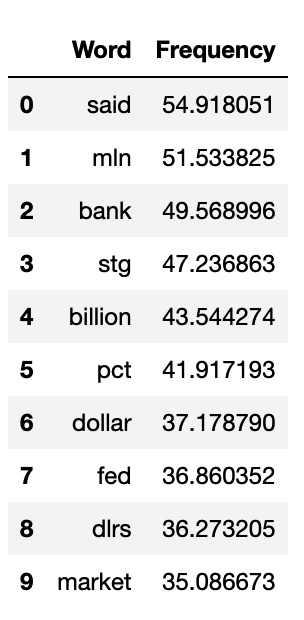

# Money Words

In this activity, you will use TF-IDF to find the most relevant words from a collection of Reuters news articles about money.

## Instructions

### Get all the Articles About Money

1. After you import the dependencies and load the Reuters dataset, use a list comprehension or `for` loop to retrieve all the "fileids" in the `money-fx` and `money-supply` categories, and store the "fileids" in a list called "money_news_ids".

    * **Hint:** Use the [Reuters corpus documentation](https://www.nltk.org/book/ch02.html#reuters-corpus) to check how you can retrieve the categories of a document using the `reuters.categories()` method.

2. Use a list comprehension or `for` loop to retrieve the text in lowercase from the corpus that contains all the news articles about money.

### Calculate the TF-IDF Weights

1. Calculate the TF–IDF weight for each word on the working corpus using `TfidfVectorizer(stop_words='english)`.

2. Use the `vectorizer.get_feature_names_out()` method to create a list to hold the words.

3. Create two lists. One to hold the words using the `vectorizer.get_feature_names_out()`, and another to hold the frequency of each word within the working corpus by summing each "fieldid" across the rows and flattening the array into two dimensions using `np.ravel(sum(axis=0))`.

    * **Note:** Using the `sum(axis=0)` method will calculate a measure similar to the term frequency, based on the TF-IDF weight. This value will be used to rank the terms for the word cloud creation.

    * **Hint:** Check out the documentation on [`np.ravel()`](https://numpy.org/doc/stable/reference/generated/numpy.ravel.html).

4. Create a DataFrame of the TF-IDF weights for each word in the working corpus.

5. Sort the DataFrame by word frequency, in descending order, and display the top 10 words.

    * Your DataFrame should like this:

        

### How many documents contain a specific word or group of words?

1. Write a function called `retrieve_docs(terms)`that searches the "money_news_ids" list and retrieves the number of articles based on the argument passed to the "terms" parameter.

2. The `retrieve_docs(terms)` function should do the following:

    * Create an empty list to hold the final results.

    * Use a `for` loop to loop through the `money_news_ids`.

    * Use a list comprehension or a `for` loop to extract words from the document using `reuters.words(doc_id))` then populate the list comprehension using a conditional statement that checks for any words in lowercase matching the "terms" passed to the function.

        * **Note:** The function should use the `reuters.words()` method to retrieve the tokenized version of each article, as can be seen on the [Reuters corpus documentation](https://www.nltk.org/book/ch02.html#reuters-corpus).

        * **Hint:** Use this [StackOverflow](https://stackoverflow.com/a/25102099/4325668) post to help you find any occurrence of the search terms. You should also ensure all words are in lowercase to ease your terms search.

    * Use a conditional statement that checks whether at least one term from the input list was found in the document. If found, append the article id to the list.

2. Once you create the function, call the function with the following words or groups of word, and answer these questions:

    * **Question 1:** How many articles talk about "yen"?

    * **Question 2:** How many articles talk about "Japan" or "banks"?

    * **Question 3:** How many articles talk about "England" or "dealers"?

## Reference

Lewis, D. 1997. Reuters-21578 Text Categorization Collection. *UCI Machine Learning Repository*. Available https://archive.ics.uci.edu/dataset/137/reuters+21578+text+categorization+collection [2023, October 25]. ([CC-BY 4.0](https://creativecommons.org/licenses/by/4.0/legalcode)).

---

© 2023 edX Boot Camps LLC. Confidential and Proprietary. All Rights Reserved.
