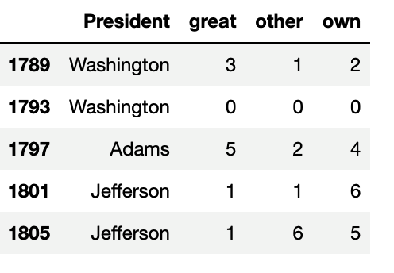
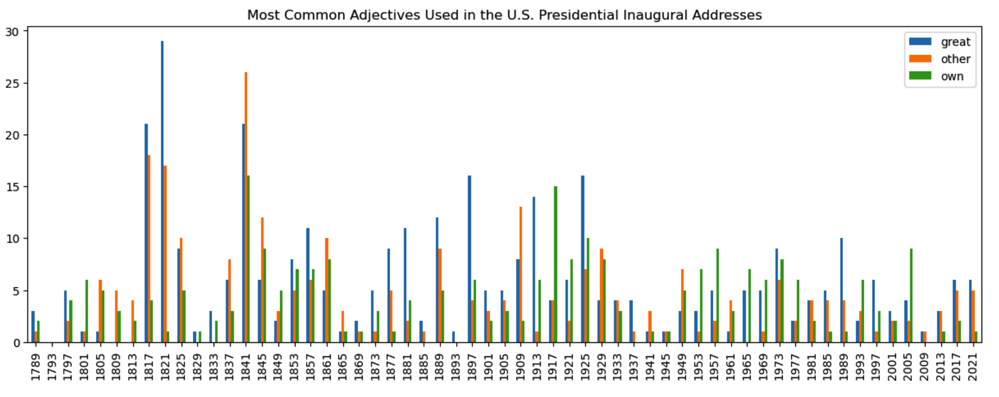

# Describing America

In this activity, you will use NLTK and spaCy to identify the most common adjectives used in the Presidents' inaugural addresses since 1798. Then, you'll identify the most common adjectives used in the inaugural addresses to describe America.

## Instructions

### Retrieve the Documents’ IDs and Text of the US Presidents’ Inaugural Addresses

1. Retrieve the "fileids" of the inaugural addresses.

2. Use a list comprehension to retrieve the text of the inaugural addresses.

    * Refer to the following documentation on [list comprehensions](https://docs.python.org/3.7/tutorial/datastructures.html#list-comprehensions) for reference.

    * **Hint:** Use the `raw()` function to retrieve the text of every inaugural address and store all the text documents as elements of a Python list called `texts`.

3. Get the length of the “fileids” and text, and use list indexing to display the text of an inaugural address.

### Retrieve the Most Frequent Adjective From Each Inaugural Address

In this section, you will create a DataFrame that has the "fileids" of each inaugural address, the most common adjective in the address, and the number of times the adjective occurred.

1. Use the `most_freq_adj()` function that is provided to retrieve the most frequent adjective used in every inaugural address. The function will do the following:

    * Use spaCy to get the most common adjective from each inaugural text.

    * Tokenize the text and parse each token.

    * Use a list comprehension to create a list with all the adjectives in the text.

    * Retrieve the most frequent adjective in the list comprehension using the `Counter` module.

        * The `Counter` module will find the most common adjective in the list using the `most_common(1)` method, which will count how many times the most common adjective appears. The output for each common adjective is a tuple with the following format: `(public, 6)`.

        * Check out the documentation on the [`Counter` module](https://docs.python.org/3.7/library/collections.html#collections.Counter.most_common) for further information.

2. Create a list comprehension that passes in the text from each inaugural address (i.e., `most_freq_adj(text)`) and then print the common adjectives.

3. Use list comprehensions to retrieve each adjective and the number of occurrences for each text in separate lists.

4. Create a DataFrame called, `adjs_df`, that has columns to hold the document IDs, the common adjectives, and the number of occurrences for each adjective.

5. Sort the DataFrame to display the top 10 adjectives.

### Analyze Adjectives Over Time

In this section, you will analyze how many times US Presidents used the most common adjectives in their inaugural address.

You will use the `all_adj()` function provided to add all the adjectives, in all of the inaugural addresses, to the `all_adjectives` list that is provided for you. You will also use the `get_word_counts()` function to count all the occurrences of the adjectives in each inaugural address.

1. Write a `for` loop that sends the "text" of the inaugural addresses to the `all_adj()` function and concatenates the returned adjective to the `all_adjectives` list.

2. Create a variable, `most_freq_adjectives`, that stores the three most frequent adjectives used in the inaugural addresses by using the `most_common()` function from the `Counter` module.

3. Once you get the three most common adjectives in all the inaugural addresses, you'll pass each adjective and the "text" from each inaugural address into the `get_word_counts()` function provided, to calculate the number of times each adjective is used. Store the adjective counts in three different lists called `great_counts`, `other_counts`, and `own_counts`.

4. Create a Python list, `dates`, to store the year that every inaugural address was delivered.

    * **Hint:** You can retrieve the year of each inaugural address from the document IDs you stored as string values in the `ids` list (`ids = inaugural.fileids()`) and use the [`split()` function](https://docs.python.org/3.7/library/stdtypes.html#str.split) to retrieve the year from the `ids`.

5. Create a Python list, `presidents`, to store the last name of the US President from each inaugural address.

    * **Hint:** You can retrieve the President's last name from the document IDs you stored as string values in the `ids` list (`ids = inaugural.fileids()`) and use the `split()` function to retrieve the President's last name from the `ids`.

6. Create a DataFrame, `presidential_adjs_df`, that contains columns that hold the Presidents’ last names and the number of times each adjective appears in the Presidents' inaugural address. Set the index of the `presidential_adjs_df` DataFrame equal to the year in the `dates` list.

    * Your DataFrame should look like the following image:

      

7. Using the `df.plot()` function, create a bar plot that displays the most common adjectives used throughout the US presidential inaugural addresses.

    * Your line plot should look like the following image:

      

### Adjectives Describing America

In this section, you will use spaCy to analyze all the documents in the inaugural corpus to identify the adjectives that describe the word "America."

1. Complete the code in the `describe_america()` function that will return the adjectives in all the inaugural addresses that describe the word "America." The function should:

    * Use the spaCy English language model to tokenize the text and parse each token.

    * Create a list with all the adjectives that describe the word "America" within the text of each inaugural address.

2. Write a `for` loop that sends the "text" of the inaugural addresses to the `describe_america()` function and concatenates the returned adjectives to the `america_adjectives` list.

## Reference

Lewis, D. 1997. Reuters-21578 Text Categorization Collection. *UCI Machine Learning Repository*. Available https://archive.ics.uci.edu/dataset/137/reuters+21578+text+categorization+collection [2023, October 25]. ([CC-BY 4.0](https://creativecommons.org/licenses/by/4.0/legalcode)).

---

© 2023 edX Boot Camps LLC. Confidential and Proprietary. All Rights Reserved.
