## Module 20.2: Advanced NLP Techniques–Text Extraction and Classification

### Overview

In this lesson, students will learn about advanced NLP techniques such as determining the importance of a word or words in a document and using supervised learning to classify the sentiment of text as positive or negative. They'll also learn how to use another NLP tool (spaCy) to tag the text parts of speech, identify the grammatical dependencies between words in a sentence, and identify key elements in the text, such as people, places, and organizations in order to understand the meaning of the text.


### Class Objectives

By the end of today's class, students will be able to:

* Understand and apply TF-IDF to assess the importance of terms in text documents.
* Implement a linear SVC model on text data and assess its performance as a binary classifier.
* Implement an ML pipeline to vectorize and transform data.
* Understand spaCy capabilities and where to find documentation.
* Be able to use POS-tagged text to extract specific words.
* Use dependency-parsed text to extract descriptors.
* Extract specific types of entities from text.


---

### Instructor Notes

In this lesson, the students will apply supervised learning skills to classify the sentiment of reviews using linear support vector classification (SVC). In doing so, they will learn to build a machine learning (ML) pipeline&mdash;a standard practice among data scientists. Students who had difficulty with supervised learning in the previous modules may need extra help today.

Also, the students will begin using another NLP tool, spaCy. Please make sure they know the difference between using NLTK and spaCy for NLP tasks. Each step in these lessons ties into the next, and every section is critical for students to learn before they can implement the full NLP workflow. Pause and ask for questions often.


---

### Class Slides

The slides for this lesson can be viewed on Google Drive here: [Module 20.2 Slides](https://docs.google.com/presentation/d/1PYNun0u2X6vNtgtJKE3NLVhDaDpIWtBAaPaH9ZViKgw/edit?usp=sharing).

To add the slides to the student-facing repository, download the slides as a PDF by navigating to File, selecting "Download as," and then choosing "PDF document." Then, add the PDF file to your class repository along with other necessary files. You can view instructions for this [here](https://docs.google.com/document/d/1XM90c4s9XjwZHjdUlwEMcv2iXcO_yRGx5p2iLZ3BGNI/edit).

**Note:** Editing access is not available for this document. If you wish to modify the slides, create a copy by navigating to File and selecting "Make a copy...".

---

### Time Tracker

| Start Time | Number | Activity                                           | Duration |
| ---------- | ------ | -------------------------------------------------- | -------- |
| 6:30 PM    | 1      | Instructor Do: Introduction to the Class           | 0:05     |
| 6:35 PM    | 2      | Instructor Do: Understand Terms Relevance (TF-IDF) | 0:15     |
| 6:50 PM    | 3      | Student Do: Money Words                            | 0:15     |
| 7:05 PM    | 4      | Review: Money Words                                | 0:10     |
| 7:15 PM    | 5      | Instructor Do: Text Classification                 | 0:15     |
| 7:30 PM    | 6      | Student Do: Movie Review Classification            | 0:25     |
| 7:55 PM    | 7      | Review: Movie Review Classification                | 0:10     |
| 8:05 PM    | 8      | BREAK                                              | 0:15     |
| 8:20 PM    | 9      | Instructor Do: Introduction to spaCy               | 0:05     |
| 8:25 PM    | 10     | Instructor Do: POS Tagging and Dependency Parsing  | 0:15     |
| 8:40 PM    | 11     | Partner Do: Describing America                     | 0:20     |
| 9:00 PM    | 12     | Review: Describing America                         | 0:10     |
| 9:10 PM    | 13     | Everyone Do: Named Entity Recognition on Coffee    | 0:15     |
| 9:25 PM    | 14     | End Class                                          | 0:05     |
| 9:30 PM    |        | END                                                |          |


---


### 1. Instructor Do: Introduction to the Class (5 min)


Open the slideshow and welcome students to the class.

Cover the following points:

We have already discussed that computers are unable to inherently understand the meaning of text. Still, a great deal of what we rely on computers for requires them to be able to understand the meaning of natural language in context.

Today’s lesson focuses on how computers create internal representations of words and create relationships between these representations.

In today’s lesson, you will learn to evaluate the importance of a term within a document or across a corpus of documents and apply supervised learning techniques to classify the sentiment of text. You will also learn to use the NLP tool spaCy to determine parts of speech (POS), identify the grammatical dependencies between words in a sentence, and identify key elements in text, such as the names of people, places, and organizations, in order to understand the meaning of the text.

By the end of the lesson, students will be able to:

* Understand and apply TF-IDF to assess the importance of terms in text documents.
* Implement a linear SVC model on text data and assess its performance as a binary classifier.
* Implement an ML pipeline to vectorize and transform data.
* Understand spaCy capabilities and where to find documentation.
* Be able to use POS-tagged text to extract specific words.
* Use dependency-parsed text to extract descriptors.
* Extract specific types of entities from text.


---


### 2. Instructor Do: Understand Terms Relevance (TF-IDF) (15 min)

**Corresponding Activity:** [01-Ins_Terms_Relevance](Activities/01-Ins_Terms_Relevance/)

This activity introduces term relevance from the perspective of **term frequency - inverse document frequency** (TF-IDF) and demonstrates how students can use it.

Use the slides to introduce term relevance and TF-IDF, highlighting the following points:

* Remind the students that computers can’t interact with words and their meanings the same way you can. Instead, computers deal with text samples in a **bag-of-words** (BoW) model.

* BoW is a technique in NLP that is used to represent the important words or tokens in a document without worrying about sentence structure. The BoW model can be used to compare documents based on the number of important words that they share.

* We will explore the exact representations of the BoW model a bit later but for now, it’s enough to understand it as a jumbled mix of the words in a text dataset.

* If you read an article, you would be able to infer the most important message(s) from the title, structure of the paragraphs, tone, and word choice. However, computers don’t have the inherent ability to infer importance from natural language. So, how does NLP gauge what is important in a text sample from its BoW?

* **Question:** It may feel a bit silly, but for a moment put yourself in the position of being an NLP model with no knowledge of natural language. You have a jumbled bag of words that individually mean nothing to you. How would you determine which of the words are important?

* **Answer:** The ones that occur most frequently are most likely to be important.

* This idea of frequency is important to how NLP models construct meaning from text. It offers a way to understand how important a word is not only to a single document but to a collection of documents, or a corpus.

* Explain how each of the following components contribute to the TF-IDF score:

    * **Term frequency (TF)** is a measure of how frequently a term appears in a document. The more a word appears in a document, the higher its TF will be.

    * **Inverse document frequency (IDF)** is a measure of how frequently the term appears in documents across a corpus. If a word occurs in only a few documents, its IDF is higher.

* Therefore, TF-IDF is a measure of how important a word is to a document as part of a corpus. It’s calculated by multiplying the TF and the IDF together.

* If a term occurs a lot in one document but not so much in other documents in the corpus, its TF-IDF will be high, and it will be interpreted as important or valuable to an analysis.

* A low TF-IDF weight is assigned to terms with a low TF but a high document frequency in the corpus; normally, this reflects that a term is commonly used across the corpus and that it could be less meaningful or valuable for analysis.

* Finally, point out that the TF-IDF must be calculated on text after it has been preprocessed.

Next, open `terms_relevance_solution.ipynb` and proceed with demonstrating how to calculate the TF-IDF of words in a corpus.

First, import the `reuters` corpus from the `nltk.corpus` library with the standard dependencies:

```python
# Import nltk, numpy and pandas.
import nltk
import numpy as np
import pandas as pd
# Import Reuters
from nltk.corpus import reuters
# Import CountVectorizer, TfidfVectorizer from sklearn
from sklearn.feature_extraction.text import CountVectorizer, TfidfVectorizer

# Download the Reuters dataset
nltk.download("reuters")
```

Cover the following and check for understanding.

* The [`CountVectorizer`](https://scikit-learn.org/stable/modules/generated/sklearn.feature_extraction.text.CountVectorizer.html) class is used to convert a collection of text documents into a matrix of token counts. The principle behind this is similar to encoding, where categorical data is turned into binary or numeric values on which the model can be trained. The process of turning the text data into a numeric representation that the model uses for training is referred to as **vectorizing**.

* The [`TfidfVectorizer`](https://scikit-learn.org/stable/modules/generated/sklearn.feature_extraction.text.TfidfVectorizer.html) class is used to calculate the importance of a word in a specific document relative to its importance across the entire corpus. We will use this to calculate the TF-IDF for our text sample.

Next, we use the `reuters.fileids()` method to retrieve a complete list of a document's unique identifiers in the corpus, as the following code shows:

```python
# Count the total number of documents in the collection
doc_ids = reuters.fileids()
print(f"Total number of docs in the corpus: {len(doc_ids)}")
```

  * The output from the preceding code shows that there are 10,788 new documents in the Reuters corpus.

#### Count the Occurrence of Each Word in the Text

Using the following code, we retrieve the first document from the Reuters corpus.

```python
# Select and print the original single document text
doc_text = reuters.raw(doc_ids[2])
print(doc_text)
```

* The preceding code produces the following image of text from the Reuters corpus:


    

Then, we create an instance of the `CountVectorizer()` class and add the `stop_words='english'` parameter, which will ignore all English-language stopwords when vectorizing the text, as the following code shows:

```python
# Create an instance of the CountVectorizer and define the English stopwords to be ignored.
vectorizer = CountVectorizer(stop_words='english')
```

Next, we use the [`fit_transform()`](https://scikit-learn.org/stable/modules/generated/sklearn.feature_extraction.text.CountVectorizer.html#sklearn.feature_extraction.text.CountVectorizer.fit_transform) method to retrieve a matrix of the term counts. In this example, a single document is passed as a parameter, but a list of documents can be passed instead.

```python
# Tokenize the text into numerical features and occurrences of each word.
X = vectorizer.fit_transform([doc_text])
```

When we print the `X` matrix, it shows the count of each term represented by the tuple `(n, t)` followed by number `c` for each line, as the following image shows:


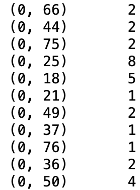

* Point out that the format is defined as follows:
    * `n` refers to the _nth_ document. (Since we have only one document in this example, `n` is `0`.)
    * `t` is the term's numeric identifier in the document.
    * `c` represents the total count for that term in the document `n`.

The interpretation for the fourth line&mdash;`(0, 25)  8`&mdash;is that the 25th term (i.e., word) appears 8 times in the document.

But what is the "25th" word? To find out we retrieve the list of words in our vocabulary by using the `get_feature_names_out()` method, as the following code shows:

```python
# Retrieve unique words list
words = vectorizer.get_feature_names_out()
print(words)
```

  * The output from running the previous code is the following unique word list:


    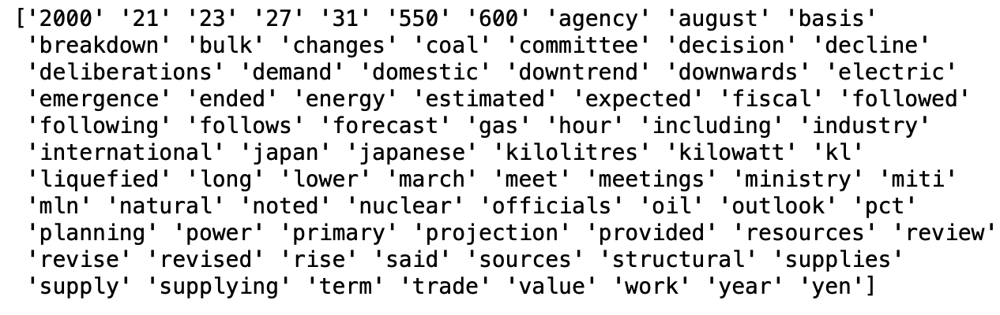

Then, using list indexing on the `words` list, we can find the 25th item in the list, which is "energy".

```python
# Get the length of the words and find a specific word or term.
print(len(words))
print(words[25])
```

```text
81
energy
```

We can also print the number of times each word appears in the document.

```python
# Print the number of times each word appears from the document.
occurrences = X.toarray()[0]
print(occurrences)
```

* The output from running the previous code is the following is a list of numbers where each number represents how many times a word appears in our vocabulary.

    ```text
    [1 1 1 1 1 1 1 1 1 1 1 1 1 1 1 1 1 1 5 1 1 1 2 1 1 8 1 1 1 1 1 1 1 2 1 1 2
    1 2 2 1 1 1 1 2 1 1 1 1 2 4 2 3 1 2 2 2 2 3 1 2 1 1 1 1 1 2 1 1 4 1 1 1 3
    1 2 1 1 1 2 1]
    ```


Next, we’ll create a DataFrame that has each word from our vocabulary as the column headings and the number of times the word appears in the text as the values.

```python
# Convert the sparse matrix to a DataFrame to get our Bag-of-Words for the document.
bow_df = pd.DataFrame(X.toarray(), columns=vectorizer.get_feature_names_out())

# Display some first 20 columns of the DataFrame.
bow_df.iloc[:,0:20:]
```

* The output shows each word and the number of times the word appears in the text.


    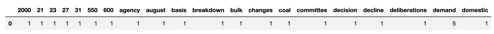


Explain that we have transformed the text into a numerical format where each word is associated with a count, which is also known as a BoW model. Usually, the count in a BoW model will be a binary value of 1 if the word is present and 0 if it's not in the document or sentence. If we broke up the text into sentences and all the sentences were transformed into a numerical format, we would get a vocabulary for each sentence and the binary value.

* Let the students know that we will be going over BoW more in depth in the next module.

We can reshape the `bow_df` DataFrame to show each word and the frequency each word occurs as columns using the `melt()` function. Then, we can sort the melted DataFrame by "Word_Counts" in descending order to get the most frequent words in the text.

```python
# Melt the Bag-of-Words DataFrame to convert columns into rows.
melted_bow = bow_df.melt(var_name='Word', value_name='Word_Counts')

# Sort the DataFrame by Word_Counts if needed
sorted_bow = melted_bow.sort_values(by='Word_Counts',
     ascending=False).reset_index(drop=True)
sorted_bow.head()
```
* The sorted DataFrame shows that "energy" is the most common word.


    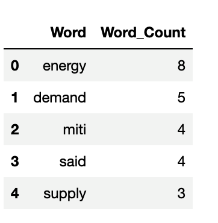


#### Calculate the TF-IDF score from a Corpus of Documents.

Next, demonstrate how to calculate the term frequency in a corpus using TF-IDF.

First, we'll get a set of 1,000 documents from the Reuters corpus, as the following code shows:


```python
# Getting the first 1000 articles from Reuters.
corpus_id = docs_id[0:1000]
corpus = [reuters.raw(doc) for doc in corpus_id]
```

Then, we create an instance of the `TfidfVectorizer()` class, add the `stop_words='english'` parameter, and use the `fit_transform()` method to retrieve a matrix of the term counts for each of the 1,000 documents, as the following code shows:

```python
#  Create an instance of the TfidfVectorizer and define the English stopwords to be ignored.
vectorizer = TfidfVectorizer(stop_words="english")
# Tokenize the 1,000 articles into numerical features.
X_corpus = vectorizer.fit_transform(corpus)
```

Printing out the matrix shows that the frequency of each term is represented by the tuple `(n, t)` followed by the number `c` for each line, where `c` is the importance of a term or word in a specific document relative to its importance in the entire corpus of documents.


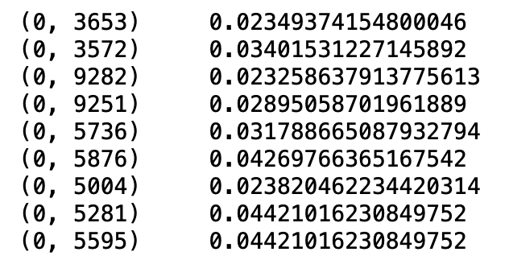

We can retrieve the information about the matrix using the following code:

```python
# Getting matrix info
print(f"Matrix shape: {X_corpus.shape}")
print(f"Total number of documents: {X_corpus.shape[0]}")
print(f"Total number of unique words (tokens): {X_corpus.shape[1]}")
```

* The shape of the matrix gives us some interesting information. The shape is 1,000 rows and 9,489 terms were found in the corpus, as shown in the following output:

```text
Matrix shape: (1000, 9489)
Total number of documents: 1000
Total number of unique words (tokens): 9489
```

We can retrieve unique words found in the corpus using the `get_feature_names_out()` method, as the following code shows:

```python
# Retrieve unique words from the corpus.
words_corpus = vectorizer.get_feature_names()
print(words_corpus)
```

  * The output from running the previous code is the following unique word list:

    ```text
    ['00' '000' '0000' ... 'zones' 'zurich' 'zy']
    ```

Finally, a DataFrame showing the most relevant words is created for the TF-IDF matrix using the `mean` function for the TF-IDF scores, as the following code shows:

```python
# Getting the TF-IDF weight of each word in corpus as DataFrame
words_corpus_df = pd.DataFrame(
    list(zip(words_corpus, np.ravel(X_corpus.mean(axis=0)))), columns=["Word", "TF-IDF"]
)

# Sort the DataFrame to show the top TF-IDF values.
sorted_words_corpus = words_corpus_df.sort_values(by=["TF-IDF"], ascending=False).reset_index(drop=True)

# Highest 10 TF-IDF scores
sorted_words_corpus.head(10)
```

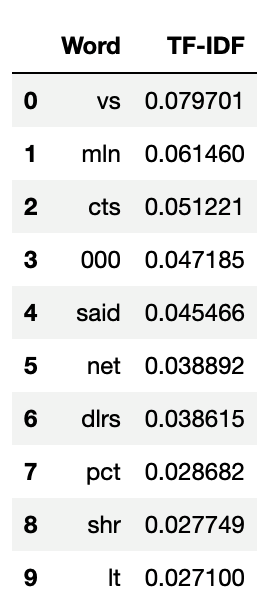


* Point out that the `zip` function is used to produce tuples in the form of `(x,y)`. For the following code, `zip(words, np.ravel(X.mean(axis=0)))`,
  * The `words` are the "x" values.
  * We use  `X.mean(axis=0)` to get the mean of the TF-IDF values for each word in the text, which are our "y" values.
  * To retrieve the tuples, we use the `list()` function.

Conclude the activity by presenting the lowest 10 TF-IDF scores. Explain that the highest values normally represent less common and more interesting terms for analysis; they have a high term frequency in some documents and a low document frequency in the corpus.

If there is time, ask the class what they think about the numbers identified as terms (tokens) by the algorithm. In fact, the importance of these terms resides in the context of the documents (e.g., a year or an amount could be relevant if you are talking about a historical fact).


---

### 3. Student Do: Money Words (15 min)


**Corresponding Activity:** [02-Stu_Money_Words](Activities/02-Stu_Money_Words/)

Continue through the slideshow, using the next slides as an accompaniment to this activity.

In this activity, the students will use TF-IDF to find the most relevant words from a collection of Reuters news articles about money.


---

### 4. Review: Money Words (10 min)

**Corresponding Activity:** [02-Stu_Money_Words](Activities/02-Stu_Money_Words/)

Open the solution, share the file with the students, and go over with the class, answering whatever questions they may have.

Begin by signposting the following stages to the activity:
* First, we will get all the articles about money and store them as `money_news`.
* Next, we will calculate the TF-IDF for all the terms in `money_news` that are not part of the standard list of stopwords. As part of this step, we’ll print a DataFrame of the 10 words with the highest TF-IDF weight.
* Finally, we will write a function that tells us how many articles contain a single term or a list of terms. We’ll use the article to determine how many articles talk about yen, Japan, or banks and England or dealers.

Cover the following key points during the discussion:

* To get all the articles about money, we use list comprehension in combination with the `reuters.categories()` method to retrieve the news articles that are under the `money-fx` and `money-supply` categories:

    ```python
    # Get all the "fileids" in the "money-fx" and "money-supply" categories.
    categories = ["money-fx", "money-supply"]
    all_docs_id = reuters.fileids()

    # Use a list comprehension or for loop to get all the field ids.
    money_news_ids = [
        doc
        for doc in all_docs_id
        if categories[0] in reuters.categories(doc)
        or categories[1] in reuters.categories(doc)
    ]

    # Print the total number of news articles about money.
    print(f"Total number of news articles about money: {len(money_news_ids)}")
    ```

    * The list comprehension contains 883 articles about money.

* Next, we get all the articles about money and print a sample article, as the following code shows:

```python
money_news = [reuters.raw(doc). for doc in money_news_ids]
# Print a sample article.
print(money_news[78])
```

* We now move onto the second stage of the activity, where we will calculate the TF-IDF weights using the following code:

```python
# Create an instance of the TfidfVectorizer and define the English stopwords to be ignored.
vectorizer = TfidfVectorizer(stop_words="english")
# Tokenize the articles about money into numerical features.
X = vectorizer.fit_transform(money_news)
```

* Next, we'll create two lists, one that holds the words and another that holds the total frequency with which the words appear, as the following code shows:

```python
# Create a list to hold the words using the vectorizer.get_feature_names_out()
words = list(vectorizer.get_feature_names_out())
# Create a list to hold the frequency using np.ravel(X.sum(axis=0))
frequency = list(np.ravel(X.sum(axis=0)))
```

* We use the following code to create a DataFrame that lists each word and its frequency in descending order:

    ```python
    # Create a DataFrame of the TF–IDF weights for each word in the working corpus.
    money_news_df = pd.DataFrame(
    list(zip(vectorizer.get_feature_names_out(), np.ravel(X.sum(axis=0)))),
    columns=["Word", "Frequency"])

    # Sort the DataFrame by word frequency in descending order and reset the index.
    money_news_df = money_news_df.sort_values(by=["Frequency"],
    ascending=False).reset_index(drop=True)

    # Print the top 10 words
    money_news_df.head(10)
    ```

    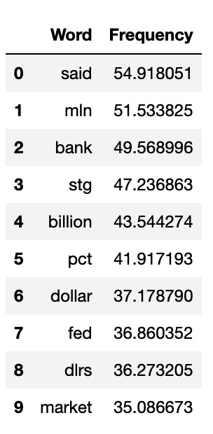


* Finally, we use the `retrieve_docs` function to retrieve the number of documents based on a given word or group of words as follows:

    ```python
    def retrieve_docs(terms):
    """
    Retrieve a list of document IDs that contain at least one of the specified terms.

    This function searches through a collection of documents represented by 'money_news_ids' to identify documents that contain at least one of the provided terms. It utilizes the NLTK Reuters corpus and tokenizes each document to find matches based on the lowercase representation of words.

    Parameters:
    terms (list of str): A list of terms to search for within the documents.

    Returns:
    list of str: A list of document IDs that contain at least one of the specified terms.

    Example:
    >>> retrieve_docs(['stock', 'market', 'invest'])
    ['doc1', 'doc3', 'doc5']
    """
    # Create an empty list to hold the results.
    result_docs = []
    # Use a for loop to loop through the ids.
    for doc_id in money_news_ids:
        # Use a list comprehension to get all the instances of the given word or group of words.
        # And, use a conditional to check if any term in the word list that is passed to the
        # function is found within the current document, the word is included in the list.
        found_terms = [
            word
            for word in reuters.words(doc_id)
            if any(term in word.lower() for term in terms)]
        # Use a conditional statement to append the given word or group of words
        # only if the list is greater than 0.
        if len(found_terms) > 0:
            result_docs.append(doc_id)
    return result_docs
    ```

   * Alternatively, the students could have used the following nested `for` loops.

        ```python
        # Create a list for the found terms.
        found_terms = []
        # Use a for loop to loop through the ids.
        for doc_id in money_news_ids:
            # Use a for loop to loop through the words in the document.
            for word in reuters.words(doc_id):
                # Use a conditional to o check if any term in the word list that is passed to the
                # function is found within the current document, the word is included in the list.
                if any(term in word.lower() for term in terms):
                    found_terms.append(word)
        ```

  * The trickiest part could have been coding the search by any of the terms passed as a parameter. Offer students the clue to use the [`any()` function](https://docs.python.org/3/library/functions.html#any) in the condition of the `found_terms` comprehension list.


* To answer the questions, we apply the `len` method on the `retrieve_docs` function and pass in the word to search the "money_news_ids".


Ask if there are any questions before moving on.

---

### 5. Instructor Do: Text Classification (15 min)


**Corresponding Activity:** [03-Ins_Text_Classification](Activities/03-Ins_Text_Classification/)

Continue using the slideshow to accompany this demonstration.

In a previous module, you learned how to apply linear classification models using SVMs. The distinct benefit of an SVM is that it is able to arrange data points in multidimensional space. For example, consider the following visualization of a dataset with three features:


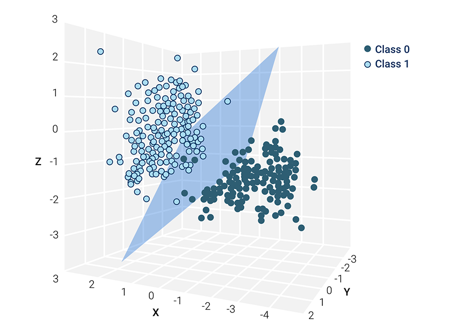

As humans, our ability to visualize information is limited to three dimensions, but SVMs are capable of representing each feature in its own dimension, which is beneficial for datasets with many features.

Remember that SVM linear classification models divide classes using a **hyperplane** like the one shown in blue on the graphic. The hyperplane orients itself to minimize any overlaps between data points as much as possible, resulting in better model performance with less computational expense.

In this demonstration, you’ll learn to apply a linear classification model to SMS text messages that have been labeled "ham" or "spam" and then predict what label a new text message will have when it’s passed into the mode.

#### Building a Linear SVC Machine Learning Model


First, we need to import the required dependencies and then load the dataset into a DataFrame.

```python
# Import pandas and numpy
import pandas as pd
import numpy as np
# Import the required dependencies from sklearn
from sklearn.model_selection import train_test_split
from sklearn.feature_extraction.text import TfidfVectorizer
from sklearn.svm import LinearSVC
from sklearn.pipeline import Pipeline
from sklearn import metrics

# Set the column width to view the text message data.
pd.set_option('max_colwidth', 200)

# Load the dataset into a DataFrame
sms_text_df = pd.read_csv('Resources/SMSSpamCollection.csv')
sms_text_df.head()
```

The DataFrame consists of two columns, one containing the text label/class ("ham" or "spam") and the other containing the text message.


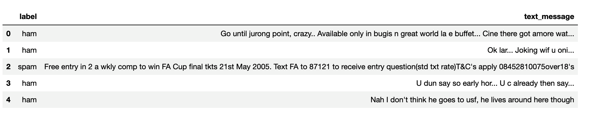

After finding there are no missing values in either column, we can get the number of messages that are labeled "ham" or "spam" as follows:

```python
#  Get the number of "ham" and "spam" from the "label" column:
sms_text_df['label'].value_counts()
```

From the output there are 4,825 "ham" (or good messages) and 747 "spam" (or unsolicited messages).

```text
ham     4825
spam     747
Name: label, dtype: int64
```

Explain that for our text classification model to be effective, it must exceed an accuracy of 86.6%, which is the percentage of "ham" messages in our dataset.

Next, set the features variable `X` to the "text_message" column and the target variable `y` to the "label" column, and then we split the data into training and testing datasets.

```python
# Set the features variable to the text message.
X = sms_text_df['text_message']
# Set the target variable to the "label" column.
y = sms_text_df['label']

# Split data into training and testing and set the `test_size = 33%`
X_train, X_test, y_train, y_test = train_test_split(X, y, test_size=0.33, random_state=42)
```

* To start off, we’ll create an instance of the `TfidfVectorizer` class and add the `stop_words='english'` parameter, which will ignore all English-language stopwords when vectorizing the text.

```python
# Create an instance of the TfidfVectorizer
vectorizer = TfidfVectorizer(stop_words='english')

# Transform the data and use the original X_train set.
X_train_tfidf = vectorizer.fit_transform(X_train)
X_train_tfidf.shape
```

```text
(3733, 6823)
```

* Our training set consists of 3,733 documents or words and has 6,823 features.

Show the students the stopwords that scikit-learn uses by running the following:

```python
# What stopwords are in the scikit-learn's built-in list
from sklearn.feature_extraction import text
print(text.ENGLISH_STOP_WORDS)
```


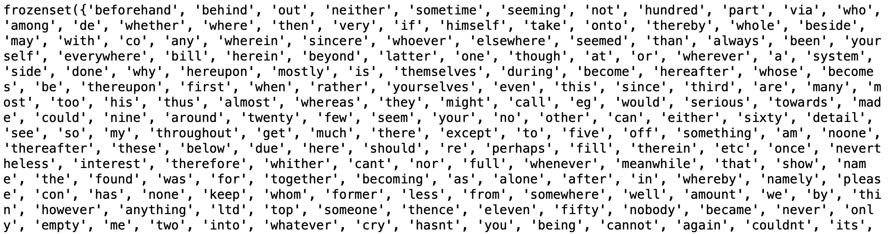

* **Question:** How can we get the frequency of each unique word in all the text messages?

* **Answer:** We can use the `get_feature_names_out()`method and create a numpy array with the vectorized data, `X_train_tfidf`, as follows:

   ```python
   # Create a list to hold the words using the vectorizer.get_feature_names_out()
   words = list(vectorizer.get_feature_names_out())
   # Create a list to hold the frequency using np.ravel(X.sum(axis=0))
   frequency = list(np.ravel(X_train_tfidf.sum(axis=0)))
   ```

* And, we can create a DataFrame of the word frequency.

   ```python
   # Create a DataFrame of the TF-IDF weights for each word in the working corpus.
    messages_df = pd.DataFrame({
        "Word": words,
        "Frequency": frequency})

   # Sort the DataFrame by word frequency in descending order and reset the index.
    messages_df = messages_df.sort_values(by=["Frequency"],
        ascending=False).reset_index(drop=True)

   # Display the DataFrame
   messages_df.head(10)
   ```


    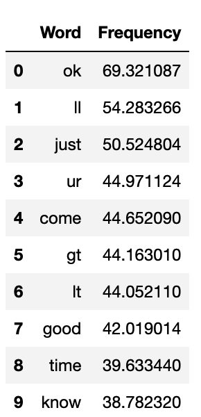

Now, we will train the data on a `LinearSVC` model. Using a linear SVC is more efficient than using `SVC(kernel='linear')` as we did previously. We are using `LinearSVC` because it is better suited to handle high-dimensional and sparse data, like text data.

   * Point out that text data usually has a high number of features, which determines the dimensionality of the data. Our data has 6,823 features, which may seem high but is actually only moderately high dimensionality. Text data is also sparse because most of the documents contain only a small subset of the entire vocabulary.


```python
# Train the data on LinearSVC classifier
linear_svc_model = LinearSVC()
# Fit the model to the transformed data,
linear_svc_model.fit(X_train_tfidf,y_train)
```

Next, determine the predictions, like we have done before with other SVM models.

```python
# Determine predictions.
predictions = linear_svc_model.predict(X_test)
```

* **Important** Notice that we get the following `ValueError:`.

    ```text
    ValueError: could not convert string to float: 'Squeeeeeze!! This is christmas hug.. If u lik my frndshp den hug me back..'
    ```

* Point out that we have to transform the testing data in the same manner as we did the training, transforming it into a vector, in order to make predictions.

* Run the following code to show the students that they can make predictions after transforming the testing data.

```python
# Transform the testing data like we did with the training data.
X_test_tfidf = vectorizer.transform(X_test)
# Make predictions
predictions = linear_svc_model.predict(X_test_tfidf)
print(predictions[:30])
```

The output is an array of either "ham" or "spam."


```text
['ham' 'ham' 'ham' 'ham' 'ham' 'ham' 'ham' 'ham' 'ham' 'ham' 'ham' 'ham'
 'ham' 'ham' 'spam' 'ham' 'ham' 'ham' 'ham' 'ham' 'ham' 'ham' 'ham' 'ham'
 'spam' 'ham' 'ham' 'ham' 'ham' 'ham']
```

Next, we can validate our model as follows:

```python
# Validate the model by checking the model accuracy with model.score
print('Train Accuracy: %.3f' % linear_svc_model.score(X_train_tfidf, y_train))
print('Test Accuracy: %.3f' % linear_svc_model.score(X_test_tfidf, y_test))
```

* The accuracy on the training data is 100% and the accuracy on the testing data is 98.9%, which is a really good model for predicting "ham" or "spam" SMS text messages.


#### Building a Machine Learning Pipeline

Now that the students are familiar with building a linear SVC model for binary text classification, remind the class that many data scientists and ML engineers build pipelines to run their models. This is more efficient than performing each task separately.

The `Pipeline` class will vectorize and transform both the training and testing data at the same time, which avoids coding errors and increases efficiency.

```python
# Build a pipeline to transform the training and testing sets.
text_clf = Pipeline([('tfidf', TfidfVectorizer(stop_words='english')),
                     ('clf', LinearSVC()),
])

#  Fit the model to the transformed data.
text_clf.fit(X_train, y_train)
```

After we fit the model, and get the training and testing accuracy, we can see that the `Pipeline` model provides the same accuracy on the training and testing data as our previous model. The accuracy on the training data is 100%, and the accuracy on the testing data is 98.9%

Next, we can get our predictions, as we did before:

```python
# Form a prediction set
message_predictions = text_clf.predict(X_test)
print(message_predictions[0:30])
```

* The first 30 predictions in the array are the same as before.

    ```text
    ['ham' 'ham' 'ham' 'ham' 'ham' 'ham' 'ham' 'ham' 'ham' 'ham' 'ham' 'ham'
    'ham' 'ham' 'spam' 'ham' 'ham' 'ham' 'ham' 'ham' 'ham' 'ham' 'ham' 'ham'
    'spam' 'ham' 'ham' 'ham' 'ham' 'ham']
    ```

Then, we create and display the confusion matrix and classification report and get the overall accuracy as follows:

```python
# Create the confusion matrix on the test data and predictions
print(metrics.confusion_matrix(y_test,predictions))
# Print a classification report
print(metrics.classification_report(y_test,predictions))
# Print the overall accuracy
print(metrics.accuracy_score(y_test,predictions))
```

The output shows 1,587 true positives, 6 false negatives, 15 false positives, and 231 true negatives. The classification report shows high precision, recall, and accuracy on the data, and the accuracy is 98.9%.


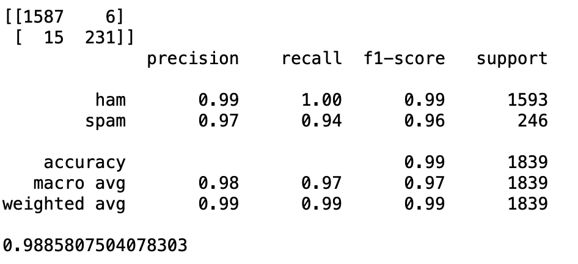


Finally, show the students how new text messages can be classified by using the `predict()` method.

```python
# Create some random text messages.
text_1 = """You are a lucky winner of $5000!!"""
text_2 = """You won 2 free tickets to the Super Bowl."""
text_3 = """You won 2 free tickets to the Super Bowl text us to claim your prize"""
text_4 = """Thanks for registering. Text 4343 to receive free updates on medicare"""

# Send the text messages to transform the data and predict the classification.
print(text_clf.predict([text_1]))
print(text_clf.predict([text_2]))
print(text_clf.predict([text_3]))
print(text_clf.predict([text_4]))
```

Our text messages were classified as follows;

    ```text
    ['ham']
    ['ham']
    ['spam']
    ['spam']
    ```

* **Question:** Ask the students why `text_2` was labeled "ham" but `text_3` was labeled "spam."

* **Answer:**  More content matters. The additional "text us to claim your prize" text may be a stronger indicator of spam. Many spam messages have a call to action or instructions to contact the sender. Our classifier may have read many spam messages like this and learned these patterns.

Answer any questions before moving on.


---

### 6. Student Do: Movie Review Classification (25 min)


**Corresponding Activity:** [04-Stu_Movie_Review_Classification](Activities/04-Stu_Movie_Review_Classification/)

Continue through the slideshow, using the next slides as an accompaniment to this activity.

In this activity, students will determine if stopwords can affect the ability of a linear SVC model to predict the classification of a movie review.

---

### 7. Review: Movie Review Classification (10 min)


**Corresponding Activity:** [04-Stu_Movie_Review_Classification](Activities/04-Stu_Movie_Review_Classification/)

Before going over the solution let the students know that the classification of their movie review may vary with each build.

Remind students that the goal of this activity is to evaluate the model’s performance when using the standard set of stopwords versus a custom set of stopwords. Mention that this is especially important for sentiment classification models.

Open the solution, share the file with the students, and go over with the class, answering whatever questions they may have.

After reading the data and checking for null values, we can split the data into training and testing datasets.

```python
# Set the features variable to the "review" column.
X = imdb_reviews_df['review']
# Set the target variable to the "label" column.
y = imdb_reviews_df['label']

# Split data into training and testing and use `test_size = 30%`.
X_train, X_test, y_train, y_test = train_test_split(X, y, test_size=0.30, random_state=42)
```

Next, we create our ML classification pipeline using the `TfidfVectorizer()`, without `stopwords`, and `LinearSVC()`, and fit the model to the transformed data.

```python
#  Build a pipeline using `TfidfVectorizer()`, without `stopwords`, and `LinearSVC()`.
text_clf = Pipeline([('tfidf', TfidfVectorizer()),('clf', LinearSVC()),])

# Fit the model to the transformed data.
text_clf.fit(X_train, y_train)
```
This model produced a 99.8% training accuracy and a 74.2% testing accuracy.

Our classification report for this module was:


 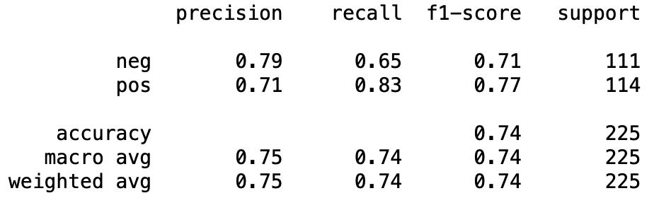

Next, we tested a review of the _Barbie_ movie:

```python
barbie_review = """I was curious to see how they would evolve the "stereotypical Barbie" into something more. But the messaging in this movie was so heavy handed that it completely lost the plot. I consider myself a proponent of gender equality, and this ain't the way to get it."""

# Print the classification of the review.
print(text_clf.predict([barbie_review]))
```
The classification of this review is "positive."

Rebuilding the pipeline using the scikit-learn stopwords dropped the training accuracy to 90.0% but slightly increased the testing accuracy to 75.6%.

Our classification report for this module was:


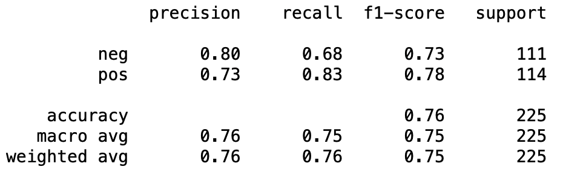

The review of the _Barbie_ movie was classified as "positive."

Rebuilding the pipeline using our custom stopwords increased the training accuracy to 99.8%, like it the first run, and increased the testing accuracy to 77.8%.

Our classification report for this module was:


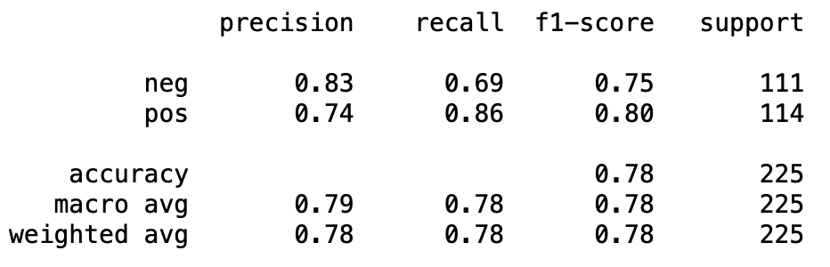

For all three modules, the precision and recall for the "neg" class improved slightly, which led to an increase in the F1-score for that class.

The review of the _Barbie_ movie was classified as "negative."

This change in classification is mostly due to using our custom stopwords, which remove words that have no effect on the review.

Point out that using custom or domain-specific stopwords is crucial when trying to classify the sentiment of a review.


---


### 8. BREAK (15 min)

---

### 9. Instructor Do: Introduction to spaCy (5 min)

This section introduces students to spaCy. There is no coding demonstration to accompany this section. Open the slides and introduce spaCy and how it compares to NLTK:

* By now, you are familiar with the trade-offs to consider when building ML models. Possibly the most ever-present consideration is the tradeoff between model performance and speed. Until now, we have been successfully drawing from NLTK to handle our NLP tasks. NLTK is accurate but as datasets get larger, model speed becomes more of an issue. If the corpus you are working with is larger, you may want to consider using spaCy’s language model modules.

* SpaCy is similar to NLTK in that it is mainly rule-based.

We will be using spaCy for POS tagging, dependency parsing, and named-entity recognition (NER). These tasks are more suitable for statistics-based solutions because they are complex and depend highly on context.

SpaCy also provides tools for tasks like tokenization and lemmatization, which we've already learned to do with NLTK, as well as for creating word vectors, which we've learned to do with scikit-learn’s `CountVectorizer` and `TfidfVectorizer` classes.

Make sure the students have installed spaCy by running the following code in the terminal.


```text
python -m spacy info
```

The output should be similar to the following:

```text
============================ Info about spaCy=============================

spaCy version    3.7.0
Location         /opt/anaconda3/envs/dev/lib/python3.10/site-packages/spacy
Platform         macOS-10.16-x86_64-i386-64bit
Python version   3.10.12
Pipelines        en_core_web_sm (3.7.0)
```

---

### 10. Instructor Do: POS Tagging and Dependency Parsing (15 min)

**Corresponding Activity:** [05-Ins_POS_Tagging](Activities/05-Ins_POS_Tagging/)

Continue through the slideshow using the next slides as an accompaniment to this activity.

Now that the students have a general understanding of spaCy, demonstrate how it can be used for NLP tasks such as determining the part-of-speech (POS) of words in text.

#### Part-of-Speech (POS)

POS tagging is intuitive. Each word in a sentence is designated a grammatical part of speech, such as noun, verb, or adjective. POS tagging categorizes each word in a sentence by its grammatical role in the sentence.

* For example, consider the following sentence: "Jose made a book collector happy the other day". POS tagging will tokenize the sentence and add a tag, such as `noun`, `verb`, or `adverb`, next to each token.


    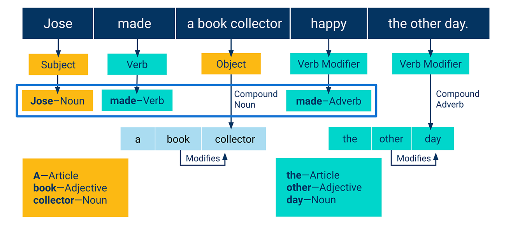

#### Dependency Parsing

Now that the students have an understanding of how to tag parts of speech, we'll explore dependency parsing to understand the relationships between words in a sentence.

Explain that POS tagging the tokenized words is the first step to deriving meaning from text, but there is still another step to be taken to parse how one token relates to the next.

* **Dependency parsing** is the step that follows POS tagging.

    * In grammar, dependency reflects the notion that words are connected to each other by directed links. These links represent specific relationships between types of words. For example, adjectives describe nouns, adverbs describe verbs, and nouns can be the subject or object of verbs.

    * Each sentence is made of not just the words it contains but also the relationships between those words. A dependency parser is an NLP tool that tries to make these implicit relationships explicit.

    * The sentence fragment "a book collector" in the slide, demonstrates this. The word "book" is implicitly related to "collector" and together they form a single compound noun.


        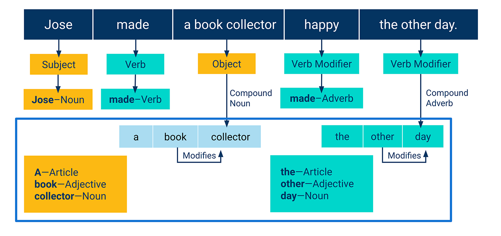

Today’s lesson uses spaCy to perform a text analysis similar to this.

Send out `pos_tagging.ipynb`, so that any students who want to follow along with your demonstration can do so.

Open the `pos_tagging.ipynb` file in Jupyter notebook and go through the demo line by line, pausing for questions and highlighting the following points:

* We start by importing the `spacy` library and loading the English language model before using spaCy's various NLP tools, as the following code shows:

    ```python
    # Import spaCy library
    import spacy

    # Load the English language model for spaCy
    nlp = spacy.load("en_core_web_sm")
    ```

    * Encourage the students to check out [spaCy Models and Languages documentation](https://spacy.io/usage/models), which is available for anyone who wants to use a different language for spaCy.

* Next, we set a sample sentence to analyze using spaCy.

    ```python
    # Set a sentence to be analyzed using spaCy
    sentence = "The brown cow jumped over the round moon."
    ```

* We use the spaCy language model object `nlp` to tokenize each word and store the POS tags and dependency data inside each token.

    ```python
    # Tokenize text and parse each token
    tokens = nlp(sentence)
    ```

* To access the POS tags, we need to iterate through each token and access its `pos_` attribute. Note that each token was parsed using the language model to determine the corresponding tag, which is presented in uppercase, as the following code and output show:

    ```python
    # Print POS-Tags for each token
    [(token.text+ " ---> " +token.pos_) for token in tokens]
    ```

    ```text
    ['The ---> DET',
    'brown ---> ADJ',
    'cow ---> NOUN',
    'jumped ---> VERB',
    'over ---> ADP',
    'the ---> DET',
    'round ---> ADJ',
    'moon ---> NOUN',
    '. ---> PUNCT']
    ```

    * Send out this link to the [POS tagging](https://spacy.io/usage/linguistic-features#pos-tagging) page and explain that it contains a complete list describing the tags.

* Using the POS tags, we can filter the words using a list comprehension with a conditional, for example, to identify all the nouns in a sentence or text, as the following code and output show:

    ```python
    # Retrieve all the nouns in the sentence using a list comprehension
    nouns = [token.text for token in tokens if token.pos_ == "NOUN"]

    # Print the nouns in the sentence
    print(nouns)
    ```

    ```text
    ['cow', 'moon']
    ```

* Similar to POS tags, we can print the grammar dependencies of each word using the `dep_` attribute.

    ```python
    # Print grammar dependencies for each word.
    [(token.text + " ---> " + token.dep_) for token in tokens]
    ```

    ```text
    ['The ---> det',
    'brown ---> amod',
    'cow ---> nsubj',
    'jumped ---> ROOT',
    'over ---> prep',
    'the ---> det',
    'round ---> amod',
    'moon ---> pobj',
    '. ---> punct']
    ```

* However, because dependencies are relationships, the list view will not tell us much. Instead, we can use `displacy`, a module that visualizes attributes generated by spaCy, to view the relationships between words in a sentence, as the following code shows:

    ```python
    # Import the displacy module from spaCy
    from spacy import displacy

    # Show the dependency tree
    displacy.render(tokens, style="dep", options={'distance': 125})
    ```

    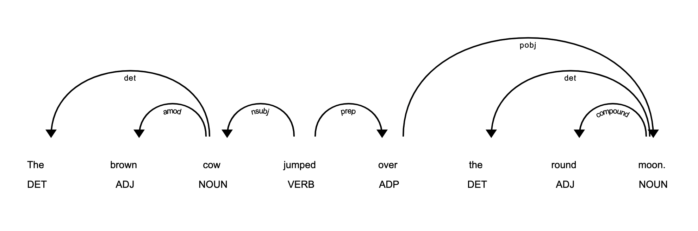

    * Point out that we can use the `options` dictionary to adjust the tree in the output window.


* Show how to change the the style and add color to the tree with the following code:

    ```python
    # Change the style and color of the relationships of words.
    options = {'distance': 125,
            'compact': 'True',
            'color': 'yellow',
            'bg': 'navy',
            'font': 'Arial'}

    displacy.render(tokens, style="dep", options=options)
    ```

  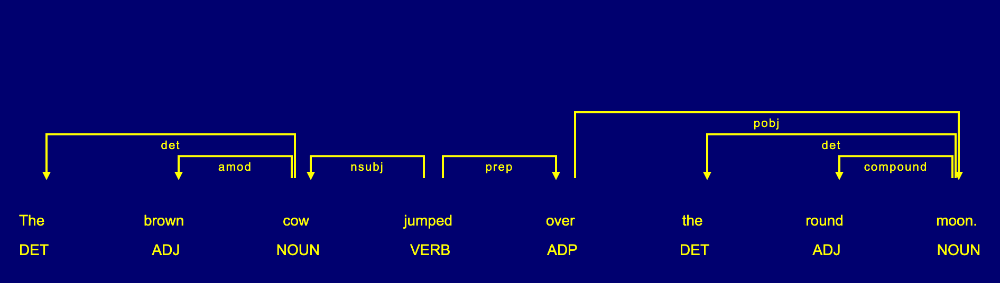

  * Send out the following [spaCy visual documentation](https://spacy.io/usage/visualizers) on how to style the dependency trees.

* Next, show the students how to render the dependency tree to a webpage.

    * In the following code, we replace `render()` with `serve()` and add a port number. Usually `port=5000` will work. If not, try `port=5050`. Then click on the link to open the image on your computer.  To stop serving on the local host `http://0.0.0.0:5050/`, select "Interrupt" under the "Kernel" options on Jupyter notebook.

        ```python
        # Host the image on a webpage.
        displacy.serve(tokens, style="dep", options=options, port=5050)
        ```

   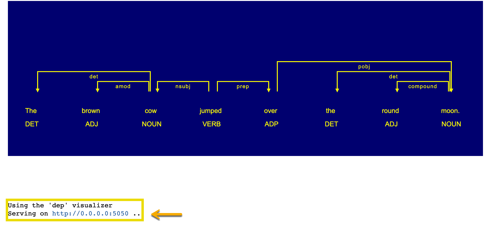

* Dependency parsing extracts a dependency parse of a sentence that represents its grammatical structure and defines the relationships between "head" words and words that modify those heads. We can retrieve the head word of each token using the `head` attribute.

    ```python
    # Print the POS-tag and head word of each token
    [token.text + " ---> " + token.pos_ + " ---> " + token.head.text for token in tokens]
    ```

    ```text
    ['The ---> DET ---> cow',
    'brown ---> ADJ ---> cow',
    'cow ---> NOUN ---> jumped',
    'jumped ---> VERB ---> jumped',
    'over ---> ADP ---> jumped',
    'the ---> DET ---> moon',
    'round ---> ADJ ---> moon',
    'moon ---> NOUN ---> over',
    '. ---> PUNCT ---> jumped']
    ```

* Point out that, in the second line, the head word is "cow" and the word that modifies "cow" is "brown."

* To get the word that modifies a head word, we can filter out adjectives that describe a particular word, like "cow," using a list comprehension, as the following code shows:

    ```python
    # Retrieve the adjectives that describe the word "cow"
    cow_describers = [token.text for token in tokens if (token.head.text == "cow" and token.pos_ == "ADJ")]

    # Print describers
    print(cow_describers)
    ```

    ```text
    ['brown']
    ```

Explain to students that this type of text analysis has different applications depending on the industry, from analyzing news or books to movie scripts, and even social media feeds.

Answer any questions before moving on.

---

### 11. Partner Do: Describing America (20 min)


**Corresponding Activity:** [06-Par_Describing_America](Activities/06-Par_Describing_America/)

Continue through the slideshow, using the next slides as an accompaniment to this activity.

In this activity, students will pair off and use NLTK and spaCy to identify the most common adjectives used by the Presidents' inaugural addresses since 1798. Then, you'll identify the most common adjectives used in the inaugural addresses to describe America.

---

### 12. Review: Describing America (10 min)

**Corresponding Activity:** [06-Par_Describing_America](Activities/06-Par_Describing_America/)

Open the solution, and go over the code, making sure to highlight the following for each section:

#### The Most Frequent Adjectives from each Inaugural Address

* We retrieve the documents’ IDs and texts of the US Presidents’ inaugural addresses, as the following code shows:

    ```python
    # Retrieve the IDs of inaugural addresses
    ids = inaugural.fileids()

    # Retrieve the text of all the inaugural addresses
    texts = [inaugural.raw(id) for id in ids]
    ```

    * Note that we use a list comprehension to create the list containing the text of each inaugural address.

* Next, we create a list comprehension that iterates through each inaugural address and passes it to the `most_freq_adjs` function for processing, as the following code shows:

    ```python
    # Create a list of the most common adjective for each inaugural address
    common_adjs = [most_common_adjs(text) for text in texts]

    # Print the common adjectives.
    print(common_adjs)
    ```

   *  The output lists the most common adjectives in all the inaugural addresses.


        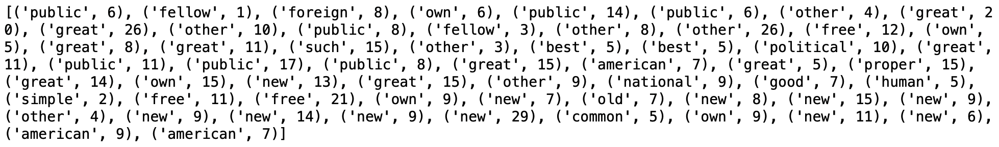

* Then, we use list comprehensions to retrieve each adjective and its number of occurrences for each text, in separate lists, and remove the ".txt" from the `ids`, as the following code shows:

    ```python
    # Use list comprehensions to retrieve each adjective and the frequency the word occurs for each address in separate lists.
    adjs = [common_adjs[i][0] for i, _ in enumerate(common_adjs)]
    occurrences = [common_adjs[i][1] for i, _ in enumerate(common_adjs)]
    # Remove the ".txt" from each id, and save the year and president as 'inaugural_address' in
    the following format "1789-Washington".
    inaugural_address = [id.replace(".txt", "") for id in ids]
    ```

* The DataFrame is created and sorted to display the top 10 adjectives, as the following code shows:

    ```python
    # Create a DataFrame called, common_adjs_df, that has columns to hold the
    # inaugural addresses, the common adjective, and the number of times each adjective
    appears.
    common_adjs_df = pd.DataFrame(
        {
            'inaugural address':inaugural_address,
            'adjective':adjs,
            'frequency':frequency
        }
    )

    # Sort the DataFrame to display the top 10 adjectives.
    presidential_adjs = common_adjs_df.sort_values(by=['frequency'],
        ascending=False).reset_index(drop=True)

    # Display the first ten rows.
    presidential_adjs.head(10)
    ```

    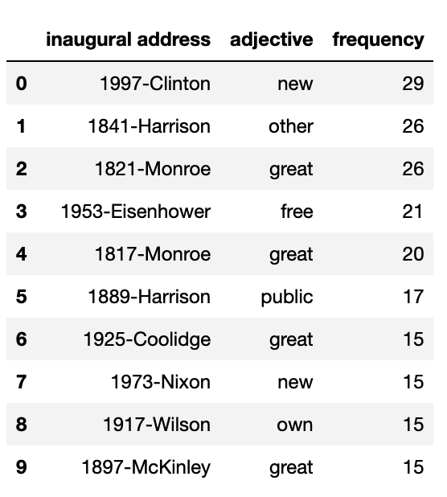

#### Most Common Adjectives Used in Inaugural Addresses

To investigate the most common adjectives used in the inaugural addresses over time, we begin by defining the function `all_adjs()`, which is similar to the `most_common_adjs()` function except that it returns all the adjectives and not only the most commonly occurring ones.

* First, we combined all the adjectives into one list called, `all_adjectives`. The list is created by using a `for` loop that sends the text of the inaugural addresses to the `all_adjs()` function and concatenates the returned adjectives to the `all_adjectives` list, as the following code shows:

    ```python
    # Create an empty list to store all the adjectives.
    all_adjectives = []

    # Use a for loop that sends the "text" of the inaugural addresses to the all_adj() function
    # and concatenates the returned adjectives to the all_adjectives list.
    for text in texts:
        all_adjectives = all_adjectives + all_adj(text)
    ```

    * Point out that, inside the `for` loop, we use the plus (`+`) operator to concatenate all the adjectives found in a text, using the `all_adj()` function provided, instead of using the `append()` method, because the `append()` method will create a list of lists that makes it more challenging to access each sub-list. And, using a list comprehension will create a list of lists as well.

Next, we create a variable, `most_common_adjectives`, that uses the `most_common()` function from the `Counter` module to store the three most frequent adjectives used in the inaugural addresses. In the `most_common()` function, we pass in the number "3" to retrieve the three most frequent adjectives, as the following code shows:

```python
# Create a variable, most_freq_adjectives, that stores the three most frequent adjectives
# used in the inaugural addresses by using the most_common() function from the Counter module.
most_freq_adjectives = Counter(all_adjectives).most_common(3)
```

    * The three most frequent adjectives are: `[('great', 332), ('other', 269), ('own', 247)]`, which tells us about the all-time frequency of these adjectives but we are actually interested in seeing how their frequency fluctuated over time in each address.

Now, we define a function `get_word_counts()` that counts how many times a word occurs in the text.

* We pass the three most frequent adjectives (`'great'`,`'other'`, and `'own'`) and the text from each inaugural address to the `get_word_counts()` function to retrieve the number of times each adjective appears in each inaugural address, which is demonstrated in the following code:

    ```python
    # Use list comprehensions to create a list with the counts of each top adjective in the inaugural addresses.
    great_counts = [get_word_counts(text,'great') for text in texts]
    other_counts = [get_word_counts(text,'other') for text in texts]
    own_counts = [get_word_counts(text,'own') for text in texts]
    ```

To retrieve the year and president of each inaugural address, we use list comprehensions to split the `id` on the hyphen and use list indexing to extract the years and presidents’ last names, as the following code shows:

```python
# Create a Python list of dates to store the year when every inaugural address was delivered.
dates = [id.split('-')[0] for id in ids]

# Create a Python list of presidents to store the last name of each U.S. President from each inaugural address.
presidents = [id.split('-')[1].split('.')[0] for id in ids]
```

Next, we create the `presidential_adjs_df` DataFrame, with the year of the inaugural address as the index, as the following code shows:

```python
# Create a DataFrame presidential_adjs_df, that contains columns that hold the President's last name
# and the number of times each adjective appears in the Presidents' inaugural address.
presidential_adjs_df = {
    'President': presidents,
    'great':great_counts,
    'other':other_counts,
    'own': own_counts
}

# Set the index of the presidential_adjs_df DataFrame equal to the year in the dates list.
presidential_adjs_df = pd.DataFrame(presidential_adjs_df, index=pd.to_datetime(dates).year)
```

  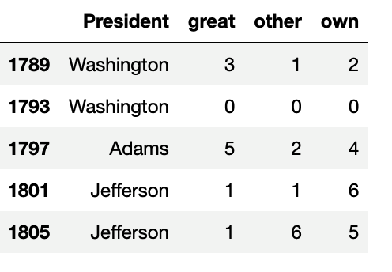

We create a bar plot to display the the most common adjectives used throughout the US presidential inaugural addresses using the following code:

```python
# Create a line plot that displays the most common adjectives used throughout the U.S. presidential inaugural addresses.
presidential_adjs_df.plot.bar(
    title = "Most Common Adjectives Used in the U.S. Presidential Inaugural Addresses",
    figsize = (15, 5)
)
```


  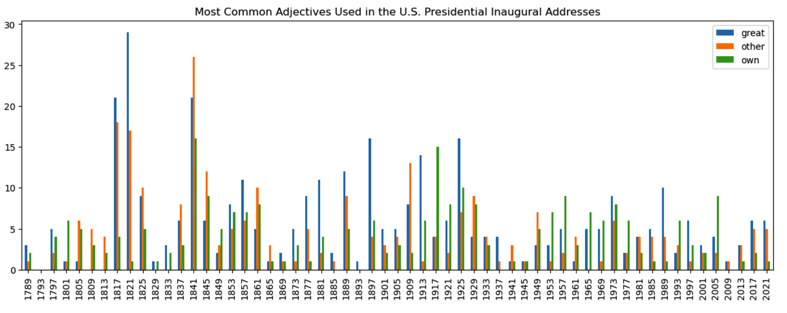

#### The Most Common Adjectives Describing America

To get all the adjectives that describe "America" we use a `for` loop that sends the text of the inaugural addresses to the `describe_america()` function. We use concatenation to add each adjective to the `america_adjectives` list, as the following code shows:

```python
# Create an empty list to store the adjectives
america_adjectives = []

# Write a for loop that sends the "text" of the inaugural addresses to the describe_america() function
# and concatenates the returned adjectives to the america_adjectives list.
for text in texts:
    america_adjectives = america_adjectives + describe_america(text)

# Print the list of adjectives describing the word "America."
america_adjectives
```

* The adjectives that describe "America" are "productive", "alert", "illumined", "strong",  "stronger" , and "rich", as the following output shows:

    ```text
    ['productive', 'alert', 'illumined', 'strong', 'stronger', 'rich']
    ````

Explain to students that this kind of textual analysis could have different applications, from analyzing social media feeds to news, to books, or movie scripts. This, and other methods for textual analysis, will come in handy when you need to understand something from a text but don't have the time to read through it manually.

Having explored how to extract and analyze adjectives in historical texts, we'll now turn our attention to identifying specific named entities within a text. This will further enhance our text analysis skills as we apply NER to contemporary materials.

Answer any questions before moving on.


---


### 13. Everyone Do: Named Entity Recognition on Coffee (15 min)


**Corresponding Activity:** [07-Evr_Coffee_NER](Activities/07-Evr_Coffee_NER/)

This activity introduces students to NER, which allows us to identify key elements in text, such as people, places, organizations, and monetary values, in order to understand the meaning of the text.

In this activity, students will code along with the instructor, who will prompt students on coding activities. These probing questions, combined with the whole group’s participation in the demonstration, are meant to reinforce the concept of NER.

Use the slides to go over NER. NER is a process that extracts specific types of nouns, or **named entities**, from the text. Named entities are often proper nouns, but NER tools can also extract currency, dates, and times.

Like POS tagging and dependency parsing, NER gives us a way of being more precise with our text analysis, only extracting the words that meet a specific grammatical or semantic criteria.

Open the `ner_coffee.ipynb` file in Jupyter notebook and begin coding while the students follow along.

* Similar to the tokens that we used to get POS and dependencies, we can access tagged entities through the `.ents` attribute and its child attributes, `.text` and `.label_`.

    ```python
    # Set a sentence to be analyzed using spaCy.
    doc = nlp(u"""Patrick Mahomes is a quarterback for the Kansas City Chiefs in the American
        Conference, which is one of two conferences in the National Football League.""")

    # Access the tagged entities with `.text` and `.label_`.
    [ent.text +" ---> "+ ent.label_ for ent in doc.ents]
    ```

* The output returns the following format:

    ```text
    ['Patrick Mahomes ---> PERSON',
    'the Kansas City Chiefs ---> ORG',
    'the American Conference ---> ORG',
    'one ---> CARDINAL',
    'two ---> CARDINAL',
    'the National Football League ---> ORG']
    ```

* Next, we get a random Reuters article that contains the word "coffee", as the following code shows:

    ```python
    # Locate and store a single article from the Reuters stories with the category "coffee."
    article = reuters.raw(fileids = reuters.fileids(categories='coffee')[3])
    print(article)
    ```

* Then, we analyze the article with spaCy and visualize our analysis with `displacy.render()`, as the following code shows:

    ```python
    # Set article to be analyzed with spaCy.
    doc = nlp(article)

    # Render NER visualization with displacy to determine entities for extraction
    displacy.render(doc, style='ent')
    ```

    * The output is an image that shows the names of entities in a variety of colors.


        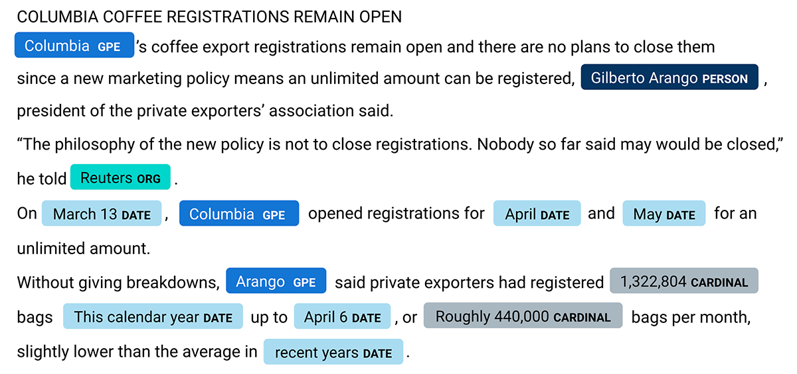

Next, we’ll get the most common geopolitical and organizational entities from all the Reuters articles on "coffee."

* Prompt the students to provide the code to get all the Reuters articles on "coffee" and analyze them with `spaCy`.

    ```python
    # Store all Reuters articles with category "coffee."
    articles = reuters.raw(categories='coffee')

    # Analyze the articles with spaCy.
    doc = nlp(articles)
    ```

* Then, ask the students how they would extract the geopolitical and organizational entities from all the Reuters articles on "coffee," and then share the following code if there are no answers:

    ```python
    # Extract geopolitical "GPE" and organizational entities "ORG".
    geo_org_entities = [ent.text for ent in doc.ents if ent.label_ in ['GPE', 'ORG']]
    # Display the first 20 entities
    geo_org_entities[:20]
    ```


* Point out that some of the entities range for one to multiple words. And some words end in the newline character, "/n".

* Ask the students how we can remove the newline character from these words, wait for answers, then provide the following code:

    ```python
    # Using a list comprehension convert each entity to lowercase and remove the newline character.
    entities = [i.lower().replace('\n','') for i in geo_org_entities]
    ```

* Next, give the students a few minutes to write the code for the next three steps:

   *  Use  the `most_common()` function from the `Counter` module to store the most common entities and have them print out the first 10 most frequent entities.
   * Use list comprehensions to retrieve each entity and the number of occurrences for each entity in separate lists.
   * Create a DataFrame that has columns to hold each entity and the number of times each entity appears.


* Then, explain the following code while the students follow along.

    ```python
    # Create a variable, most_freq_entities, that stores the most frequent entities
    # using the most_common() function from the Counter module.
    most_freq_entities = Counter(entities).most_common()

    # Print the first 10 most frequent entities
    print(most_freq_entities[:10])

    # Use list comprehensions to retrieve each entity and the number of occurrences for each entity in separate lists.
    entity = [most_freq_entities[i][0] for i, _ in enumerate(most_freq_entities)]
    frequency = [most_freq_entities[i][1] for i, _ in enumerate(most_freq_entities)]

    # Create a DataFrame that has columns to hold each entity and the number of times each entity appears.
    common_entities_df = pd.DataFrame(
        {
            'entity':entity,
            'frequency':frequency
        }
    )

    # Sort the DataFrame
    common_entities_df.sort_values(by=['frequency'], ascending=False).reset_index(drop=True)

    # Display the first 10 rows.
    common_entities_df.head(10)
    ```

   * The DataFrame should look similar to the following image.

        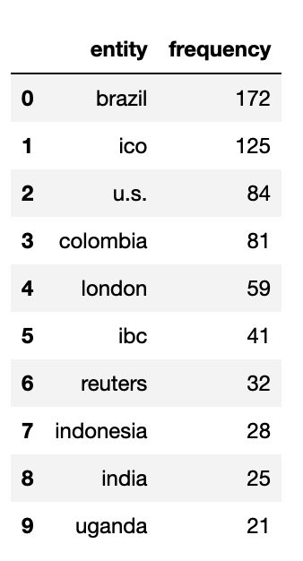


Answer any questions before moving on.

---


### 14. End Class (5 min)

Encourage students to take full advantage of office hours by reminding them that this is their time to ask questions and get assistance from instructional staff as they learn new concepts.

Open the recap slide in the slide deck and let students know that they have reached the end of the lesson. Read through the learning objectives on the recap slide to sum up what students have achieved in this lesson.

Use the following questions to prompt learners to reflect on their learning:

* How would you describe the process of applying a linear SVC model to classify text data?

* Recall the performance metrics we discussed. How did assessing the performance of our binary classifier help you understand the model's effectiveness?

* What are the key differences you observed between using a traditional SVC model and a LinearSVC model for text classification? How does this impact your approach to future text classification tasks?

* What insights did you gain from analyzing the confusion matrix and classification report? How could these insights be applied to improve the model?

* In your own words, explain why some text messages were classified as "ham" while others were labeled as "spam." What have you learned about the features that might influence these classifications?


Use these points as a guide to briefly summarize the next lesson:

* In the next lesson, you will get even more hands on with NLP tasks and begin exploring advanced NLP techniques.

* We will begin to work with much larger corpora to go with our more advanced NLP techniques.

* Today we focused primarily on text classification and the methods that support that NLP task. In the next lesson, we will continue to deepen our knowledge of text classification and also introduce some text generation techniques using what we already know about deep learning models.


---

© 2023 edX Boot Camps LLC. Confidential and Proprietary. All Rights Reserved.
