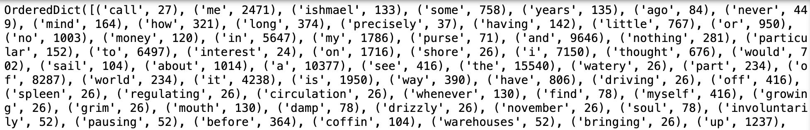

## Module 20.3: Advanced NLP Techniques: Topic Modeling and LSTM-RNN

### Overview

In this lesson, the students will apply their NLP preprocessing skills to classify news headlines into categories through unsupervised learning models, focusing on topic modeling. They will also train a deep learning LSTM RNN model on a large corpus of text to be used for text generation. This practical and engaging lesson combines text analysis and text generation techniques, refining their NLP and deep learning expertise.
### Class Objectives

By the end of today's class, the students will be able to:

* Apply NLP preprocessing to a large corpora of text.
* Demonstrate how to classify text into topics using unsupervised learning.
* Understand and demonstrate how to use LSTM RNN to generate text.

---

### Instructor Notes

In this lesson, students will learn how to use two new unsupervised learning models: latent Dirichlet allocation (LDA) and non-negative matrix factorization (NMF).These models classify text into topics or categories, similar to clustering numerical data.

Additionally,they will learn how to train a deep learning long short-term memory (LSTM) recurrent neural network (RNN) model on a large corpus of text for a text generation task. Using LSTM RNN is one of the building blocks of transformers and understanding how they work and what their limitations are is important to understanding transformers.

---

### Class Slides

The slides for this lesson can be viewed on Google Drive here: [Module 20.3 Slides](https://docs.google.com/presentation/d/1ExclQBwYayCKrgI69QcgqBOPhMMrk5bL_SM4ReSw-oY/edit?usp=sharing).

To add the slides to the student-facing repository, download the slides as a PDF by navigating to File, selecting "Download as," and then choosing "PDF document." Then, add the PDF file to your class repository along with other necessary files. You can view instructions for this [here](https://docs.google.com/document/d/1XM90c4s9XjwZHjdUlwEMcv2iXcO_yRGx5p2iLZ3BGNI/edit).

**Note:** Editing access is not available for this document. If you wish to modify the slides, create a copy by navigating to File and selecting "Make a copy...."

---

### Time Tracker

| Start Time | Number | Activity                                           | Duration |
| ---------- | ------ | -------------------------------------------------- | -------- |
| 6:30 PM    | 1      | Instructor Do: Introduction to the Class           | 0:05     |
| 6:35 PM    | 2      | Instructor Do: Topic Modeling with Latent Dirichlet Allocation (LDA) | 0:25     |
| 7:00 PM    | 3      | Students Do: BBC News Topic Modeling with LDA      | 0:20     |
| 7:20 PM    | 4      | Review: BBC News Topic Modeling with LDA           | 0:10     |
| 7:30 PM    | 5      | Instructor Do: Topic Modeling with Non-negative Matrix Factorization | 0:10     |
| 7:40 PM    | 6      | Everyone Do: BBC News Topic Modeling with NMF      | 0:15     |
| 7:55 PM    | 7      | BREAK                                              | 0:15     |
| 8:10 PM    | 8      | Instructor Do: Introduction to RNNs and LSTMs      | 0:15     |
| 8:25 PM    | 9      | Instructor Do: Text Generation with LSTMs          | 0:30     |
| 8:55 PM    | 10     | Student Do: Sherlock Holmes Text Generation        | 0:20     |
| 9:15 PM    | 11     | Review: Sherlock Holmes Text Generation            | 0:10     |
| 9:25 PM    | 12     | End Class                                          | 0:05     |
| 9:30 PM    |        | END                                                |          |


---


### 1. Instructor Do: Introduction to the Class (5 min)

Open the slideshow and welcome to the class.

Cover the following points:

Welcome the students and explain that in today’s lesson, they will apply their NLP processing skills to text.  They will then use unsupervised learning models, specifically lLatent Dirichlet allocation (LDA) and non-negative matrix factorization (NMF), to classify the text into topics or categories. Following this, they will train a deep learning model on a large corpus to create a text generator.

* By the end of the lesson, students will be able to:
    * Apply NLP preprocessing to a large corpora of text.
    * Demonstrate how to classify text into topics using unsupervised learning.
    * Understand and demonstrate how to use LSTM RNN to generate text.

With that introduction, let's dive deeper into the fascinating world of NLP.

---

### 2. Instructor Do: Topic Modeling with Latent Dirichlet Allocation (LDA) (25 min)

**Corresponding Activity:** [01-Ins_Topic_Modeling](Activities/01-Ins_Topic_Modeling/)

Begin by mentioning that topic modeling is a form of unsupervised learning. It is used to identify and extract meaningful topics or themes from large volumes of text, such as news articles, social media posts, academic papers, and more, without prior knowledge of the topics.

** Note:** Remind the students that text data is unlabeled data.

Imagine if you had a large database of articles on a website such as the Huffington Post. How would you identify meaningful themes and topics across articles so that you could group them together and get a better understanding of the content? This is where **topic modeling** comes into play.

What is a topic? And, how do we model topics? To begin to answer these questions, let’s revisit an activity we already did and link it to topic modeling.

* Recall the Describing America text processing activity from earlier in this module. In that activity, you and your partner worked with a function called `describe_america()` that retrieved the adjectives in the text that described the word "America." The function accomplishes this with a conditional statement that searches for adjectives that refer to America.

* The idea behind this function was simple: If there are adjectives that occur alongside the word "America," then that adjective is being used to describe America and we should store it.

* Put very simply, terms that occur together often, such as adjectives occurring near "America," and in a repeating pattern across a corpus, are considered to be topics. We might say that "Describing America" is one topic across the corpus of inaugural speeches.

* However, we were actively seeking out a topic called "Describing America," so we were able to explicitly write the function `describe_america()` to look for the pattern of recurring terms we expected. This rule-based approach works, but in reality it is impractical for a number of reasons.

  * It is cumbersome and tedious to write explicit rules for each and every topic. More importantly, however, there may be topics and patterns that are not apparent to us that need to be identified, particularly in large corpora. These hidden topics can be identified with topic modeling.

* Now that we understand what topics are, let’s think about what "modeling" refers to. Remember that in order to make predictions based on training data, computers need to create internal numerical representations of natural language tokens.

* **Question:** What is the main internal representation that computers use to perform NLP tasks?

* **Answer:** The bag-of-words (BoW) model OR vector embeddings. If students respond by saying "DataFrames," use probing questions to push them towards the answer. (Okay, the representations are stored in a DataFrame, but what do the DataFrames represent?)

* Computers depend on the BoW representations to perform NLP tasks. The bag of words is a vectorized frequency tally of every token in the document. It’s a collection of vector embeddings that are a numerical representation of some NLP qualities.

* How does that relate to topic modeling? Well, computers still can’t accomplish NLP tasks in the same way that people can. For example, consider the following two news article headlines:


   


* Looking at these two headlines, you would probably be able to identify that they are both related to entertainment. But how would a computer model a similar guess about the topic being discussed?

  

* Each article is connected to an underlying topic that the model identifies and explicates. Notice that the strength of the connections to each topic differs. Both articles have a clear, strong likelihood of being part of the "celebrities" topic, but the article about Michelle Yeoh’s Oscar win has a stronger connection to the "movies" topic. The article about Usher’s Super Bowl performance is strongly connected to the "live performances" topic and has a less significant&mdash;but still notable&mdash;connection to the "sport" topic by comparison.

* We might represent the strength or weight of these connections numerically as follows:

  

* If we wanted to represent these weights in a vector, as we do in models, they would look like this numerical representation. And this is what we refer to as topic modeling. The strength of relationships between each document in the corpus and the underlying topics (or features) are represented by vectors.

* Topic modeling is able to uncover themes based on patterns of co-occurring words that humans might not be able to identify easily or comprehensively. This makes it ideal as part of recommendation engines for sites with large corpora.

* Let’s look at a specific topic modeling algorithm. One of the most well-known algorithms for topic modeling is latent Dirichlet (dee-rish-lay) allocation (LDA). This algorithm is used to identify topics within a collection of documents, where each topic is a distribution over words in the documents after the text has been preprocessed.

* It’s important to note that LDA assumes that documents are mixtures of topics and that topics are mixtures of words. It starts with a fixed number of topics, which the user defines, and aims to find two probability distributions:
   * Document-topic distribution: For each document, what is the probability of it belonging to each topic? This is similar to the entertainment headlines example we just reviewed.
   * Topic-word distribution: For each topic, what is the probability of each word being associated with that topic?

After presenting a background on topic modeling and LDA, open `Latent_Dirichlet_Allocation_solution.ipynb`  and import the dependencies and load the Huffington Post news headlines file, `news_articles.csv`, into a DataFrame.

```python
# Import dependencies
import pandas as pd
import numpy as np
import random
from sklearn.feature_extraction.text import CountVectorizer
from sklearn.decomposition import LatentDirichletAllocation
# Set the column width
pd.set_option('max_colwidth', 200)

# Load the news_articles.csv into a DataFrame.
news_articles_df = pd.read_csv('Resources/news_articles.csv')
# Display the first 10 headlines
news_articles_df.head(10)
```


* Point out that the text data we are importing contains articles from the HuffPost website.

Next, we'll preprocess our dataset, a crucial step in preparing our text for analysis. Let's begin by cleaning our headlines to ensure accurate topic modeling.

#### Preprocess the Text

Before we apply scikit-learn’s `CountVectorizer()`, we should remove numbers, non-alphabetic characters, and spaces so that they don’t influence the topics.

```python
# Remove digits and non-alphabetic characters.
news_articles_df['headline'] = news_articles_df['headline'].apply(lambda x: re.sub(r'[^a-zA-Z\s ]', '', str(x)))
news_articles_df.head(10)
```


Now that our text data is cleaned, we’ll use scikit-learn's `CountVectorizer()` to transform these headlines into a document-term matrix (DTM) for our LDA model.

#### Process the Text to Tokens and Counts.

Next, we'll use scikit-learn’s `CountVectorizer()` class to process our news headlines. In the `CountVectorizer()` class we pass three parameters (`max_df`, `min_df, and `stop_words='english'`), as the following code shows:

```python
# Create an instance of the CountVectorizer and set the max_df to 0.95 and min_df to 10, and use the "english" stopwords.
cv = CountVectorizer(max_df=0.95, min_df=10, stop_words='english')
```

* The `max_df`, or "maximum document frequency," is used to set the limit on how frequently a word can appear across all the documents. We are using `max_df=0.95`, which means that any word appearing in more than 95% of the documents will be excluded.

   * This helps you filter out common words that don't carry much unique information, like "the," "and," or "in," so that your analysis focuses on more meaningful terms. The range is from 0.0 to 1.0.

* The `min_df`, or "minimum document frequency," allows you to set a minimum limit on how many documents a word must appear in to be included. We are using `min_df=10`, which means that a word must appear in at least 20 documents to be considered. This helps you exclude rare words that might not be useful for your analysis. This has to be adjusted depending on how many documents you have.

Point out that both `max_df` and `min_df` have to be adjusted to get the best results.

* The students should know that the `stop_words='english'` parameter will ignore all English-language stopwords when vectorizing each article.


* **Question:** Do we need to split the data into training and testing datasets?

* **Answer:** No, when using unsupervised learning, we don’t split the data into training and testing datasets.

* We need to convert the text in all the articles to an array consisting of each word and how many times that word appears in each row, or headline. In essence, we need to create our BoW:

* First, we get the "headline" column as a pandas Series.

  ```python
  # Get the headlines.
  headlines= news_articles_df['headline']
  print(headlines)
  ```

  


* Next, we’ll fit and transform our headline data into a DTM. Recall that the DTM is a representation of how frequently each term occurs in each document. Each column contains numbers representing how much a specific term occurs across the corpus.

  ```python
  # Transform each row from the headlines Series to a DTM.
  dtm = cv.fit_transform(headlines)
  # Get the shape of the DTM.
  print(dtm.shape)
  ```

The shape of our DTM is 23,377 rows and 3,149 columns, where each column contains a unique word from our vocabulary that was created using `fit_transform`.

* Take a moment to show how to get the length of our vocabulary by using the `len` function on the `get_feature_names_out()` method.

  ```python
  # Get the length of the vocabulary.
  len(cv.get_feature_names_out())
  ```

  * The length of our vocabulary is 3,149, which is the same length as the number of columns.

* Next, demonstrate how to access the words in the vocabulary by using list indexing on the `get_feature_names_out()` method.

  ```python
  # Look at 100 random words in the vocabulary
  print(cv.get_feature_names_out()[:100])
  ```

  


Continuing on, mention that in our DTM, not every word is going to be in every row. If a word from the vocabulary appears in a column, then the value for that column will be greater than "0," depending on the number of times that that word appears in the row. And if a vocabulary word does not appear in a column, the value for that column will be "0."

Demonstrate this by printing the first 500 elements from the first row in the DTM.

```python
# Print the first 500 elements (transformed words) from the 1st row( i.e., document).
print(dtm.toarray()[0][:500])
```


* **Question:** What do you notice about these elements?

* **Answer:** There are mostly zeros, with only one non-zero value.

 * In the first 500 columns of the first row, there is only one unique word. Remember that we expected that the DTM would be a sparse matrix with many zeroes.

Next, show how we can get all the words, the word index, and how many times the word appears in the vocabulary from the first row.

```python
# Get the feature names (words) from the CountVectorizer.
feature_names = cv.get_feature_names_out()

# Get all the non-zero elements from the first row.
non_zero_elements = dtm.toarray()[0]

# Get the indices for each non-zero element.
non_zero_indices = non_zero_elements.nonzero()[0]

# Print out the word and the number of times the word is in the row.
for idx in non_zero_indices:
    print(f"Word: {feature_names[idx]} | Word index {idx} | Count = {non_zero_elements[idx]}")
```

  * The output shows the six words in the first row and how many times each word appears.

    ```text
    Word: bachelor | Word index 183 | Count = 1
    Word: yearold | Word index 3131 | Count = 1
    Word: young | Word index 3138 | Count = 1
    ```

Before moving on to apply the LDA model, show how we can convert our DTM to a BoW DataFrame and display a random number of columns for the first 10 rows as follows:

```python
# Convert the DTM to a DataFrame.
dtm_df = pd.DataFrame(dtm.toarray(), columns=cv.get_feature_names_out())

# Display some random columns and the first 20 rows of the DataFrame.
dtm_df.iloc[:,180:195:].head(10)
```


* Remind the students that each row represents a news headline and the values represent if the word appears in the news headline, "1," or if it doesn’t appear, "0." This is a true representation of a BoW.

Let the students know that we can apply LDA to uncover underlying topics in our headlines.

#### Applying LDA

Remind the students that LDA assumes that all the headlines are a mixture of topics and that topics are a mixture of words.

Explain that there is no easy way to classify each headline; therefore, we must define how many topics we want to start with, fit the model, get the top 10&ndash;15 words for each topic, then assign a category or topic (like "sports," "business," etc.) based on the top words for each topic, and repeat the process until we are satisfied with the classification of each headline.

Begin by creating an instance of the `LatentDirichletAllocation()` class and assigning a number to the `n_components` parameter, which will be our number of topics.

* **Note:** The headlines consisted of the following seven categories: "business," "politics," "entertainment," "food and drink," "sports," "technology," and "travel."


```python
# Pick 7 topics to start with: `n_components=7`
LDA = LatentDirichletAllocation(n_components=7,random_state=42)
# Fit the model with our document term matrix data. This may take awhile if you have a large amount of documents.
LDA_data = LDA.fit(dtm)
```

Next, show how we can get the distribution of all of the words for each topic as an array of numbers. Each number represents the probability or weight of each word in the vocabulary being associated with that particular topic. The higher the value indicates that the word is highly likely to be associated with the topic, whereas lower values are less likely to be associated with that topic.

```python
# Get the values of each topic-word distribution.
topic_word_distributions = LDA.components_
print(topic_word_distributions)
```


* Point out that each topic has 3,149 values, which represent each word in our vocabulary. This can be demonstrated by using the following code:

```python
# Get the length of the array of each topic. It should be the same as the vocabulary.
for index,topic in enumerate(LDA.components_):
    print(len(LDA.components_[index]))
```

* The output shows that each of the seven topics has 3,149 values.

  ```text
  3149
  3149
  3149
  3149
  3149
  3149
  3149
  ```

Next, go over how to access the array of the first topic.

```python
# Get the array of the first topic.
first_topic = LDA.components_[0]
# This is the ranking of each word in the array. Lower values have less impact than higher values.
print(first_topic)
```

We can display all the values in descending order. First, we get the indices of each value using `np.argsort(-first_topic)` so the values that have a higher impact on the topic appear first. Then, iterate through the sorted topic values as follows:

```python
# Get the indices for the first topic in descending order.
sorted_first_topic_indices = np.argsort(-first_topic)

# Use the sorted indices for the values from greatest to least.
sorted_first_topic_values = first_topic[sorted_first_topic_indices]
for value in sorted_first_topic_values:
    print(value)
```


Before showing the students how to retrieve the word associated with each value, demonstrate the functionality of `argsort()`.

#### Using `argsort()`.

In general, `argsort()` returns index positions from least to greatest.

Using a simple array of three numbers, [10, 200, 1], we can print out the indices of each number in the array and sort on those indices.

```python
# Define an array of values index 0 = 10, index 1 = 200, index 2 = 1.
arr = np.array([10, 200, 1])
# Print out the indices after sorting the array from least to greatest (i.e., 1, 10, 200).
print(f"The indices the the array, '10, 200, 1' from least to greatest: {np.argsort(arr)}")
# Reverse the sort from greatest to least.
print(f"The indices the the array, '10, 200, 1' from greatest to least: {np.argsort(-arr)}")
```

* The output shows the indices printed from least to greatest and greatest to least.

    ```text
    The indices the the array, '10, 200, 1' from least to greatest: [2 0 1]
    The indices the the array, '10, 200, 1' from greatest to least: [1 0 2]
    ```

Next, sort the array of the first topic and print the indices of the vocabulary..

```python
# Sort the vocabulary array of the first topic
first_topic.argsort()
```

* The array is

    ```text
    array([1716, 1868,  999, ..., 2801, 2869, 1688])
    ```

The word that has the least impact is "1716," and the word that has the greatest impact is "1688."

The values for the words that have the least impact and greatest impact on the topic are as follows:

```python
# Get the value of the word that is least representative of this topic.
print(f"The value of the word that is least representative of this topic is: {first_topic[1716]}")
# Get the value of the word that is most representative of this topic.
print(f"The value of the word that is most representative of this topic is: {first_topic[1688]}")
```

* The output is:

    ```text
    The value of the word that is least representative of this topic is: 0.14285722531681794
    The value of the word that is most representative of this topic is: 390.507603043464
    ```

Next, show how we get the top ten indices for the first topic.

```python
# Get the indices of the top 10 indices for the first topic.
top_word_indices = first_topic.argsort()[-10:][::-1]
print(top_word_indices)
```

```text
[1688 2869 2801 3042  247 3041 1544  250 2830  823]
```

We can iterate through these indices to print out the word by using indexing on the `cv.get_feature_names_out()` method as follows.

```python
# Get the top 10 words from the indices.
for index in top_word_indices:
    print(cv.get_feature_names_out()[index])
```

* The top 10 words associated with topic one are:

    ```text
    make
    travel
    things
    ways
    best
    way
    know
    better
    tips
    dont
    ```

Likewise, we can get the bottom 10 words.

```python
# Get the bottom 10 words from the indices.
bottom_word_indices = first_topic.argsort()[:10][::-1]
for index in bottom_word_indices:
    print(cv.get_feature_names_out()[index])
```

* The bottom 10 words associated with topic 1 are:

    ```text
    manziel
    mitch
    marie
    mcconnell
    greene
    franco
    meter
    fargo
    nassar
    marjorie
    ```

Knowing how to access each topic and getting the top 10 words for each topic, we can use the following script to print out the top 20 words associated with each topic. This will allow us to determine how we should label each topic.

```python
# Print the top 20 words for each topic.
for index,topic in enumerate(LDA.components_):
    print(f"The Top 20 Words For Topic #{index+1}")
    print([cv.get_feature_names_out()[i] for i in topic.argsort()[-20:][::-1]])
    print('\n')
```

In the code above, we are adding "1" to the index of our topic to call the first topic, "Topic 1," etc.
The output is as follows:

```text
The Top 20 Words For Topic #1
['make', 'travel', 'things', 'ways', 'best', 'way', 'know', 'better', 'tips', 'dont', 'world', 'reasons', 'vacation', 'tom', 'work', 'perfect', 'didnt', 'free', 'just', 'heres']


The Top 20 Words For Topic #2
['like', 'nfl', 'new', 'national', 'state', 'player', 'football', 'great', 'google', 'looks', 'pay', 'guide', 'soccer', 'dies', 'players', 'police', 'billion', 'deal', 'sports', 'womens']


The Top 20 Words For Topic #3
['photos', 'food', 'best', 'recipes', 'need', 'dead', 'want', 'recipe', 'places', 'worlds', 'foods', 'america', 'eat', 'day', 'right', 'life', 'wine', 'visit', 'youll', 'cake']


The Top 20 Words For Topic #4
['trump', 'says', 'biden', 'game', 'donald', 'james', 'gop', 'john', 'sexual', 'joe', 'report', 'twitter', 'election', 'president', 'rep', 'house', 'million', 'covid', 'lebron', 'obama']


The Top 20 Words For Topic #5
['business', 'women', 'video', 'facebook', 'world', 'best', 'ceo', 'watch', 'house', 'qa', 'black', 'white', 'uber', 'good', 'ice', 'ryan', 'week', 'tech', 'videos', 'youtube']


The Top 20 Words For Topic #6
['new', 'trumps', 'trump', 'york', 'donald', 'social', 'twitter', 'media', 'white', 'city', 'shows', 'war', 'house', 'people', 'taylor', 'news', 'book', 'covid', 'big', 'jimmy']


The Top 20 Words For Topic #7
['day', 'apple', 'super', 'new', 'olympic', 'american', 'bowl', 'olympics', 'star', 'iphone', 'just', 'watch', 'winter', 'wins', 'years', 'gold', 'week', 'amazon', 'year', 'says']
```

Next, we can assign each set of words a topic. Let the students know that the categories of the headlines are: "business," "politics," "entertainment," "food and drink," "sports," "technology," and "travel."

* Take a few minutes to determine which words belong to which topic.

Our best guess is:

```text
- Topic 1: Travel
- Topic 2: Sports
- Topic 3: Food
- Topic 4: Politics
- Topic 5: Business
- Topic 6: Entertainment
- Topic 7: Technology
```

Now that we have identified our topics, we'll now match them to the original headlines to determine their dominant themes.

#### Assigning the Topic to the Headline

To assign a topic to each headline, we will transform the DTM so that we have an array with 23,377 documents and 7 topics, where each document will be given a probability distribution of documents (or articles) over the topics.

```python
# Transform our DTM so we get an array with the (number_of_documents, number_of_topics).
topic_results = LDA.transform(dtm)
# Get the shape of the topic results
topic_results.shape
```

```text
(23377, 7)
```

Next, we get the first headline’s topic probability distribution rounded to six decimal places.

```python
# Get the first headline's topic probability distribution rounded to six decimal places.
print(topic_results[0].round(6))
```

The following array shows the probability distribution of each topic for the first headline.

```text
[0.035997 0.494534 0.035804 0.035731 0.035714 0.035751 0.326469]
```

Using the following code, we can rank the topics for the first headline based on the probability distribution.

```python
# Get the sorted indices for each topic in the first headline.
sorted_indices = np.argsort(-topic_results[0])
# Print the ranking of topics for the headline.
print("Ranking of topics for the first headline:")
for rank, topic_index in enumerate(sorted_indices):
    print(f"   Rank {rank+1}: Topic {topic_index+1}, Probability: {topic_results[0, topic_index]:.6f}")
```

* The rankings of each topic for the first headline are as follows:

```text
Ranking of topics for the first headline:
   Rank 1: Topic 2, Probability: 0.494534
   Rank 2: Topic 7, Probability: 0.326469
   Rank 3: Topic 1, Probability: 0.035997
   Rank 4: Topic 3, Probability: 0.035804
   Rank 5: Topic 6, Probability: 0.035751
   Rank 6: Topic 4, Probability: 0.035731
   Rank 7: Topic 5, Probability: 0.035714
```

This means that our first headline would be "Topic 2: Sports."

We can also use the `argmax()` method to get the array’s highest value.

```python
# Get the topic with the highest probability.
topic_results[0].argmax()+1
```

Next, read in the original news headline data and then combine the original data with the topic label as follows.

```python
# Read in our original news headlines.
news_articles_df_2 = pd.read_csv('Resources/news_articles.csv')
# Display the first 20 headlines.
news_articles_df_2.head(20)
#Find the dominant topic for each document and add the label to a new column.
news_articles_df_2['topic'] = (topic_results.argmax(axis=1)+1)
# Get the first 10 rows.
news_articles_df_2.head(10)
```


Point out that we are assigning the topic with the highest probability. So, all the headlines might not be appropriately labeled. Some may be more suitable for the second or third highest probability.

Answer any questions before moving on.

---

### 3. Students Do: BBC News Topic Modeling with LDA  (20 min)


**Corresponding Activity:** [02-Stu_BBC_News_LDA_Topic_Modeling](Activities/02-Stu_BBC_News_LDA_Topic_Modeling/)

Continue through the slideshow, using the next slides as an accompaniment to this activity.

In this activity, students will use LDA to determine the topic for BBC News summaries. After they have determined the label for each topic, they’ll add two new columns to the DataFrame that assign each news summary a topic number and topic label.

---


### 4. Review: BBC News Topic Modeling with LDA (10 min)

**Corresponding Activity:** [02-Stu_BBC_News_LDA_Topic_Modeling](Activities/02-Stu_BBC_News_LDA_Topic_Modeling/)

Open the solution and go over the code, making sure to highlight the following for each section:

Once the `bbc_news_articles.csv` has been read into a DataFrame, print out the first summary.

```python
# Print out the first summary.
first_summary = news_articles_df["news_summary"].iloc[0]
first_summary
```

```text
'According to the Financial Times, chief operating officer Peter Chernin said that News Corp is "kicking the tires of pretty much all video game companies."  Video games are "big business," the paper quoted Mr Chernin as saying.  News Corp, the media company controlled by Australian billionaire Rupert Murdoch, is eyeing a move into the video game market.  And with their price tags reflecting the heavy investment by development companies, video games are proving almost as profitable as they are fun.  The success of products such as Sony\'s Playstation, Microsoft\'s X-Box and Nintendo\'s Game Cube have boosted demand for video games.'
```

* Point out that the news summary text contains many more words than what we saw in each row of our news headlines in the previous activity. Providing a larger amount of text can provide more context and information, which can be beneficial for topic modeling. However, too much text, like a whole column, may contain more irrelevant information, which can skew results.

Next, we remove numerical digits and non-alphabetic characters from each new summary.

```python
# Remove digits and non-alphabetic characters from the `news_summary` column.
news_articles_df['news_summary'] = news_articles_df['news_summary'].apply(lambda x: re.sub(r'[^a-zA-Z\s ]', '', str(x)))
news_articles_df.head(10)
```

After we create an instance of the `CountVectorizer()` setting the `max_df=0.95`, the `min_df=5` and `stop_words='english'`, we transform the "news_summary" to a DTM and get the shape of our DTM.

```python
# Transform each row from the `news_summary` column to a DTM .
dtm = cv.fit_transform(news_articles_df['news_summary'])
# Get the shape of the DTM.
print(dtm.shape)
```

Next, we create an instance of the `LatentDirichletAllocation()` using five topics and fit the model with our "dtm."

```python
# Create an instance of the `LatentDirichletAllocation()` class with five topics.
LDA = LatentDirichletAllocation(n_components=5,random_state=42)
# Fit the model with our DTM data.
LDA_data = LDA.fit(dtm)
```

Point out the students should have gotten a vocabulary length of 5,172 words using the `len(cv.get_feature_names_out())`.

Then, we print out the top 15 words for each topic as follows:

```python
# Print the top 15 words for each topic.
for index,topic in enumerate(LDA.components_):
    print(f'The Top 15 Words For Topic #{index+1}')
    print([cv.get_feature_names_out()[i] for i in topic.argsort()[-15:]])
    print('\n')
```

The top 15 words for each topic should look similar to the following:

```text
The Top 15 Words For Topic #1
['actress', 'years', 'told', 'time', 'star', 'actor', 'new', 'game', 'director', 'games', 'lord', 'mr', 'best', 'film', 'said']


The Top 15 Words For Topic #2
['wales', 'cup', 'play', 'years', 'number', 'second', 'won', 'england', 'new', 'win', 'music', 'world', 'game', 'best', 'said']


The Top 15 Words For Topic #3
['foreign', 'mr', 'new', 'uk', 'oil', 'economic', 'company', 'sales', 'economy', 'market', 'bank', 'growth', 'year', 'bn', 'said']


The Top 15 Words For Topic #4
['says', 'tax', 'howard', 'told', 'minister', 'new', 'brown', 'party', 'election', 'labour', 'blair', 'government', 'people', 'mr', 'said']


The Top 15 Words For Topic #5
['users', 'million', 'net', 'make', 'video', 'use', 'phone', 'digital', 'tv', 'music', 'technology', 'new', 'mobile', 'people', 'said']
```

Based on these words, we have assigned the following labels to each topic.

```text
Topic 1: Entertainment
Topic 2: Sports
Topic 3: Business
Topic 4: Politics
Topic 5: Technology
```

To assign the topic to the news summaries, first we transform our DTM to get an array with our total number of documents and the number of topics.

```python
# Transform our DTM so we get an array with the (number_of_documents, number_of_topics).
topic_results = LDA.transform(dtm)

# Get the shape of the topic results.
topic_results.shape
```

After reading the original `bbc_news_articles.csv` file into a DataFrame, we use the `add_topic_labels` function to add the topic and topic label to each news summary, and we call the function with the DataFrame, the topics, and `topic_labels` dictionary.

```python
# Dictionary of topics and topic label.
topic_labels = {
    1: 'Entertainment',
    2: 'Sports',
    3: 'Business',
    4: 'Politics',
    5: 'Technology'
}

# Define the function and pass in the DataFrame, the topic_results, and topic_labels dictionary.
def add_topic_labels(df, topic_results, topic_labels):
    # Find the dominant topic for each document and add the label to a new column.
    df['topic'] = topic_results.argmax(axis=1) + 1
    # Use the map function to add the topic label to the news summary based on the topic number.
    df['topic_label'] = df['topic'].map(topic_labels)

# Call the function to add topic labels to your DataFrame.
add_topic_labels(news_articles_df, topic_results, topic_labels)
```

The first 10 rows of the final DataFrame are as follows.


Based on the results, we can say that our LDA model did a good job at assigning the appropriate topic and label to the news summaries, since most of the news summaries look like they have been appropriately assigned the correct topic and topic label.

After exploring topic modeling with LDA, let’s now examine NMF to see how it compares and contrasts with LDA in text classification.

---


### 5. Instructor Do: Topic Modeling with Non-negative Matrix Factorization (10 min)


**Corresponding Activity:** [03-Ins_Topic_Modeling_NMF](Activities/03-Ins_Topic_Modeling_NMF/)

Continue using the slideshow to accompany this demonstration.

Begin by letting the students know that we are going to repeat the topic modeling on the Huffington Post news headlines using an NMF algorithm that classifies texts using the term frequency - inverse document frequency (TF-IDF) score of our terms.

* NMF, another unsupervised learning algorithm, performs dimensionality reduction and clustering simultaneously. Unlike LDA, it uses TF-IDF to model topics across documents.

* Remind students that we covered dimensionality reduction using PCA. NMF works in a similar manner. Also, point out to the students that we covered matrix factorization when we learned about the restricted Boltzmann machines (RBMs) that power recommendation systems.

Explain the concept behind NMF by covering the following:

* Consider, for example, a DTM. This is typically a sparse matrix, representing the distribution of words in the corpus. In other words, it is a tool for frequency analysis of bodies of text. However, the DTM is not typically the most useful tool, especially when it comes to topic modeling.

* For topic modeling, we want to understand more about the topics, which are underlying features in text datasets. A way to extract information about the topics is to perform NMF on the DTM. In other words, the computer asks: "Which two smaller matrices were multiplied together to obtain the larger DTM?"

* More specifically, the two smaller matrices are document-topic and topic-word matrices. The program conducting the NMF makes a guess at what the two matrices should look like and then iteratively refines the approximation.

* By extracting these two smaller matrices, we are able to have topics as a feature in our system of matrices, which is part of what we want in order to train and make predictions with a topic modeling application.

* Recall that TF-IDF is a weighting factor intended to measure how important a word is to a document in a corpus.

* Using `TfidfVectorizer` we get a matrix, we will call "V," that has rows and columns, where the rows represent documents and the columns represent unique terms or words in your document collection. The vector matrix (V) is our DTM.

When we apply topic modeling we use the DTM from the `TfidfVectorizer` which will be split into two non-negative matrices, "H" for height and "W" for width, where "H" is a document-topic matrix and "W" is a topic-word matrix.

W = Topics x Words
H = Documents x Topics


#### Create a TF-IDF matrix from our documents.

After loading the `news_articles.csv` file into a DataFrame and applying the preprocessing steps as we did with LDA, we create a TF-IDF matrix from the documents, or headlines.

First, we create an instance of the `TfidfVectorizer()`. Like we did with the `CountVectorizer()`, we will pass three parameters (`max_df`, `min_df, and `stop_words='english'`) to the TfidfVectorizer()`, as the following code shows:

```python
# Create an instance of the TfidfVectorizer and set the max_df to 0.95 and min_df to 10, and use the English stopwords to be ignored.
tfidf = TfidfVectorizer(max_df=0.95, min_df=10, stop_words='english')
tfidf
```

Then, we transform each row from the "headline" column into a DTM, and get the shape of the DTM.
```python
# Transform each row from the headlines Series to a DTM.
dtm = tfidf.fit_transform(news_articles_df["headline"])
# Get the shape of the DTM.
print(dtm.shape)
```

* Mention that the shape is the same as when we used the `CountVectorizer()`, where we have 23,377 documents, one for each row, and 3,149 words in our vocabulary.

Next, show the students the matrix that was created by transforming the documents.

```python
# Print the sparse matrix of the transformed data.
print(dtm)
```


* Remind the students that the matrix consists of a tuple, with the first number representing the row for each document; we have 23,377 documents, and the second number in the tuple represents the index of the word in the vocabulary created by `fit_transform`. The last number is the value of the TF-IDF score for that word in the vocabulary.


Next, demonstrate how we can print out the words and their values for the first document as follows

```python
# Get the feature names (words) from the TfidfVectorizer.
feature_names = tfidf.get_feature_names_out()

# Get all the non-zero elements from the first row.
non_zero_elements = dtm.toarray()[0]

# Get the indices for each non-zero element.
non_zero_indices = non_zero_elements.nonzero()[0]

# Print out the word and the number of times the word is in the row.
for idx in non_zero_indices:
    print(f"Word: {feature_names[idx]} | Word index {idx} | Value = {non_zero_elements[idx]}")
```

* The output is as follows:

    ```text
    Word: bachelor | Word index 183 | Value = 0.6345657383532866
    Word: yearold | Word index 3131 | Value = 0.5447013164784799
    Word: young | Word index 3138 | Value = 0.5482944460185232
    ```

* Point out that the output has the same words ("bachelor," "yearold," and "young")  as we got using `CountVectorizer()` with LDA. However, with `TfidfVectorizer()` we get the value of the word in relation to all the words in the vocabulary instead of a count.

#### Applying NMF

Similar to our approach with LDA, we start by creating an instance of the `NMF()` class and assign a number to the `n_components` parameter, which will be our number of topics.

* **Rewind:** The headlines consist of the following seven categories: "business," "politics," "entertainment," "food and drink," "sports," "technology," and "travel."


```python
# Initialize the NMF and set the number of topics to seven.
nmf_model = NMF(n_components=7,random_state=42)
# Fit the model with our DTM data.
nmf_model.fit(dtm)
```

Mention that the length of the array for each topic is going to be the same as the length of our vocabulary, 3,149.

Next, print the top 30 words for each topic

```python
# Print the top 30 words for each topic
for index,topic in enumerate(nmf_model.components_):
    print(f'The top 20 words for topic #{index+1}')
    print([tfidf.get_feature_names_out()[i] for i in topic.argsort()[-30:]])
    print('\n')
```

The list of words for each topic is as follows:

```text
The top 30 words for topic #1
['way', 'things', 'hotel', 'friday', 'cheese', 'huffpost', 'foods', 'ways', 'black', 'test', 'eat', 'deathmatch', 'according', 'beaches', 'deals', 'taste', 'time', 'worst', 'places', 'cities', 'bars', 'restaurants', 'worlds', 'order', 'hotels', 'americas', 'food', 'america', 'world', 'best']


The top 30 words for topic #2
['trailer', 'tech', 'rumors', 'time', 'ad', 'shows', 'love', 'heres', 'netflix', 'prime', 'year', 'game', 'hulu', 'orleans', 'like', 'amazon', 'world', 'just', 'youtube', 'videos', 'years', 'iphone', 'video', 'thats', 'city', 'apple', 'week', 'watch', 'york', 'new']


The top 30 words for topic #3
['breakfast', 'chocolate', 'fall', 'taste', 'coffee', 'italian', 'instagram', 'dinner', 'time', 'easy', 'ice', 'worst', 'summer', 'things', 'ways', 'cream', 'need', 'favorite', 'order', 'better', 'eat', 'cook', 'cheese', 'love', 'dessert', 'like', 'food', 'make', 'recipes', 'photos']


The top 30 words for topic #4
['giuliani', 'wont', 'fox', 'calls', 'users', 'million', 'administration', 'mueller', 'election', 'nfl', 'melania', 'hes', 'john', 'president', 'coronavirus', 'news', 'people', 'joe', 'just', 'report', 'covid', 'gop', 'white', 'biden', 'trumps', 'house', 'twitter', 'says', 'donald', 'trump']


The top 30 words for topic #5
['pay', 'things', 'need', 'know', 'big', 'model', 'better', 'uber', 'leaders', 'sexual', 'small', 'men', 'company', 'ways', 'partner', 'way', 'make', 'executive', 'vice', 'officer', 'chief', 'marketing', 'cofounder', 'director', 'president', 'founder', 'ceo', 'qa', 'women', 'business']


The top 30 words for topic #6
['grilled', 'just', 'weekend', 'zucchini', 'stuffed', 'bread', 'chips', 'st', 'cream', 'mothers', 'pie', 'potato', 'perfect', 'fathers', 'corn', 'soup', 'ride', 'labor', 'national', 'video', 'youll', 'salad', 'chicken', 'chocolate', 'valentines', 'cake', 'need', 'make', 'recipe', 'day']


The top 30 words for topic #7
['insurance', 'vacation', 'like', 'people', 'didnt', 'trip', 'hacks', 'apps', 'holiday', 'save', 'year', 'want', 'places', 'time', 'better', 'summer', 'way', 'destinations', 'dont', 'need', 'things', 'world', 'reasons', 'know', 'weekly', 'zen', 'tips', 'ways', 'make', 'travel']
```

Next, we can assign each set of words a topic. Let the students know that the categories of the headlines are "business," "politics," "entertainment," "food and drink," "sports," "technology," and "travel."

* Take a few minutes to determine which words belong to which topic.

Our best guess is:

```text
- Topic 1: Entertainment
- Topic 2: Technology
- Topic 3: Food and Drink**
- Topic 4: Politics
- Topic 5: Business
- Topic 6: Sports
- Topic 7: Travel
```

#### Assigning the Topic to the Headline

Next, we assign a topic to each headline, like we did with LDA.

```python
# Transform our DTM so we get an array with the (number_of_documents, number_of_topics).
topic_results = nmf_model.transform(dtm)
# Get the shape of the topic results.
topic_results.shape
```

```text
(23377, 7)
```

As we did with LDA, we can rank the topics for the first headline based on the probability distribution.

```python
# Get the sorted indices for each topic in the first headline.
sorted_indices = np.argsort(-topic_results[0])
# Print the ranking of topics for the headline.
print("Ranking of topics for the first headline:")
for rank, topic_index in enumerate(sorted_indices):
    print(f"   Rank {rank+1}: Topic {topic_index+1}, Probability: {topic_results[0, topic_index]:.6f}")
```

The rankings of each topic for the first headline are as follows:

```text
Ranking of topics for the first headline:
   Rank 1: Topic 7, Probability: 0.002277
   Rank 2: Topic 4, Probability: 0.001495
   Rank 3: Topic 2, Probability: 0.001041
   Rank 4: Topic 5, Probability: 0.000894
   Rank 5: Topic 3, Probability: 0.000472
   Rank 6: Topic 1, Probability: 0.000284
   Rank 7: Topic 6, Probability: 0.000208
```

This means that our first headline would be "Topic 7: Travel."

Then, read in the original news headline data and then combine the original data with the topic label as follows.

```python
# Read in our original news headlines.
news_articles_df_2 = pd.read_csv('Resources/news_articles.csv')
# Display the first 20 headlines.
news_articles_df_2.head(20)
#Find the dominant topic for each document and add the label to a new column.
news_articles_df_2['topic'] = (topic_results.argmax(axis=1)+1)
# Get the first 10 rows.
news_articles_df_2.head(10)
```


Remind the students that we are assigning the topic with the highest probability. So, all the headlines might not be appropriately labeled.

Finally, show the results from using LDA and NMF. Then, ask the students the following question.

* **Question:** How do these results compare with LDA?

* **Answer:** NMF does a decent job of assigning topics to each headline, although it misses the mark on many of them.

Answer any questions before moving on.

---


### 6. Everyone Do: BBC News Topic Modeling with NMF (15 min)


For this activity, prompt the students to assist you in performing the steps for topic modeling.

**Corresponding Activity:** [04-Evr_BBC_News_NMF_Topic_Modeling](Activities/04-Evr_BBC_News_NMF_Topic_Modeling/)

Continue through the slideshow, using the next slides as an accompaniment to this activity.

Let's see how NMF classifies the BBC News summaries.

Begin by letting the students have a few minutes to read in the `bbc_news_articles.csv` into a DataFrame and perform the preprocessing steps.

* **Question:** Ask the students what the next step is. Pause for answers and provide feedback for incorrect answers, or acknowledge if they got it right.

* **Answer:** The next step is to create an instance of the `TfidfVectorizer` and set the `max_df` to 0.95, `min_df` to 5, and use the English stopwords to be ignored. Then, we transform each row of the news summaries into a DTM.

```python
# Create an instance of the TfidfVectorizer and set the max_df to 0.95 and min_df to 5, and use the English stopwords to be ignored.
tfidf = TfidfVectorizer(max_df=0.95, min_df=5, stop_words='english')
# Transform each row from the news summary to a DTM.
dtm = tfidf.fit_transform(news_articles_df['news_summary'])
# Get the shape of the DTM.
print(dtm.shape)
```

* **Question** Ask the students what the next step is. Pause for answers and provide feedback for incorrect answers, or acknowledge if they got it right.

* **Answer** The next step is to create an instance of the `NMF` class, set the `n_components` to five, like we did with LDA, and use `random_state=42`. Then, we fit the `dtm` to the model.

```python
# Initialize the NMF and set the number of topics to five.
nmf_model = NMF(n_components=5,random_state=42)
# Fit the model with our DTM data.
nmf_model.fit(dtm)
```

* **Question** Ask the students what the next step is. Pause for answers and provide feedback for incorrect answers, or acknowledge if they got it right.

* **Answer** The next step is to print out the top words for each topic.

Have the students run the code and then provide you with the topic label for each topic based on the output.


```python
# Print the top 15 words for each topic.
for index,topic in enumerate(nmf_model.components_):
    print(f'The top 15 words for topic #{index+1}')
    print([tfidf.get_feature_names_out()[i] for i in topic.argsort()[-15:]])
    print('\n')
```

The top 15 words for each topic are:

```text
The top 15 words for topic #1
['government', 'rise', 'december', 'company', 'prices', 'market', 'economic', 'economy', 'oil', 'bank', 'sales', 'growth', 'year', 'said', 'bn']


The top 15 words for topic #2
['oscar', 'nominated', 'comedy', 'named', 'star', 'festival', 'director', 'actress', 'films', 'actor', 'awards', 'won', 'award', 'best', 'film']


The top 15 words for topic #3
['leader', 'tax', 'told', 'government', 'chancellor', 'minister', 'prime', 'howard', 'party', 'election', 'brown', 'labour', 'said', 'blair', 'mr']


The top 15 words for topic #4
['team', 'coach', 'players', 'rugby', 'ireland', 'match', 'games', 'play', 'wales', 'world', 'said', 'cup', 'win', 'england', 'game']


The top 15 words for topic #5
['net', 'use', 'service', 'video', 'new', 'phones', 'tv', 'broadband', 'technology', 'digital', 'phone', 'said', 'music', 'mobile', 'people']
```

Based on these words, we have assigned the following labels to each topic.

```text
Topic 1: Business
Topic 2: Entertainment
Topic 3: Politics
Topic 4: Sports
Topic 5: Technology
```

* **Question** Ask the students what the next step is. Pause for answers and provide feedback for incorrect answers, or acknowledge if they got it right.

* **Answer** The next step is to assign the topics and labels to the news summaries. To do this, we have to transform our DTM so that we have an array with 2,225 documents and 5 topics, where each document will be given a probability distribution of documents (or articles) over the topics.

```python
# Transform our DTM so we get an array with the (number_of_documents, number_of_topics).
topic_results = nmf_model.transform(dtm)

# Get the shape of the topic results.
topic_results.shape
```

Then we read in our original DataFrame and then use the `add_topic_labels` function as we did with LDA to assign the topic and label for each news summary.

The first 10 rows of our DataFrame will look like this:


* **Question** Ask the students which topic modeling algorithm was better at assigning topics to the new summary.

* **Answer** A cursory look at the first and last 20 rows of the updated DataFrame indicates that both LDA and NMF did a good job of assigning the appropriate topics and labels to the news summaries.

Ask the students one final question before the break.

* **Question** If the original `bbc_news_articles.csv` had a "category" column for each news summary and you performed topic modeling, how would you check the accuracy of the topic labels compared to the categories?

* **Answer** You can apply supervised learning to assess how well your unsupervised topics capture the underlying structure and content of the data as compared to the predefined categories.

---


### 7. BREAK (15 min)

---


### 8. Instructor Do: Introduction to RNNs and LSTMs  (15 min)

In this lecture, students will be introduced to the general concepts behind RNNs and LSTM networks. The complex math behind these types of neural networks is beyond the scope of this lesson, but additional resources will be shared for those students interested in learning more about them.

Use the slides to introduce RNNs and highlight the following:

* RNNs are neural networks that are able to remember the past. Their decisions are influenced by what they have learned previously.

* RNNs are suitable for sequential pattern recognition. Some examples of contexts in which sequential pattern recognition is used include:
  * NLP
  * DNA sequencing
  * Time series data analysis
  * Music composition

* Before going deeper into RNNs, it's essential to understand the general differences between artificial neural networks (ANNs), like convolutional neural networks (CNNs), and RNNs. Pose the following question to students:

  * **Question:** CNNs can be used to identify the type of car from a still image. However, can we predict the direction of a car's movement?

  * **Answer:** The short answer to this question is _No_; if you try to predict the direction of a car with only the information of a still image, you don't have enough information to predict; you can only make a _random guess_.

* Explain to the class that, without knowledge of where the car has been, you wouldn't have enough data to predict where the car is going.

* Highlight the following reasons that ANNs are not suitable for detecting patterns over time:

  * If we record a car's movement, we may have enough information to make a better prediction since we can have a sequence of images representing the car's movement.

  * However, this is still a challenge for ANNs, because they have a memory mechanism to store the different states of a sequence of images _per se_.

  * This is where RNNs come into action! RNNs are good at modeling sequence data because of their sequential memory.

  * Following the example in the slides, we can use RNNs to predict that the car is moving to the right.

* Explain to the class that, in contrast to an ANN, an RNN can remember previous data thanks to a feedback loop. This feedback loop allows information to flow from one step to the next, along the sequence.


    (Images/rnn-feedback-loop.png)

  * For the car-in-motion example, the feedback loop of the RNN allows us to save the position of the car from one step to the next, as long as we have sequence data about the car's location.

Use an example from NLP to explain how RNNs work:

  * When a person reads a sentence such as, "I want to invest for retirement," their brain starts to make associations among the words as they read the sentence.


    

    * Our brains can decode a phrase and understand it because the architecture of our brain has memory to capture the sequence of the words over time. RNNs attempt to replicate this behavior.

    * If we pass the sentence, "I want to invest for retirement," to an RNN, the sentence is split into individual words, like we have seen using tokenization in previous activities, and the following steps are performed:

    * Our first step is to feed "I" into the RNN. The RNN encodes "I" and produces an output of `01`.

    * Then, we feed the word "want" and the hidden state from the previous step. The RNN now has information on both the word "I" and "want."

    * We repeat this process until the final step. By the last step, the RNN has encoded information from all the words in the previous steps.

    * The final output, `06`, was created from the rest of the sequence. To predict what the phrase means, we take the final output and pass it to the feed-forward layer of the RNN to retrieve the intent.


      

Explain to the students that the memory of an RNN has limitations: RNNs only remember the most recent few steps of a sequence.

  * The vanishing gradient in the hidden states illustrates this issue, which is known as **short-term memory**.

    

    * We can see that the RNN remembers a lot from the _navy blue state_, but just a little from the _gold state_.

    * This short-term memory issue is solved using long short-term memory recurrent neural networks, aka LSTM or LSTM RNN.

* Explain to the class that we are not going over the complex math of LSTMs. However, a key point to know is that an LSTM RNN works like an original RNN. The critical difference is that an LSTM can selectively decide which types of longer-term events are worth remembering and which are okay to forget.

    * Thanks to LSTMs, we will be able to use the power of RNNs in longer time windows.

    * LSTMs are capable of learning long-term dependencies using a mechanism called **gates**.

    * With LSTMs we have the capability to summarize, generate, and translate text, as well as generate musical notes or chords.

* Open your web browser and navigate to the [Write With Transformer](https://transformer.huggingface.co/doc/gpt2-large) website. Send out the URL to the students and explain that this website showcases different models that use neural networks for automatic text generation. This is part of the magic behind intelligent bots.


    

* Continue the demo by highlighting the following:

    * Automatic text generators typically use neural networks to predict the next logical word or phrase after an initial text.

    * Predictions are only possible after models have been trained with thousands of corpora, which usually rely on different knowledge areas.

    * Click on the text that says "try one of the examples," clear the given text, and begin typing "I want to" as the initial sentence and then press the `tab` key on your computer. The algorithm automatically creates some text suggestions based on the sequence of the previous words and the knowledge in its corpus.


        

    * When we type a longer sentence like, "I want to invest for retirement," we also include an intention in the phrase, so a different text with an apparently better semantic context is generated.

         (Image)

  * This is just one example of how RNNs and LSTMs can be used for NLP. You may have noticed similar functionality while typing an email if your email client generates automatic suggestions that adapt while you draft your copy.

Let the students know that we’ll be exploring and using HuggingFace transformers in the next module.

Send out the [Recurrent Neural Networks cheat sheet](https://stanford.edu/~shervine/teaching/cs-230/cheatsheet-recurrent-neural-networks), hosted by Stanford University, so that students who are interested can learn more about this.

Answer any questions before moving on.

---

### 9. Instructor Do: Text Generation with LSTMs (30 min)


**Corresponding Activity:** [05-Ins_Text_Generation_LSTM](Activities/05-Ins_Text_Generation_LSTM/)

Continue using the slideshow to accompany this demonstration.

In this demonstration, you will be showing the students how to use an LSTM neural network to generate text on which the model has been trained.

Before you start, mention that we are going to train an LSTM neural network on the first four chapters of _Moby Dick_. After the LSTM model has been trained, we will provide the model with a passage from the text, and the model will output the next word or words we tell it.

   * **Note:** The LSTM model takes approximately 40&ndash;60 minutes to train. Although times can be as low as 15 minutes, depending on the CPU. To avoid training the model in class, we have provided the trained model weights, `four_chapters_moby_dick_model_300.keras`, and the tokenizer, `four_chapters_moby_dick_tokenizer_300`, for you to use. The accuracy for these model weights and tokenizers was 98.5%.

Have the students open the `LSTM_Text_Generation` file in their Unsolved folder so that they can follow along.

#### Tokenize and Clean Text

Next, open the `LSTM_Text_Generation_solution` file and walk through the reading in the first four chapters of _Moby Dick_, `moby_dick_four_chapters.txt`, using the `read_file` function, then tokenize and clean the text using the `separate_punc` function.

```python
# Use the separate_punc function to remove the punctuation.
def separate_punc(md_text):
    """
    Retrieves all the words in the text without punctuation

    Args:
        text (str): The input text from which words are extracted without punctuation.

    Returns:
        list: A list of words

    """
    # Create a list comprehension to get only the tokens (i.e., words in the text).
    return [token.text.lower() for token in nlp(md_text) \
            if token.text not in '\n\n \n\n\n!"-#$%&()--.*+,-/:;<=>?@[\\]^_`{|}~\t\n']
```

* Remind the students that when we are tokenizing the text, every word and punctuation is a token. The list comprehension `[token.text.lower() for token in nlp(md_text) if token.text not in '\n\n \n\n\n!"-#$%&()--.*+,-/:;<=>?@[\\]^_`{|}~\t\n']` will only keep the "tokens" that are words.

Print out a random number of tokens from the `tokens` list to see if the punctuation was removed.

* Point out that some tokens contain punctuation (i.e., `see?--Posted`). Using the code below, we can determine that there are six tokens that contain `?--`.

    ```python
    # How many tokens contain "?--"?
    count = 0
    for token in tokens:
    if "?--" in token:
        count +=1
    print(count)
    ```

* For our model, these six tokens shouldn’t make a big difference.

   * As an alternative, you may try the following code that uses regular expressions; however, some words will not be split on the double hyphens `--`.

    ```python
       import re
      # Read in the four chapters of _Moby Dick_.
       md_text = read_file('Resources/moby_dick_four_chapters.txt')

      # Use regex.
     pattern = r'[^a-zA-Z0-9_\s ]+|(-?<!\S)\w+(-?<!\S)'

      # Use re.sub to remove the matched characters from the text.
     cleaned_text = re.sub(pattern, '', md_text)

       # Convert the text to lowercase if needed.
       cleaned_text = cleaned_text.lower()

      # Split the cleaned text into tokens
      tokens = cleaned_text.split()
    ```

#### Create a Sequence of Tokens

Now, we are going to create a sequence of 26 tokens, or words, from the `tokens` list.

Explain that we are using 26 tokens because, when we train our model later on, the input variable `X` will be the first 25 tokens in each sequence of 26 tokens, and the target variable `y`, will be the last token in each sequence of 26 tokens. This way, the model will be able to predict what the next word will be when it is given a passage of 25 words.

```python
# Organize into sequences of tokens.
# Use 25 words to predict the 26th word using "+1."
train_len = 26 # = 25 training words plus one target word.

# Create an empty list of sequences.
text_sequences = []

for i in range(train_len, len(tokens)):
    # Range is 26 to 11,338.
    # Get the train_len amount of characters.
    # First iteration gets the words from 0:26.
    # The second iteration gets the words from 1:27, etc.
    seq = tokens[i-train_len:i]

    # Add to list of sequences.
    text_sequences.append(seq)
```

Print the 26 tokens from the first three sequences in the `sequences` list.

```python
# The first 26 words [0:26].
print(text_sequences[0])
# The next 26 words [1:27].
print(text_sequences[1])
# The next 26 words [2:28].
print(text_sequences[2])
```

* Mention that each list is 26 words long and will move down one word at a time until `text_sequences` contains every sequential 26-word token in the first 4 chapters.

* You will notice that some words occur many times. For example, the word "ishmael" occurs in all three sequences we’ve printed out. The goal of building these text sequences is not exactly the same as creating a frequency representation of words. The goal is to get some idea of meaning in context by looking at every possible 26-word sequence of words in the text.

```text
['call', 'me', 'ishmael', 'some', 'years', 'ago', 'never', 'mind', 'how', 'long', 'precisely', 'having', 'little', 'or', 'no', 'money', 'in', 'my', 'purse', 'and', 'nothing', 'particular', 'to', 'interest', 'me', 'on']
['me', 'ishmael', 'some', 'years', 'ago', 'never', 'mind', 'how', 'long', 'precisely', 'having', 'little', 'or', 'no', 'money', 'in', 'my', 'purse', 'and', 'nothing', 'particular', 'to', 'interest', 'me', 'on', 'shore']
['ishmael', 'some', 'years', 'ago', 'never', 'mind', 'how', 'long', 'precisely', 'having', 'little', 'or', 'no', 'money', 'in', 'my', 'purse', 'and', 'nothing', 'particular', 'to', 'interest', 'me', 'on', 'shore', 'i']
```

Next, join each sequence of words to make a string of text for each sequence.

```python
# Join the first 26 words.
print(' '.join(text_sequences[0]))
# Join the next 26 words.
print(' '.join(text_sequences[1]))
# And, join the next 26 words.
print(' '.join(text_sequences[2]))
```

```text
call me ishmael some years ago never mind how long precisely having little or no money in my purse and nothing particular to interest me on
me ishmael some years ago never mind how long precisely having little or no money in my purse and nothing particular to interest me on shore
ishmael some years ago never mind how long precisely having little or no money in my purse and nothing particular to interest me on shore i
```
* Point out that we will be using the `join` function to join the text that the model generates.

Finally, show that the length of our `text_sequences` list contains 11,312 sequences of 26 words.

#### Perform Tokenization with Keras

The next step in our process is to map each word in our `text_sequences` list to an index and get the number of times each word appears in the text. This is necessary so we can convert our word indices to arrays to train our model and use the size of our vocabulary to get the length of each array for one-hot encoding.


Import the `Keras` `Tokenizer` class, initialize it, and assign a unique numerical index to each unique word in the corpus.

```python
# Import the Keras tokenization to format the data from words into a numerical format.
from keras.preprocessing.text import Tokenizer
# Initialize the Keras Tokenizer class.
tokenizer = Tokenizer()
# Map each word with an index.
tokenizer.fit_on_texts(text_sequences)
```

Demonstrate how to get the dictionary mapping of the words to each index.

```python
# Get the dictionary mapping of words to their indices.
print(tokenizer.word_index)
```


Next, demonstrate how to get the words and the number of times they appear in the text.

```python
# Get the dictionary of words and the number of times they appear in the text.
print(tokenizer.word_counts)
```




Then, we create a variable to hold the size of our vocabulary.

```python
# What is the size of the vocabulary?
vocabulary_size = len(tokenizer.word_counts)
print(vocabulary_size)
```

* The length of our vocabulary is 2,718 unique words.

Next, we are going to convert the text sequences into sequences of indices based on the vocabulary learned during the fitting step.

```python
# Encode each word in the text_sequences to the indices.
sequences = tokenizer.texts_to_sequences(text_sequences)
```

Next, demonstrate how to explore the indices of each list of sequences.

* First, print out the first array, consisting of the first 26 words.

    ```python
    # Get the encoded indices for the the first 26 words.
    print(sequences[0])
    ```


    ```text
    [956, 14, 263, 51, 261, 408, 87, 219, 129, 111, 954, 260, 50, 43, 38, 314, 7, 23, 546, 3, 150, 259, 6, 2713, 14, 24]
    ```

* Then, get the word associated with each index for the first 26 words.

    ```python
    # Get the word associated with the indices for the first sequence.
    for i in sequences[0]:
        print(f'{i} : {tokenizer.index_word[i]}')
    ```

    ```text
    956 : call
    14 : me
    263 : ishmael
    51 : some
    261 : years
    408 : ago
    87 : never
    219 : mind
    129 : how
    111 : long
    954 : precisely
    260 : having
    50 : little
    43 : or
    38 : no
    314 : money
    7 : in
    23 : my
    546 : purse
    3 : and
    150 : nothing
    259 : particular
    6 : to
    2713 : interest
    14 : me
    24 : on
    ```

* Next, show how we can get a word by a specific index.

    ```python
    # Get the word associated with a specific index.
    tokenizer.index_word.get(956)
    ```

    * The word associated with index 956 is "call."

* Finally, show how we can get the number of times a word appears in the text.

    ```python
    # Get the number of times the word "call" appears in the text.
    count = 0
    index_to_word = {index: word for word, index in tokenizer.word_index.items()}
    for sequence in sequences:
        words = [index_to_word.get(index, '') for index in sequence]
        count += words.count(tokenizer.index_word.get(956, ''))

    print(count)
    ```

    * The number of times "call" appears in the text is 27.

#### Convert the List of Sequences to Arrays.

Now, we are going to convert all the 26 word lists to arrays. Remind students that we are doing this because neural networks, including LSTMs, require numerical input in the form of matrices, which ensures that the model can effectively learn patterns and relationships within the sequential data during training. The datatype of the `text_sequences` list is a `list`, which can’t be used for training the model.

```python
# Import numpy to convert the list of sequences to arrays.
import numpy as np

# Convert all the 26 word list of lists to arrays.
num_sequences = np.array(sequences)
print(num_sequences)
```

The output is the indices for each list as arrays–meaning there are no commas to separate each index.

```text
[[ 956   14  263 ... 2713   14   24]
 [  14  263   51 ...   14   24  957]
 [ 263   51  261 ...   24  957    5]
 ...
 [ 952   12  166 ...  262   53    2]
 [  12  166 2712 ...   53    2 2718]
 [ 166 2712    3 ...    2 2718   26]]
```

Show that the length of our `num_sequences` is the same as the length of the `text_sequences`, 11,312.

#### Create Input Sequences and One-Hot Encode the Target Variable.

Let’s quickly take stock of where we are in the process: We now have created numerical representations (matrices) to represent each of the 26-word-long tokens in our text. We’ve built up this set of sequences to use as training data for our LSTM model, so we are now in familiar territory.

Our next steps will be much like what we’ve been doing in the model-fit-predict process.

We are going to set the input variable, 'X', to the first 25 indices of the `num_sequences`, and set the target variable, `y`, to the last index in each sequence.

```python
# Import the to_categorical function to convert the arrays to binary values.
import keras
from keras.utils import to_categorical
```

To get the first 25 indices of each array, we use list slicing.

```python
# Get the first 25 numbers from each array. These will be our "X."
for sequence in num_sequences[:,:-1]:
    print(sequence)
```


* Mention that we will use this code for our input variable, `X`.

Next, we use list indexing to get the last index for each sequence.

```python
# Get the last number (number 26) from each array. These will be our "y."
for sequence in num_sequences[:,-1]:
    print(sequence)
```

```text
24
957
5
60
5
56
315
37
2
50
3
94
1
958
164
```

Now, set the input variable, `X`, to the first 25 numbers of each array and set the target variable, `y`, to the last number of each array.

```python
# Set the input variable, `X`, to the first 25 numbers of each array.
X = num_sequences[:,:-1]
# Set target variable, `y`, to the last number in each array.
y = num_sequences[:,-1]
```

Next, get the shape of the input variable and set the "seq_length" equal to the length of each sequence.

```python
# Get the shape of `X`.
print(X.shape)
# Get the length of each sequence.
seq_len = X.shape[1]
print(seq_len)
```

* The shape consists of 11,312 rows or arrays with 25 numerical sequences. And the sequence length is 25.

* The shape of `y` is 11,312 rows containing one numerical value&ndash;the index to the 26th number for each array. For the first array, this index is "24" for the word "on."

Next, we one-hot encode the target variable, `y`, and transform each index into a binary value. The number for the last index in the first array is "24," one-hot encoding will place a "1" at position 24 in the first array of 2,719 values, one longer than our vocabulary length to accommodate the zero index.

```python
# Next, one-hot encodes the target variable to transform each index into a binary value.
# We increase the vocabulary by one so that we can predict the next word.
y = to_categorical(y, num_classes=vocabulary_size+1)
# Get the shape of `y` again.
y.shape
```

* The shape of `y` is (11312, 2719)`: 11,312 arrays each with 2,719 binary values.

* Point out that one-hot encoding is used to represent the foundational truth for each sequence. In our case, the foundational truth is the index of the actual next word in the vocabulary. One-hot encoding creates a binary vector where the index corresponding to the true next word is set to one, and all other indices are set to zero.

Next, demonstrate how to get the first 25 binary values in the first array.

```python
# Print the first 25 binary values of 2,719 in the first array.
# The index for the last word in the first array is converted to a "1."
print(y[0,:25])
```

```text
[0. 0. 0. 0. 0. 0. 0. 0. 0. 0. 0. 0. 0. 0. 0. 0. 0. 0. 0. 0. 0. 0. 0. 0. 1.]
```

* Mention that in the first array the "true" next word is at the 25th position. The next "true" word in the second array will be at the 957th position.


Now, we are ready to create our LSTM deep learning model.

#### Create an LSTM Model

After importing our dependencies for the LSTM model, we are going to write a `create_model` function that will create and compile an LSTM-based sequential model for text generation.

* Remember that LSTM models fall under the umbrella of ANNs, and so we will need to use the `Sequential` model architecture to stack the input, hidden, and output layers.

In this function, we’ll create the model architecture with an embedding layer, LSTM layers, a dense layer, and an output layer with the `softmax` activation function for multi-class classification. During the compilation, we’ll use the `categorical_crossentropy` loss and `adam` optimizer functions.

* Mention that the embedding layer is responsible for mapping word indices to dense vectors. This is crucial because raw text data is usually represented by integer indices, and the embedding layer allows the model to learn meaningful representations for each word based on the context in which they appear

```python
def create_model(vocabulary_size, seq_len):
    """
    Create and compile an LSTM-based sequential model for text generation.

    Parameters:
    - vocabulary_size (int): The size of the vocabulary (i.e., the number of unique words in the text).
    - seq_len (int): The length of the input sequences, indicating the number of words in each sequence.

    Returns:
    - model (Sequential): A compiled Keras sequential model for text generation.

    Model architecture:
    - Embedding layer: Maps word indices to dense vectors.
    - LSTM layer 1: 150 units, returns full sequence.
    - LSTM layer 2: 150 units.
    - Dense layer: 150 units, ReLU activation.
    - Output layer: Dense layer with softmax activation for multi-class classification.

    Compilation:
    - Loss: Categorical crossentropy.
    - Optimizer: Adam.
    - Metrics: Accuracy.

    Usage Example:
    ```python
    model = create_model(vocabulary_size=10000, seq_len=25)
    ```
    """
    model = Sequential()
    model.add(Embedding(vocabulary_size, 25, input_length=seq_len))
    model.add(LSTM(150, return_sequences=True))
    model.add(LSTM(150))
    model.add(Dense(150, activation='relu'))

    model.add(Dense(vocabulary_size, activation='softmax'))

    model.compile(loss='categorical_crossentropy', optimizer='adam', metrics=['accuracy'])

    model.summary()

    return model
```

#### Train the Model

Next, we define the model and pass in the vocabulary size and the sequence length of words, which is 25.

```python
# Define the model and pass in the vocabulary (+1) and the seq_len (25 words).
model = create_model(vocabulary_size+1, seq_len)
```

The output after creating the model shows how many trainable parameters are in each layer of the neural network.

```text
Model: "sequential"
_________________________________________________________________
 Layer (type)                Output Shape              Param #
=================================================================
 embedding (Embedding)       (None, 25, 25)            67975

 lstm (LSTM)                 (None, 25, 150)           105600

 lstm_1 (LSTM)               (None, 150)               180600

 dense (Dense)               (None, 150)               22650

 dense_1 (Dense)             (None, 2719)              410569

=================================================================
Total params: 787394 (3.00 MB)
Trainable params: 787394 (3.00 MB)
```

* For the LSTM model we created, point out to the students the following:
   * The output shape of the embedding layer is a 3D array: "(None, 25, 25)."
   * The first dimension is the batch size, which we’ll set in the next step.
   * The second dimension, 25, is our input sequence length of 25 words.
   * The third dimension, 25, represents the embedding dimension, where each word in the input sequence is mapped to a vector of size 25, where the vectors are the embeddings learned during the training.


* Lastly, point out that the total number of parameters that this model is trained on is 787,394. In the next module, we’ll be using pre-trained models that have been trained on millions to a billion parameters, which makes them more accurate, more expressive, and capable of more tasks.

* **Question:** Ask the students if they know how many parameters GPT-3, GPT-3.5, or GPT-4 have been trained on.

* **Answer:** GPT-3: ~175 billion, GPT-3.5: ~350 billion, and GPT-4: ~1.76 trillion.

Then, we fit the model with 300 epochs with a batch size of 128.

```python
# Fit model with 300 epochs.
model.fit(X, y, batch_size=128, epochs=300,verbose=1)
```

* **Note:** You can skip executing the code above and continue using the pretrained model, `four_chapters_moby_dick_model_300.keras`, and the tokenizer, `four_chapters_moby_dick_tokenizer_300`.

#### Generate Text

After importing our dependencies for generating text, we are going to write a `generate_text` function that will generate text using our trained LSTM model.

In this function, we’ll provide the following parameters: the saved `model` and `tokenizer`, the `seq_len`, the `seed_text`, and the `num_gen_words` when we call the function.

```python
def generate_text(model, tokenizer, seq_len, seed_text, num_gen_words):
    '''
    Generate text using a trained language model.

    INPUTS:
     - model: Trained language model (e.g., LSTM) capable of text generation.
     - tokenizer: Tokenizer that was fitted on text data.
     - seq_len: Length of the training sequences used to train the model.
     - seed_text: A raw string text serving as the seed for text generation.
     - num_gen_words: The number of words to be generated by the model.
    '''

    # Final Output
    output_text = []

    # Initial Seed Sequence
    input_text = seed_text

    # Create num_gen_words
    for i in range(num_gen_words):

        # Take the input text string and encode it to a sequence.
        encoded_text = tokenizer.texts_to_sequences([input_text])[0]
        # Pad sequences to our trained rate.
        pad_encoded = pad_sequences([encoded_text], maxlen=seq_len, truncating='pre')
        # Predict Class Probabilities for each word
        pred_w = model.predict(pad_encoded, verbose=0)[0]
        pred_word_ind = np.argmax(pred_w, axis= -1)

        # Grab a word.
        pred_word = tokenizer.index_word[pred_word_ind]

        # Update the sequence of input text (shifting one over with the new word).
        input_text += ' ' + pred_word

        output_text.append(pred_word)

    # Make it look like a sentence.
    return ' '.join(output_text)
```

* If time allows, go over the code in the `for` loop. We iterate over the number of words we want the function to generate, `num_gen_words`.

* The `for` loop does the following for each iteration:

   * Encodes the current `input_text` into a sequence of indices using the tokenizer, and assigns it the `encoded_text` variable.
  * Pads the encoded sequence to match the training sequence length (`seq_len`), and assigns the `pad_encoded` variable.
  * Predicts the class probabilities for each word in the vocabulary based on the padded sequence and assigns the prediction to the `pred_w` variable.
  * Finds the index of the word with the highest probability using `argmax` and assigns it to the `pred_word_ind` variable.
  * We look up the actual word from the tokenizer's index-to-word mapping dictionary and assign the word to the `pred_word` variable.
  * We update the sequence of input text by adding the `pred_word` to the `input_text` shifting over by one word for the next iteration.
  * We append the predicted word to the `output_text`.
  * Then, join the output and return the result.

 #### Testing a Random Text Sequence.

We can test our model by generating a random 26-word sequence and passing it to the `generate_text` function.

```python
# Import the random module.
import random
# Pick a random sequence of 26 words.
random_pick = random.randint(10,len(text_sequences))
random_seed_text = text_sequences[random_pick]
# Join the words.
test_seed_text = ' '.join(random_seed_text)
print(test_seed_text)
```

Then, we assign the saved trained model, `four_chapters_moby_dick_model_300.keras` to the `model` variable, and the saved tokenizer, `four_chapters_moby_dick_tokenizer_300` to the `tokenizer` variable, and then call the function with the parameters. Note that we need to use the `load_model()` method from Keras to load the pretrained model and tokenizer.


```python
# Set the model to the saved trained 300 epoch model.
model = load_model('four_chapters_moby_dick_model_300.keras')
# Set the tokenizer to the trained tokenizer from the model.
tokenizer = load(open('four_chapters_moby_dick_tokenizer_300', 'rb'))

# Call the generate_text function and pass in the required parameters. We set the num_gen_words = 25.
generate_text(model,tokenizer,seq_len, seed_text=test_seed_text, num_gen_words=25)
```

We can also pass in text in the form of a string.
```python
# Choose a 26 word text string from the first four chapters of _Moby Dick_.
# If less than 26, the accuracy is off.
text = """Seeing, now, that there were no curtains to the window and that the street was very narrow,
the house opposite commanded a plain view into the room, and"""
```

Then, we pass the text to the `separate_punc` function to create tokens and remove the punctuation, then join the tokens.

```python
# Create tokens by using the separate_punc function.
text_tokens = separate_punc(text)
print(text_tokens)
# Join the tokens and set them to the "seed_text" variable.
test_seed_text = ' '.join(text_tokens)
print(test_seed_text)
```

After call the `generate_text` function, the output is:

```text
'observing more and more the indecorous figure that queequeg made staving about with little else but his hat and boots on, he begged him as'
```

After checking the generated text against the text file, we find that the accuracy is really good for this text sequence.

Ask the students the following questions:

* **Question:** How could we know what the accuracy would be if we asked for 30, 40, or 50 words?

* **Answer:** We would have to test the model with 50 words. We could run the `generate_text` function with these parameters and see what happens.


Answer any questions before moving on.

---


### 10. Student Do: Sherlock Holmes Text Generation (20 min)

**Corresponding Activity:** [06-Stu_Sherlock_Holmes_Text_Generation](Activities/06-Stu_Sherlock_Holmes_Text_Generation/)

Continue through the slideshow, using the next slides as an accompaniment to this activity.

We've seen how LSTM models work, so let's apply this knowledge to a Sherlock Holmes short story.

In this activity, students will clean and tokenize the Sherlock Holmes short story "A Case of Identity," and then create and train an LSTM using the tokenized text. After the model has been trained, the students will provide the model with 25 words from the short novel as a seed text, and then the model will return the next 25 words from the short story.

If students run short on time during the training phase, we have provided the saved model and tokenized files for them to use.


---

### 11. Review: Sherlock Holmes Text Generation (10 min)


**Corresponding Activity:** [06-Stu_Sherlock_Holmes_Text_Generation](Activities/06-Stu_Sherlock_Holmes_Text_Generation/)

Open the solution and go over the code, making sure to highlight the following for each section while you run the code.

#### Tokenize and Clean Text

First we read in the short story, `A_Case_Of_Identity.txt` using  the `read_file` function, Then, the text is tokenized and all the tokens that are words are added to the `tokens` list using the `separate_punc` function.

Inspection of the 7,106 tokens shows there was one token that contained `"—i`.

* **Question:** Is it necessary for us to do any further preprocessing on this token?

* **Answer:** No. It is only one out of 7,106 tokens so it will not significantly impact our LSTM model.

#### Create a Sequence of Tokens

A sequence of tokens is created with the `for` loop we used in the demonstration. With this `for` loop we are going to create multiple lists of 26-word sequences that will be stored in the `text_sequences` list. The length of our `text_sequences` list is 7,080.


#### Perform Tokenization with Keras

Using the Keras `Tokenizer` class, we map each word in the `text_sequences` list with an index to build our vocabulary and encode each word in the `text_sequences` list to their corresponding indices. The size of the vocabulary is 1,596 words.

#### Convert the List of Sequences to Arrays.

Next, we convert all the 7,080 lists to `numpy` arrays. The length of the arrays should be the same as the length of the `text_sequences` list.

#### Create Input Sequences and One-Hot Encode the Target Variable.

Using our `numpy` arrays, we set the input variable `X` to the first 25 numbers in each array and the target variable `y` to the last number in each array, as we did in the demonstration.

Then, we one-hot encode the target variable to transform each number into a binary value, where we indicate the number of classes to be the length of the vocabulary plus "1."

#### Create an LSTM Model

This code is straight forward; we use the same `create_model` function to create the LSTM model as we did in the demonstration, making sure to include the `vocabulary_size` and `seq_len` parameters.

#### Train the Model

We recommended that the model be trained on 290&ndash;300 epochs with a `batch_size=128`, which will take approximately 40&ndash;60 minutes to complete, depending on the CPU. The saved model weights, `sherlock_model_300.keras`, and tokenizer, `sherlock_tokenizer_300`, were generated from a LSTM model with 94.7%.

#### Generating Text

To generate text, text we use the`'generate_text` function, as we did in the demonstration.

For this part the students should have done the following:
  * Provided a random 26-word passage from the short story.
  * Used the `separate_punc` function to tokenize the text.
  * Used the `join` function to join all the tokens to get a text string with no punctuation.
  * Assign the `seed_text` variable to the final text string.

The students can use their model weights and tokenizers, or the saved ones we provided in the "Resources" folder. The `seq_len` and the `num_gen_words` should be 25.

After the students run the function, they should check how well their results match the next 25 words that come after the random 26-word passage they provided.

The text generated in the solution file matches 100% of what is in the text.

Please share the solution file with the students and answer any questions before ending class.

---


### 12. End Class (5 min)

Open the recap slide in the slide deck and let students know that they have reached the end of the lesson.

**Reflection and Feedback:** At the end of each day or module, encourage students to reflect on what they've learned and provide an avenue for them to give feedback. Take the day’s learning objectives and rephrase them as reflection questions. Use the following questions as a jumping off-point and update based on that day’s learnings.

Use the following questions to prompt learners to reflect on their learning:

* How has your understanding of LSTM RNNs and their application in text generation evolved through this lesson?

* What insights did you gain from the process of tokenizing and training an LSTM model on the Sherlock Holmes story? How did the model perform with different seed texts?

* What challenges did you encounter while working on the text generation activity, and how did you overcome them?

* What was the most surprising thing you learned?

* What questions do you have?

Use these points as a guide to briefly summarize the next lesson:

* In this module you built up considerable ability to work with NLP tasks. This toolkit sets you up well for the next module where we will explore large language models and transformers. These days, many of the AI applications that are disrupting industries with innovation involve some combination of NLP, LLMs, and transformers. For example, the much-talked about GPTs that power OpenAI’s ChatGPT are transformers. GPT stands for "generalized pretrained transformer".


–--


© 2023 edX Boot Camps LLC. Confidential and Proprietary. All Rights Reserved.
