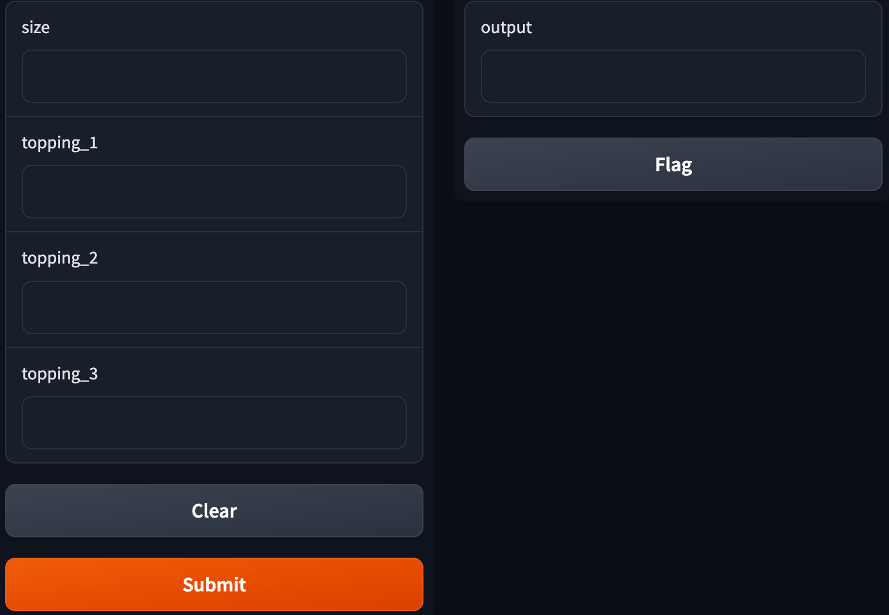

# Gradio Pizza Order

In this activity, you will write a function that creates a pizza order that calculates the total cost of a pizza order based on the size and includes up to three toppings. Then, you'll use Gradio to launch the application.

## Instructions

1. In the body of the `pizza_order` function, use conditional statements to determine the price of the pizza. The size prices are as follows:
    * A large pizza is 19.99.
    * A medium pizza is 14.99.
    * A small pizza is 9.99.

    * **Note:** Convert the size text to lowercase.

2. Set the topping price to zero.

3. Use a conditional to check if each topping field has a topping. If there is a topping then add 1.99 to the topping price.

4. Add the price of the pizza and the total topping price and calculate 7% sales tax on the total pizza price.

5. Return the gross price of the pizza formatted to two decimal places, for example:

    * `Your pizza costs $22.43, including tax.`

6. Create an instance of the Gradio Interface application function with the appropriate parameters, and launch the application.

7. Your Gradio pizza order application should look similar to the following:

    

---

© 2023 edX Boot Camps LLC. Confidential and Proprietary. All Rights Reserved.
