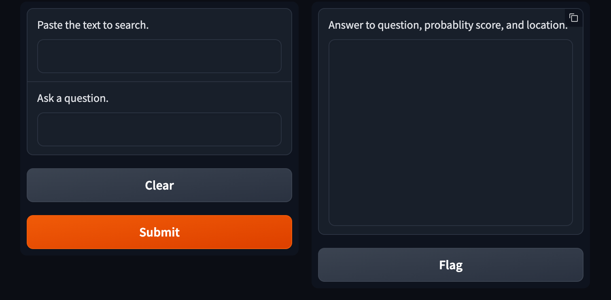

# Gradio Question and Answer Textbox

You will refactor the code used for the Hugging Face Question and Answering solution and create two textbox components. One textbox will be used to paste in the source text that will be searched and the second will be for a user to ask a question. The results will be displayed after the user clicks **Submit** on the app.

## Instructions

1. Install `transformers` and `gradio`.

2. Import the transformers pipeline and Gradio.

3. Initialize the pipeline to generate questions and answers using the `distilbert-base-cased-distilled-squad` model.

4. Refactor the code from the `question_answer` function in the [`question_answering_solution.ipynb`](Unsolved/question_answering_solution.ipynb) so that the function returns the question, answer, probability score, and starting and ending index of the answer.

5. Create the app with two textbox components as the image shows:

    * The first textbox takes the text to search and the second takes the question.
    * The output should show the question, answer, probability score, and starting and ending index of the answer.

        

6. For this activity, use the text from the [Wikipedia article on transformers](https://en.wikipedia.org/wiki/Transformer_(machine_learning_model)), which has been provided in the notebook.

7. Next, copy and paste each question and wait for the results.

    * Who introduced transformers?
    * Why is parallelization important?
    * What pre-trained systems were developed from parallelization?

---

© 2023 edX Boot Camps LLC. Confidential and Proprietary. All Rights Reserved.
